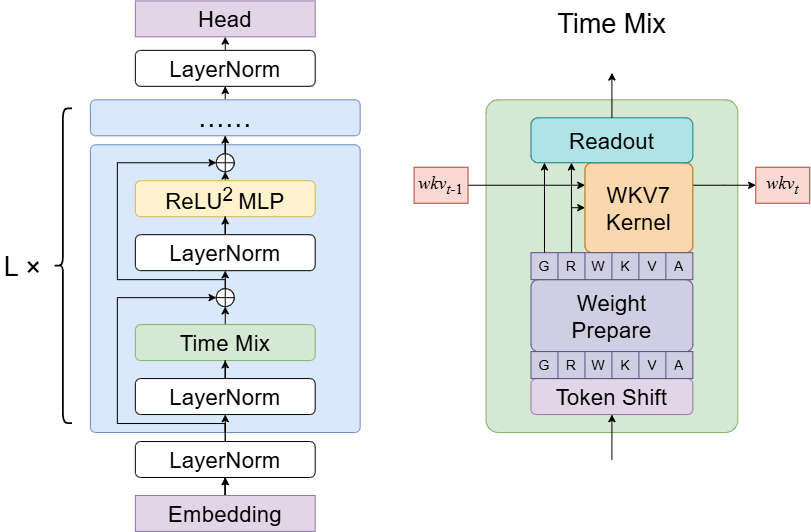

# RWKV Language Model

RWKV (pronounced RWaKuV) is an RNN with GPT-level large language model (LLM) performance that can be trained directly like a GPT Transformer (parallelizable).

RWKV combines the best features of RNN and Transformer: excellent performance, constant memory usage, constant inference generation speed, "infinite" context length, and free sentence embeddings. It is also 100% free of self-attention mechanisms.

The RWKV project was initially proposed by Bo Peng (Blink_DL), and as the project gained attention, it gradually developed into an open-source community.

On September 20, 2023, the RWKV open-source project officially joined the Linux Foundation. Today, the RWKV project is an open-source non-profit organization under the Linux Foundation, with some computing power previously supported by sponsors.

- [Discord Forum](https://discord.gg/bDSBUMeFpc)
- [HF Gradio-1 | completion)](https://huggingface.co/spaces/BlinkDL/RWKV-Gradio-1)
- [HF-Gradio-2 | completion)](https://huggingface.co/spaces/BlinkDL/RWKV-Gradio-2)
- [HF-Gradio-2 | Chat](https://huggingface.co/spaces/RWKV-Red-Team/RWKV-LatestSpace)

# RWKV Architecture and Papers

RWKV-7 (Goose) is the latest version of the RWKV architecture. The paper was co-authored by Bo Peng and the RWKV community, published on March 18, 2025. 
- **RWKV-7 Paper**: "RWKV-7 Goose with Expressive Dynamic State Evolution"
- **Paper Link**: [arXiv:2503.14456](https://arxiv.org/abs/2503.14456)

RWKV-7 adopts Dynamic State Evolution, surpassing the fundamental limitations of the TC0 expressive power of the attention/linear attention paradigm.

::: details **Click to view RWKV-7 Architecture Diagram**

:::

RWKV 5/6 (Eagle/Finch) architectures have several improvements based on the RWKV-4 architecture. Therefore, these two architectures are published in the same paper.

- **RWKV 5/6 Paper**: "Eagle and Finch: RWKV with Matrix-Valued States and Dynamic Recurrence"
- **Paper Link**: [arXiv:2404.05892](https://arxiv.org/abs/2404.05892)

RWKV-4 is the first official version of the RWKV model. The paper was co-authored by Bo Peng and the RWKV community and was first published on May 22, 2023. In October of the same year, the RWKV-4 architecture paper was accepted by [EMNLP 2023](https://2023.emnlp.org/program/accepted_findings/).

- **RWKV-4 Paper**: "RWKV: Reinventing RNNs for the Transformer Era"
- **Paper Link**: [arXiv:2305.13048](https://arxiv.org/abs/2305.13048)

# RWKV Model Version Status

RWKV has released open-source models of various parameter scales for each architecture version.

| Version | RWKV-V4 | RWKV-v5-Eagle | RWKV-v6-Finch | RWKV-v7-Goose | RWKV-v7-G1 |
| --- | --- | --- | --- | --- | --- | 
| Paper | [Published](https://arxiv.org/abs/2305.13048) | [Published](https://arxiv.org/abs/2404.05892) | [Published](https://arxiv.org/abs/2404.05892) | [Published](https://arxiv.org/abs/2503.14456) | [Published](https://arxiv.org/abs/2503.14456) |
| Overall Status | **EOL** | **EOL**| **EOL** | **EOL** | **Continuously Updating**| 
| 0.4B Model |  Released |  Released |  No Plan | [Released](https://huggingface.co/BlinkDL/rwkv-7-world/tree/main) | [Released](https://huggingface.co/BlinkDL/rwkv7-g1/tree/main) | 
| 1.5B Model |  Released |  Released|  [Released](https://huggingface.co/BlinkDL/rwkv-6-world/blob/main/RWKV-x060-World-1B6-v2.1-20240328-ctx4096.pth) | [Released](https://huggingface.co/BlinkDL/rwkv-7-world/tree/main) | [Released](https://huggingface.co/BlinkDL/rwkv7-g1/tree/main) |
| 3B Model |  Released |  Released |  [Released](https://huggingface.co/BlinkDL/rwkv-6-world/blob/main/RWKV-x060-World-1B6-v2.1-20240328-ctx4096.pth) | [Released](https://huggingface.co/BlinkDL/rwkv-7-world/tree/main) | [Released](https://huggingface.co/BlinkDL/rwkv7-g1/tree/main)|
| 7B Model | Released |  Released|  [Released](https://huggingface.co/BlinkDL/rwkv-6-world/blob/main/RWKV-x060-World-7B-v2.1-20240507-ctx4096.pth) | No Plan  | [Released](https://huggingface.co/BlinkDL/rwkv7-g1/tree/main)  |
| 14B Model |  Released |  No Plan |  [Released]([Released](https://huggingface.co/BlinkDL/rwkv7-g1/blob/main/rwkv7-g0a3-7.2b-20251029-ctx8192.pth)) | No Plan  | [Released](https://huggingface.co/BlinkDL/rwkv7-g1/tree/main) |

# Which RWKV Models Should I Use?

::: tip
Due to performance issues caused by outdated architectures, all RWKV-6/5/4 series models (Raven / World / Pile ...) and earlier RWKV versions have reached end-of-life, with existing models serving only as archives.
:::

- 1️⃣ Select the **latest architecture**, e.g., RWKV7 > RWKV6
- 2️⃣ Select models with **better datasets**. Dataset quality ranking: G1c > G1b(G0b)  > G1(G0) 
- 3️⃣ **Check the date in the model name**. Given the same parameters, the newer the model, the better! For example, for a 1.5B model, the `G1c` version released on `20260110` is definitely superior to the `G1` version released on `250429`

The latest models can be downloaded from [Hugging Face](https://huggingface.co/BlinkDL/rwkv7-g1/tree/main).

# Differences Between RWKV and Transformer

- Advantages
  - Lower resource usage during runtime and training (VRAM, CPU, GPU, etc.).
  - **10 to 100 times lower computational requirements compared to Transformers with larger contexts**.
  - Supports linear scaling to any context length (Transformers scale quadratically).
  - Performs as well as Transformer architectures in terms of answer quality and generalization ability.
  - RWKV models' training data includes languages other than English (e.g., Chinese, Japanese, etc.), offering better multilingual capabilities than most existing open-source models.

- Disadvantages
  - RWKV base models are very sensitive to the format of prompts, and the format of prompts significantly affects the generation results.
  - Due to architectural design, RWKV models are weaker on **tasks requiring lookback/review**, and we are working on various optimizations to address this issue.

# Basic Terminology of the RWKV Community

| Concept | Description |
| --- | --- |
| **RWKV** | The model architecture itself, training code available [here](https://github.com/BlinkDL/RWKV-LM) |
| **state** | RWKV is a variant of RNN architecture, state is the hidden state that RWKV passes across time steps during inference, used to retain historical context information |
| **ChatRWKV** | Official chatbot for RWKV (similar to ChatGPT, but based on RWKV), code available [here](https://github.com/BlinkDL/ChatRWKV) |
| **RWKV-4/5/6/7** | Different architectural versions of RWKV. Note that the latest RWKV-7 series models are recommended |
| **RWKV World** | Base RWKV models trained on data from over 100 languages worldwide. These models cover a broader and more diverse dataset, including training data from over 100 languages, as well as some instruction tuning |
| **Raven** | Official fine-tuned version of the RWKV-4 base model, including instruction training. However, since the RWKV-4 series has been discontinued, continued use is not recommended |
| **RWKV ABC/MIDI** | RWKV music models based on ABC/MIDI format |
| **RWKV CHNtuned / one-state-chat / role_play / novel ...** | Fine-tuned models provided by the RWKV community, optimized for specific tasks or data types. Please prioritize using fine-tuned models from the RWKV-7 series |
| **RWKV7-G1 (Goose One)** | Base model trained on RWKV-7 architecture and World v3.5 dataset, supports **reasoning/thinking** (Think), with stronger performance |

# RWKV Model Naming Rules

RWKV models typically follow two naming conventions: one for **World models**, and another for the **RWKV G1 series** introduced during the RWKV 7 architecture era (which supports 'think' reasoning).

::: tabs
@tab RWKV G1 Models
G1 Model Naming Format:
- rwkv7a-g1b-0.1b-20250819-ctx4096.pth
- rwkv7-g0a2-7.2b-20251005-ctx4096.pth
- rwkv7-g1a3-1.5b-20251015-ctx8192.pth

Meaning of each field in G1 model names:

| Field | Meaning |
| --- | --- |
| **rwkv7a / rwkv7** | Model architecture version. [rwkv7](https://rwkv.cn/news/read?id=20250320) is the latest RWKV base architecture; rwkv7a adds the [DE](https://rwkv.cn/news/read?id=20250527) mechanism on top of rwkv7; rwkv7b adds [DE](https://rwkv.cn/news/read?id=20250527) and [DEA](https://rwkv.cn/news/read?id=20250630) on top of rwkv7 |
| **0.1b / 7.2b** | Model parameter scale, where "B" stands for "Billions" |
| **g1b / g0a2 / g1a3** | **Training data version**. Dataset quality ranking: G1c > G1b(G0b)  > G1(G0) |
| **20250819 / 20251005** | Model release date |
| **ctx4096/ctx8192** | Pre-trained context length |  

@tab RWKV World Models

World Model Naming Format:
- RWKV-x060-World-3B-v2.1-20240208-ctx4096.pth
- RWKV-x070-World-0.1B-v2.8-20241210-ctx4096.pth

Meaning of each field in World model names:

| Field | Meaning |
| --- | --- |
| **RWKV** | Model name |
| **x060 / X070** | RWKV model architecture. X060 = RWKV6, X070 = RWKV7 |
| **World** | Dataset type. The World dataset contains over 100 global languages; World models support multi-language tasks |
| **3B / 0.1B** | Model parameter scale, where "B" stands for "Billions" |
| **v2.1 / v2.8** | Model training set version. v2 ≈ 1.1T, v2.1 ≈ 2.5T, v3 ≈ 5.6T  |
| **20240208 / 20231113** | Model release date |
| **ctx4096** | Pre-trained context length |

:::

# Who sponsors the compute for RWKV?

RWKV is made possible, as an Open Source project, thanks to the large amount of GPU compute and researchers time contributions from

    
    
    
    

Without their invaluable support, we would not have been able to develop the core RWKV foundation models that you see today.

---

In addition, we would like to thank
- [alpin @ pygmalionAI](https://pygmalion.chat/)
- [AutoMeta @ AlignmentLab](https://twitter.com/alignment_lab)
- [FeatherlessAI](https://featherless.ai)
- Various other folks who donated slices of GPU time / preferred not to be named

For helping with GPU time, on smaller experiments, finetunes, and various models. Especially for those models that never get publically released in failed runs.