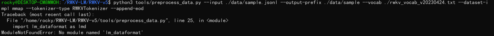
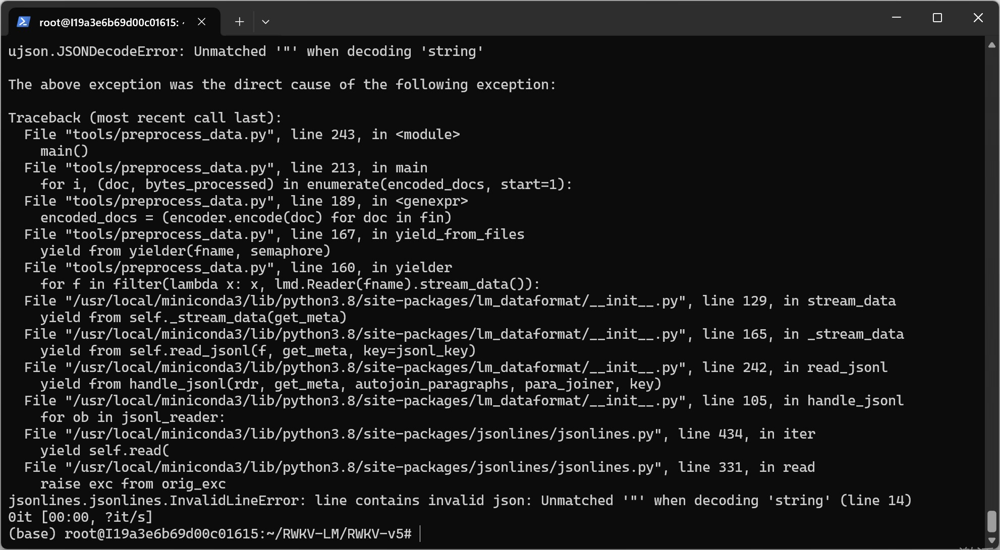
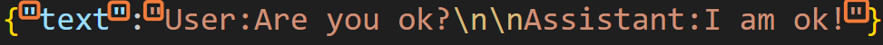
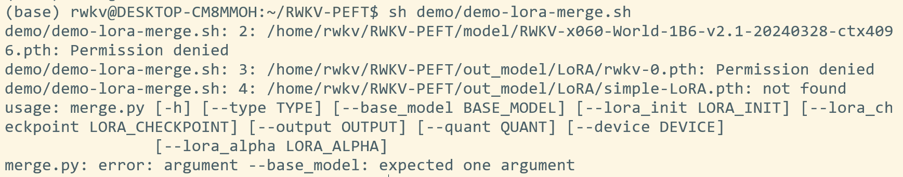
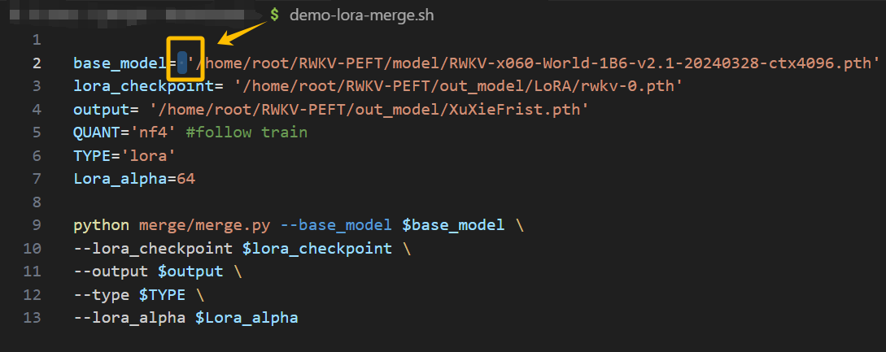

# FAQ about Fine-Tuning
---
description: The RWKV fine-tuning document provides fine-tuning tutorials for RWKV, including LoRA, State tuning, Pissa, Lisa, etc. By fine-tuning the RWKV model, you can enhance the model's performance on specific tasks or enable the model to play a specific role.
keywords: Frequently Asked Questions about RWKV Fine-Tuning, RWKV Fine-Tuning Error Reports, RWKV Runtime Errors

## When converting jsonl to binidx, a ModuleNotFoundError: No module named 'xxx' error occurs.



Solution: This is because the corresponding software package is missing. Please run the command `pip install xxx` to install it.

## An error occurs when converting jsonl to binidx.

```
Error message: JSONDecodeError: Unmatched '"' when decoding 'string'! 
```



Solution: This is because your jsonl file lacks quotation marks, causing the conversion tool to have a parsing error. Please check whether all lines of the jsonl file conform to the following quotation mark format:



## "unable to access" when cloning the GitHub repository

```
 fatal: unable to access 'https://github.com/shoumenchougou/RWKV-LM.git/': GnuTLS recv error (-110): The TLS connection was non-properly terminate
```

Solution: This is a network problem with your device. Please adjust the network.

## When running the sh script, the following appears: train.py: error: unrecognized arguments:\ 

Solution: Please remove all the \ in the sh script and separate each parameter with a space.

## After running the script to start the training, an error related to insufficient VRAM (memory/VRAM) occurs.

Solution: The VRAM is insufficient, and you need to upgrade the graphics card device.

## When merging the LoRA file, the following appears: merge.py: error: argument error



Solution: This may be because there are some spaces in your path variables, resulting in the inability to properly parse the parameters of the base model, output folder, and other paths. Please carefully check the space issues!

 