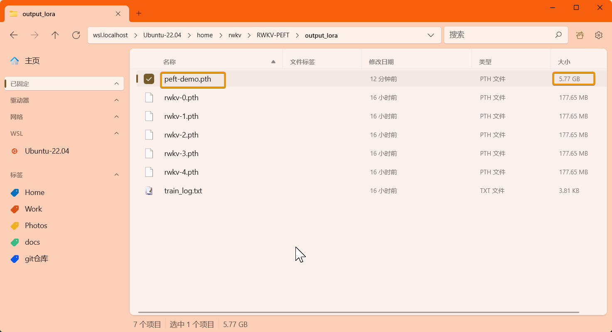

# LoRA Fine-Tuning Tutorial

::: info
**What is LoRA Fine-Tuning?**

LORA (Low-Rank Adaptation) is a fine-tuning technique for large pre-trained models. It does not change most of the parameters of the original model but adjusts part of the model's weights to achieve optimization for specific tasks.
:::
---

The LoRA fine-tuning method in this article comes from the RWKV community fine-tuning project [RWKV-PEFT](https://github.com/JL-er/RWKV-PEFT).

Before starting the LoRA fine-tuning, make sure you have a Linux workspace and an NVIDIA graphics card that supports CUDA.

## LoRA VRAM Reference

The GPU VRAM requirements for RWKV LoRA fine-tuning can be referred to in the following table:

::: tabs
@tab RWKV-7

| Model Parameters | bf16  | int8 | nf4 |
| --------- | ---- | ---- | ---- |
| RWKV7-0.1B | 2.7GB GPU  | 2.5GB GPU  | 2.4GB GPU  |
| RWKV7-0.4B | 3.4GB GPU  | 2.9GB GPU  | 2.7GB GPU  |
| RWKV7-1.5B | 5.6GB GPU  | 4.6GB GPU  | 3.9GB GPU  |
| RWKV7-2.9B | 8.8GB GPU  | 6.7GB GPU  | 5.7GB GPU  |

@tab RWKV-6

| Model Parameters | bf16  | int8 | nf4 |
| --------- | ---- | ---- | ---- |
| RWKV6-1.6B | 7.3GB GPU  | 5.9GB GPU  | 5.4GB GPU  |
| RWKV6-3B  | 11.8GB GPU  | 9.4GB GPU  | 8.1GB GPU  |
| RWKV6-7B | 23.7GB GPU | 17.3GB GPU | 14.9GB GPU  |

:::
The data in the above table is based on the following training parameters:

- ctxlen=1024 
- micro_bsz=1
- strategy=deepspeed_stage_1
- peft_config=\'\{\"r\":64,\"lora_alpha\":32,\"lora_dropout\":0.05}\'

As the training parameters change, the VRAM required for RWKV LoRA fine-tuning will also change.

## Collect Training Data

You need to collect binidx data that is more suitable for training RWKV. For specific methods, you can refer to [Preparing the Training Dataset](../advance/training-datasets.md).

## Configure the Training Environment

To train the RWKV model, you first need to configure the training environment such as conda. For the specific process, please refer to the [RWKV Training Environment Configuration](../advance/training-enviroment.md) section.

## Clone the Repository and Install Dependencies

In Linux or WSL, use the git command to clone the RWKV-PEFT repository:

```  bash copy
git clone https://github.com/JL-er/RWKV-PEFT.git
```

After the cloning is completed, use the `cd RWKV-PEFT` command to enter the RWKV-PEFT directory. And run the following command to install the dependencies required by the project:

```  bash copy
pip install -r requirements.txt
```

## Modify the Training Parameters

Open the `run_lora.sh` file in the `RWKV-PEFT/scripts` directory using any text editor (such as vscode), and you can modify the training parameters to control the fine-tuning training process and training effect:


The following is a parameter adjustment process for LoRA fine-tuning:

### Adjust the Path Parameters

The first three lines of the `run_lora.sh` file are file path parameters:

- load_model: The path of the base RWKV model
- proj_dir: The output path of the training log and the LoRA file obtained from training
- data_file: The path of the training dataset. Note that there is no need to include the bin and idx suffixes in the path, only the file name is required.

### Adjust the n_layer and n_embd Parameters

::: warning
For RWKV models with different parameters, the values of n_layer and n_embd used during training are different.
:::

The following are the corresponding n_layer/n_embd values for RWKV model parameters:

| Model Parameters | n_layer | n_embd |
|------------|---------|--------|
| 0.1B       | 12      | 768    |
| 0.4B       | 24      | 1024   |
| 1.5B       | 24      | 2048   |
| 2.9B       | 32      | 2560   |
| 7B         | 32      | 4096   |
| 14B        | 61      | 4096   |

### Adjust the Important Training Parameters

::: tip
The following parameters are recommended to be adjusted according to your fine-tuning data and device performance.
:::

| Parameter | Description |
| --- | --- |
| `micro_bsz=1` | Micro-batch size. Adjust according to the size of the VRAM. Gradually increase it starting from 1 during fine-tuning |
| `epoch_save=5` | Save the LoRA file every few training epochs. Pay attention to whether the storage space is sufficient |
| `epoch_steps=1000` | The number of steps in each training epoch. Increasing this value will lengthen the training time of a single epoch |
| `ctx_len=512` | The context length of the fine-tuned model. It is recommended to modify it according to the length of the corpus |
| `--my_testing "x070"`| The RWKV model version for training. Use `x070` for v7, `x060` for v6, and `x052` for v5 (deprecated, not recommended). |
### Adjust the LoRA-Related Parameters

::: tip
`lora_config` contains the parameters for LoRA fine-tuning. Refer to the following table for the effects:
:::

| Parameter | Description |
| --- | --- |
| **"r": 32** | The rank parameter for LoRA fine-tuning. Higher values generally give better results but require more training time and GPU memory. Typically, 32 or 64 is sufficient. |
| **"lora_alpha": 32** | The alpha (scaling) parameter for LoRA fine-tuning. It is recommended to keep it at twice the value of lora_r. |
| **"lora_dropout": 0.01** | The dropout rate for LoRA fine-tuning. A value of 0.01 is recommended. |


### Adjust Other Training Parameters

The following lists other modifiable training parameters in the script and the effects of their modification.

| Parameter | Description |
| --- | --- |
| `--vocab_size 65536` | Vocabulary size, default is 65536. Setting it to 0 allows the model to determine the vocabulary size automatically. |
| `--data_type binidx` | Format of the training corpus. Supported formats: `utf-8`, `utf-16le`, `numpy`, `binidx`, `dummy`, `uint16`, `sft`, `jsonl`. It is recommended to use `jsonl` or `binidx`. |
| `--epoch_count 5` | Total number of training epochs. |
| `--lr_init 2e-5` | Initial learning rate. MiSS recommends `2e-5`, and it should not exceed `1e-4`. |
| `--lr_final 2e-5` | Final learning rate. It is recommended to keep this the same as the initial learning rate. |
| `--accelerator gpu` | Type of accelerator to use. Currently supports mainly `gpu`. `cpu` is generally not suitable for training. |
| `--devices 1` | Number of GPUs. Set to `1` for a single GPU, or the actual number when using multiple GPUs. |
| `--precision bf16` | Training precision. Recommended to keep the default `bf16`. Supported options: `fp32`, `tf32`, `fp16`, `bf16`. |
| `--strategy deepspeed_stage_1` | Lightning training strategy. For fine-tuning, `deepspeed_stage_1` is recommended. If GPU memory is too small, change `1` to `2`. |
| `--grad_cp 1` | Gradient accumulation steps. `0` trains faster but uses more GPU memory; `1` trains slower but saves memory. |
| `--peft lora` | Fine-tuning type. Use `lora` for LoRA fine-tuning. |
| `--op` | Operator selection. Supports `cuda`, `fla`, `triton`. Default is `cuda`. |
| `--wandb RWKV-PEFT-LoRA` | *Optional.* Enable wandb for training log visualization. Requires a configured wandb account. |
| `--lr_schedule wsd` | *Optional.* Learning rate scheduler. Default is `cos_decay`. Supported: `cos_decay`, `wsd`. |


::: warning
After adjusting the parameters, remember to save the `run_lora.sh` file.
:::

### Appendix: Configuration Reference for run_lora.sh

``` bash copy filename="run_lora.sh"
load_model="/home/rwkv/model/rwkv7-g1-1.5b-20250429-ctx4096.pth"
proj_dir='/home/rwkv/JL/out_model/test'
data_file=/home/rwkv/JL/data/roleplay

n_layer=24
n_embd=2048

micro_bsz=8
epoch_save=1
epoch_steps=200
ctx_len=128
peft_config='{"r":8,"lora_alpha":32,"lora_dropout":0.05}'

python train.py --load_model $load_model \
--proj_dir $proj_dir --data_file $data_file \
--vocab_size 65536 \
--data_type jsonl \
--n_layer $n_layer --n_embd $n_embd \
--ctx_len $ctx_len --micro_bsz $micro_bsz \
--epoch_steps $epoch_steps --epoch_count 4 --epoch_save $epoch_save \
--lr_init 1e-5 --lr_final 1e-5 \
--accelerator gpu --precision bf16 \
--devices 1 --strategy deepspeed_stage_1 --grad_cp 1 \
--my_testing "x070" \
--peft lora --peft_config $peft_config
# Optional parameters
# --op cuda/fla/triton     (Select different operators; if not set, defaults to cuda)
# --wandb RWKV-PEFT-LoRA (Whether to use wandb to monitor the training process)
# --lr_schedule wsd        (Whether to enable cosine annealing for learning rate; 
#                           the default lr_schedule is cos_decay)

```

## Start the Training

In the RWKV-PEFT directory, run the command `sh scripts/run_lora.sh` to start the LoRA fine-tuning.

After the training starts normally, it should be as follows:


### Use the LoRA Weight File

After training is completed, you can find the full LoRA fine-tuned model file (in `.pth` format) in the output directory.



The merged LoRA fine-tuned model can be used normally in RWKV Runner or Ai00.


For detailed usage, please refer to the [Ai00 Tutoria](../inference/ai00.md).