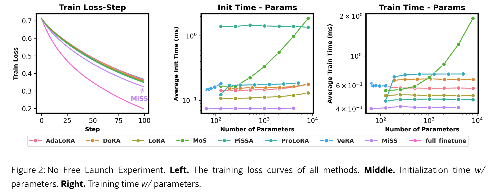
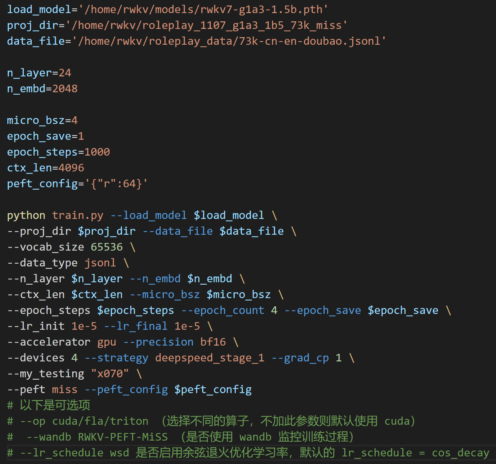
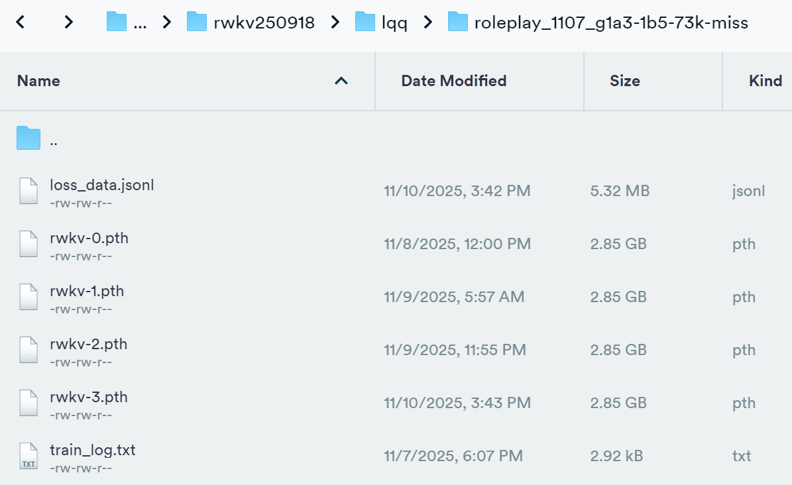
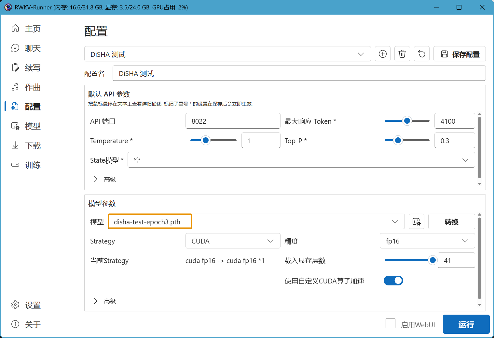

# MiSS Fine-Tuning Tutorial

::: info What is MiSS Fine-Tuning?

[MiSS Fine-Tuning](https://arxiv.org/abs/2409.15371) (Matrix Shard Sharing) is a novel parameter-efficient fine-tuning method (PEFT, Parameter-Efficient Fine-Tuning), aiming to further reduce the number of trainable parameters while accelerating convergence.

The MiSS fine-tuning framework expands the design space of PEFT by introducing two core computational structures: Block Affine Efficient Computation (Bone) and Block Affine Transformation (Bat). The Bone structure significantly improves computational efficiency while maintaining high performance, and Bat overcomes the possible collinearity problems in some MiSS variants through non-linear transformation, thus enhancing the model's capabilities.

Experimental results show that MiSS and its Bone structure outperform LoRA and its variants in terms of evaluation metrics, computational efficiency, and resource usage.



:::
---

The MiSS fine-tuning method in this article comes from the RWKV community fine-tuning project [RWKV-PEFT](https://github.com/JL-er/RWKV-PEFT).

Before starting the MiSS fine-tuning, make sure you have a Linux workspace and an NVIDIA graphics card that supports CUDA.

## MiSS Fine-Tuning VRAM Reference

The GPU VRAM requirements for RWKV MiSS fine-tuning can be referred to in the following table:
::: tabs
@tab RWKV-7

| Model Parameters | bf16  | int8 | nf4 |
| --------- | ---- | ---- | ---- |
| RWKV7-0.1B | 2.7GB GPU  | 2.5GB GPU  | 2.4GB GPU  |
| RWKV7-0.4B | 3.1GB GPU  | 2.9GB GPU  | 2.7GB GPU  |
| RWKV7-1.5B | 5.6GB GPU  | 4.5GB GPU  | 3.9GB GPU  |
| RWKV7-2.9B | 8.8GB GPU  | 6.7GB GPU  | 5.7GB GPU  |

@tab RWKV-6

| Model Parameters | bf16  | int8 | nf4 |
| --------- | ---- | ---- | ---- |
| RWKV-6-1.6B | 7.3GB  | 5.9GB  | 5.4GB  |
| RWKV-6-3B  | 11.8GB  | 9.4GB  | 8.1GB  |
| RWKV-6-7B | 23.7GB| 17.3GB | 14.9GB  |

:::
The data in the above table is based on the following training parameters:

- ctxlen=1024 
- micro_bsz=1
- strategy=deepspeed_stage_1
- peft_config='\{"r":64\}'

As the training parameters change, the VRAM required for RWKV MiSS fine-tuning will also change.

## Collect Training Data

You need to collect binidx data that is more suitable for training RWKV. For specific methods, you can refer to [Preparing the Training Dataset](../advance/training-datasets.md).

## Configure the Training Environment

To train the RWKV model, you first need to configure the training environment such as conda. For the specific process, please refer to the [RWKV Training Environment Configuration](../advance/training-enviroment.md) section.

## Clone the Repository and Install Dependencies

In Linux or WSL, use the git command to clone the RWKV-PEFT repository:

```  bash copy
git clone https://github.com/JL-er/RWKV-PEFT.git
```

After the cloning is completed, use the `cd RWKV-PEFT` command to enter the RWKV-PEFT directory. And run the following command to install the dependencies required by the project:

```  bash copy
pip install -r requirements.txt
```

## Modify the Training Parameters

Open the `miss.sh` file in the `RWKV-PEFT/scripts` directory using any text editor (such as vscode), and you can modify the training parameters to control the fine-tuning training process and training effect:



The following is a parameter adjustment process for MiSS fine-tuning:

### Adjust the Path Parameters

The first three lines of the `miss.sh` file are file path parameters:

- load_model: The path of the base RWKV model
- proj_dir: The output path of the training log and the MiSS file obtained from training
- data_file: The path of the training dataset. Note that there is no need to include the bin and idx suffixes in the path, only the file name is required.

### Adjust the n_layer and n_embd Parameters

::: warning
For RWKV models with different parameters, the values of n_layer and n_embd used during training are different.
:::

The following are the corresponding n_layer/n_embd values for RWKV model parameters:

| Model Parameters | n_layer | n_embd |
|------------|---------|--------|
| 0.1B       | 12      | 768    |
| 0.4B       | 24      | 1024   |
| 1.5B       | 24      | 2048   |
| 2.9B       | 32      | 2560   |
| 7B         | 32      | 4096   |
| 14B        | 61      | 4096   |

### Adjust the Important Training Parameters

::: tip
The following parameters are recommended to be adjusted according to your fine-tuning data and device performance.
:::

| Parameter | Description |
| --- | --- |
| `micro_bsz=1` | Micro batch size. Adjust based on VRAM capacity; for fine-tuning, start from 1 and gradually increase. |
| `epoch_save=5` | Interval for saving the MiSS file (every N epochs). Ensure sufficient storage space is available. |
| `epoch_steps=1200` | Number of steps per training epoch. Increasing this will extend the training time for a single epoch. |
| `ctx_len=512` | Context length for the fine-tuned model. It is recommended to adjust this based on the length of the corpus. |
| `peft_config='{"r":64}'` | Rank parameter for MiSS fine-tuning. Higher values yield better results but result in slower training speed and higher VRAM requirements. Generally, 32 or 64 is sufficient. |


### Adjust Other Training Parameters

The following lists other modifiable training parameters in the script and the effects of their modification.

| Parameter | Description |
| --- | --- |
| `--vocab_size 65536` | Vocabulary size. Default is `65536`. Set to `0` to let the model automatically determine the vocabulary size. |
| `--data_type binidx` | Training corpus file format. Supports: `utf-8`, `utf-16le`, `numpy`, `binidx`, `dummy`, `uint16`, `sft`, `jsonl`. Recommended: `jsonl` or `binidx`. |
| `--epoch_count 5` | Total number of training epochs. |
| `--lr_init 2e-5` | Initial learning rate. Recommended `2e-5` for MiSS; maximum should not exceed `1e-4`. |
| `--lr_final 2e-5` | Final learning rate. Recommended to keep consistent with the initial learning rate. |
| `--accelerator gpu` | Accelerator type. Currently primarily supports `gpu`; `cpu` is generally not supported for training. |
| `--devices 1` | Number of GPUs. Enter `1` for a single card, or the actual count for multi-GPU setups. |
| `--precision bf16` | Training precision. Recommended to keep default `bf16`. Supports: `fp32`, `tf32`, `fp16`, `bf16`. |
| `--strategy deepspeed_stage_1` | Lightning training strategy parameter. `deepspeed_stage_1` is recommended for fine-tuning. If VRAM is too low, change `1` to `2`. |
| `--grad_cp 1` | Gradient checkpointing steps. `0`: Faster training but requires more VRAM. `1`: Slower training but saves VRAM. |
| `--my_testing "x070"` | RWKV model version for training. Select `x070` for v7, `x060` for v6, and `x052` for v5 (deprecated, not recommended). |
| `--peft miss` | Fine-tuning type. Use `miss` for MiSS fine-tuning. |
| `--op` | Operator selection. Supports `cuda`, `fla`, `triton`. Default is set to `cuda`. |
| `--wandb RWKV-PEFT-MiSS` | **Optional**. Whether to use wandb for logging training logs. Requires a pre-configured [wandb](https://wandb.ai/) account. |
| `--lr_schedule wsd` | **Optional**. Learning rate scheduler. Default is `cos_decay`. Supports: `cos_decay`, `wsd`. |

### Appendix: Configuration Reference for miss.sh

``` bash copy filename="miss.sh"
load_model='/home/rwkv/models/rwkv7-g1a3-1.5b.pth'
proj_dir='/home/rwkv/roleplay_1107_g1a3_1b5_73k_miss'
data_file='/home/rwkv/roleplay_data/73k-cn-en-doubao.jsonl'

n_layer=24
n_embd=2048

micro_bsz=4
epoch_save=1
epoch_steps=1000
ctx_len=4096
peft_config='{"r":64}'

python train.py --load_model $load_model \
--proj_dir $proj_dir --data_file $data_file \
--vocab_size 65536 \
--data_type jsonl \
--n_layer $n_layer --n_embd $n_embd \
--ctx_len $ctx_len --micro_bsz $micro_bsz \
--epoch_steps $epoch_steps --epoch_count 4 --epoch_save $epoch_save \
--lr_init 1e-5 --lr_final 1e-5 \
--accelerator gpu --precision bf16 \
--devices 4 --strategy deepspeed_stage_1 --grad_cp 1 \
--my_testing "x070" \
--peft miss --peft_config $peft_config
```

::: warning
After adjusting the parameters, remember to save the `miss.sh` file.
:::

## Start the Training

In the RWKV-PEFT directory, run the command `sh scripts/miss.sh` to start the MiSS fine-tuning.

After the training starts normally, it should be as follows:


## How to Use MiSS Fine-Tuned Models

After training is complete, you should be able to find the complete MiSS weight file (`.pth` format) and the training log (`.txt` file) in the output folder:



The merged MiSS model can be used normally in Ai00. For detailed usage instructions, please refer to the  [Ai00 Tutorial](../inference/ai00.md).



