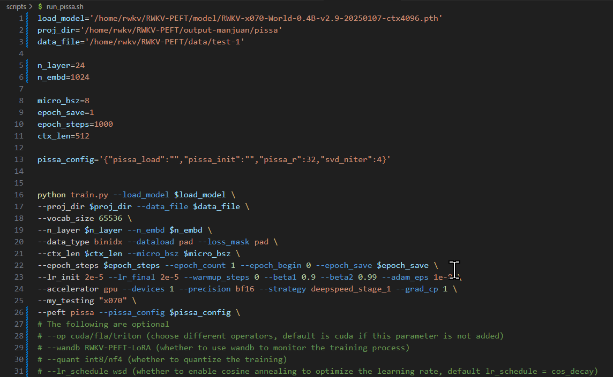
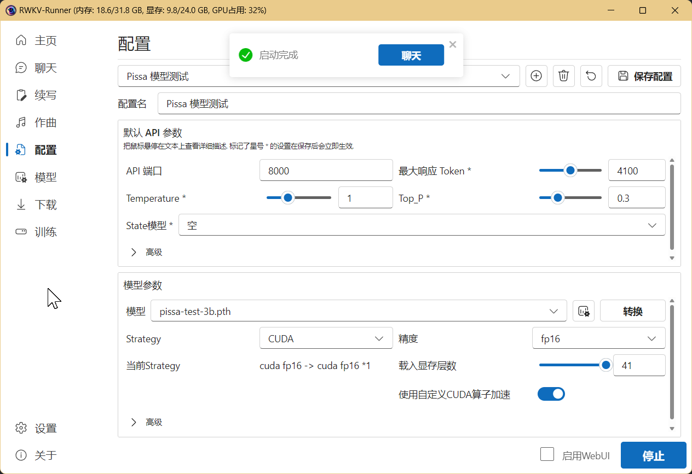

# PiSSA Fine-Tuning Tutorial

::: info What is PiSSA Fine-Tuning?

[PiSSA Fine-Tuning](https://arxiv.org/abs/2404.02948) is a parameter-efficient fine-tuning method (PEFT, Parameter-Efficient Fine-Tuning). PiSSA fine-tuning maintains model performance by selectively updating part of the parameters (such as LoRA or Adapter layers), while avoiding a comprehensive update of the entire model, thus improving training efficiency.

PiSSA has the same architecture as LoRA fine-tuning, but only differs in the way of initializing the Adapter: LoRA initializes the adapter parameters with Gaussian noise and 0 and freezes the core model parameters, while PiSSA directly fine-tunes the low-rank principal components A and B of W and freezes the secondary correction terms.


Therefore, PiSSA converges faster and performs better than LoRA.
:::
---

The PiSSA fine-tuning method in this article comes from the efficient parameter fine-tuning project [RWKV-PEFT](https://github.com/JL-er/RWKV-PEFT) in the RWKV community.

Before starting the PiSSA fine-tuning, make sure you have a Linux workspace and an NVIDIA graphics card that supports CUDA.

## PiSSA VRAM Reference

The GPU VRAM requirements for RWKV PiSSA fine-tuning can be referred to in the following table:

::: tabs
@tab RWKV-7

| Model Parameters | bf16  | int8 | nf4 |
| --------- | ---- | ---- | ---- |
| RWKV7-0.1B | 2.6GB GPU | 2.4GB GPU  | 2.5GB GPU  |
| RWKV7-0.4B | 3.4GB GPU  | 3GB GPU  | 2.7GB GPU  |
| RWKV7-1.5B | 5.6GB GPU  | 4.6GB GPU  | 3.9GB GPU  |
| RWKV7-2.9B | 8.8GB GPU  | 6.7GB GPU  | 5.7GB GPU  |

@tab RWKV-6

| Model Parameters | bf16  | int8 | nf4 |
| --------- | ---- | ---- | ---- |
| RWKV6-1.6B | 7.3GB GPU  | 5.9GB GPU  | 5.4GB GPU  |
| RWKV6-3B  | 11.8GB GPU  | 9.4GB GPU  | 8.1GB GPU  |
| RWKV6-7B | 23.7GB GPU | 17.3GB GPU | 14.9GB GPU  |

:::

The data in the above table is based on the following training parameters:

- ctxlen=1024
- micro_bsz=1
- strategy=deepspeed_stage_1
- pissa_r=32
- svd_niter=4

As the training parameters change, the VRAM required for RWKV PiSSA fine-tuning will also change.

## Collect Training Data

You need to collect binidx data that is more suitable for training RWKV. For specific methods, you can refer to [Preparing the Training Dataset](../advance/training-datasets.md).

## Configure the Training Environment

To train the RWKV model, you first need to configure the training environment such as conda. For the specific process, please refer to the [RWKV Training Environment Configuration](../advance/training-enviroment.md) section.

## Clone the Repository and Install Dependencies

In Linux or WSL, use the git command to clone the RWKV-PEFT repository:

```  bash copy
git clone https://github.com/JL-er/RWKV-PEFT.git
```

After the cloning is completed, use the `cd RWKV-PEFT` command to enter the RWKV-PEFT directory. And run the following command to install the dependencies required by the project:

```  bash copy
pip install -r requirements.txt
```

## Modify the Training Parameters

Open the `run_pissa.sh` file in the `RWKV-PEFT/scripts` directory using any text editor (such as vscode), and you can modify the training parameters to control the fine-tuning training process and training effect:



The following is a parameter adjustment process for PiSSA fine-tuning:

<Steps>

### Adjust the Path Parameters

The first three lines of the `run_pissa.sh` file are file path parameters:

- load_model: The path of the base RWKV model
- proj_dir: The output path of the training log and the PiSSA file obtained from training
- data_file: The path of the training dataset. Note that there is no need to include the bin and idx suffixes in the path, only the file name is required.

### Adjust the n_layer and n_embd Parameters

::: warning
For RWKV models with different parameters, the values of n_layer and n_embd used during training are different.
:::

The following are the corresponding n_layer/n_embd values for RWKV model parameters:

| Model Parameters | n_layer | n_embd |
|------------|---------|--------|
| 0.1B       | 12      | 768    |
| 0.4B       | 24      | 1024   |
| 1.5B       | 24      | 2048   |
| 2.9B       | 32      | 2560   |
| 7B         | 32      | 4096   |
| 14B        | 61      | 4096   |

### Adjust the Important Training Parameters

::: tip
The following parameters are recommended to be adjusted according to your fine-tuning data and device performance.
:::

| Parameter | Description |
| --- | --- |
| `micro_bsz=1` | Micro-batch size. Adjust according to the size of the VRAM. Gradually increase it starting from 1 during fine-tuning |
| `epoch_save=5` | Save the PiSSA file every few training epochs. Pay attention to whether the storage space is sufficient |
| `epoch_steps=1000` | The number of steps in each training epoch. Increasing this value will prolong the training time of a single epoch |
| `ctx_len=512` | The context length of the fine-tuned model. It is recommended to modify it according to the length of the corpus |

### Adjust the PiSSA-Related Parameters

::: tip
`pissa_config` contains the parameters for PiSSA fine-tuning. Refer to the following table for the effects:
:::

| Parameter | Description |
| --- | --- |
| "pissa_load":"" | The path of the PiSSA file, indicating from which PiSSA checkpoint to start fine-tuning. If training PiSSA from scratch, this can be left blank |
| "pissa_init":"" | The path of the weights for PiSSA initialization. If training PiSSA from scratch, this can be left blank |
| "pissa_r":32 | The rank parameter for PiSSA fine-tuning. The larger the value, the better the effect, but the slower the training speed and the higher the VRAM requirement. Generally, 32 or 64 is sufficient for training |
| "svd_niter":4 | The number of singular value decomposition iterations for PiSSA fine-tuning. The larger the value, the better the effect, but the slower the training speed and the higher the VRAM requirement. Generally, 4 is sufficient for training |

### Adjust Other Training Parameters

The following lists other modifiable training parameters in the script and the effects of their modification.

| Parameter | Description |
| --- | --- |
| `--data_type binidx` | The file format of the training corpus, supporting: `utf-8`、 `utf-16le`、 `numpy`、 `binidx`、 `dummy`、 `wds_img`、 `uint16` |
| `--vocab_size 65536` | The size of the vocabulary. The default is `65536`. Setting it to `0` means the model automatically determines the size of the vocabulary |
| `--epoch_count 10` | The total number of training epochs |
| `--epoch_begin 0` | The initial training epoch, that is, start loading from the Nth training epoch |
| `--pre_ffn 0` | Replace the first att layer with ffn. Usually keep the default value of `0` |
| `--head_qk 0` | Usually keep the default value of `0`, that is, the closed state |
| `--lr_init 2e-5` | The initial learning rate. It is recommended to be 2e-5 for PiSSA, and the maximum should not exceed 1e-4 |
| `--lr_final 2e-5` | The final learning rate. It is recommended to keep it the same as the initial learning rate |
| `--warmup_steps 0` | The number of warm-up steps. The default is `0`. When loading the model, you can try changing it to `50` |
| `--beta1 0.9` | The beta1 parameter of the Adam optimizer. Keep the default value |
| `--beta2 0.99` | The beta2 parameter of the Adam optimizer. Keep the default value |
| `--adam_eps 1e-8` | The epsilon parameter of the Adam optimizer. Keep the default value |
| `--accelerator gpu` | The type of accelerator used. Currently, it mainly supports gpu, and cpu basically does not support training |
| `--devices 1` | The number of graphics cards. Fill in 1 for a single graphics card, and fill in the actual number for multiple cards |
| `--precision bf16` | The training precision. It is recommended to keep the default value of `bf16`, and it supports: `fp32`、`tf32`、`fp16`、`bf16` |
| `--strategy deepspeed_stage_1` | The lightning training strategy parameter. deepspeed_stage_1 is recommended for fine-tuning. If the device VRAM is too small, you can change 1 to 2 |
| `--grad_cp 1` | The number of gradient accumulation steps. `0` makes the training faster but requires more VRAM, and `1` makes the training slower but saves VRAM |
| `--my_testing "x060"` | The version of the RWKV model being trained. Select x052 for v5 and x060 for v6 |
| `--dataload pad` | The data loading option. "pad" supports `bsz>1`, and "only" limits `bsz=1` |
| `--loss_mask pad` | Perform padding at the end of the data. You can change it to "qa" to mask the question part in the QA task to prevent the model from memorizing the answer based on the question, thereby enhancing the model's generalization ability. |
| `--fla` | Whether to enable fla to reduce the VRAM requirements. It is recommended to turn it on when bsz is less than `8` |
| `--peft pissa` | The training type. Fill in pissa for PiSSA fine-tuning, supporting: "lora", "state", "pissa", "bone" |
| `--quant int8/nf4` | RWKV uses the bf16 training precision by default, but it supports two quantization training types, int8 and nf4. int8 with less precision loss is recommended |
| `--train_parts` | Specify the model area for fine-tuning, such as "emb", "head", "time", "ln". It is recommended to remove this parameter during training to use the default value ["time", "ln"]|
| `--wandb RWKV-PEFT-Pissa` | Whether to use wandb to visually record the training log. You need to configure a [wandb](https://wandb.ai/) account in advance |

::: warning
After adjusting the parameters, remember to save the `run_pissa.sh` file.
:::

</Steps>

### Appendix: Configuration Reference for run_pissa.sh

``` bash copy filename="run_pissa.sh"
load_model='/home/rwkv/RWKV-PEFT/model/RWKV-x070-World-0.4B-v2.9-20250107-ctx4096.pth'
proj_dir='/home/rwkv/RWKV-PEFT/output-manjuan/pissa'
data_file='/home/rwkv/RWKV-PEFT/data/test-1'

n_layer=24
n_embd=1024

micro_bsz=8
epoch_save=1
epoch_steps=1000
ctx_len=512

pissa_config='{"pissa_load":"","pissa_init":"","pissa_r":32,"svd_niter":4}'


python train.py --load_model $load_model \
--proj_dir $proj_dir --data_file $data_file \
--vocab_size 65536 \
--n_layer $n_layer --n_embd $n_embd \
--data_type binidx --dataload pad --loss_mask pad \
--ctx_len $ctx_len --micro_bsz $micro_bsz \
--epoch_steps $epoch_steps --epoch_count 1 --epoch_begin 0 --epoch_save $epoch_save \
--lr_init 2e-5 --lr_final 2e-5 --warmup_steps 0 --beta1 0.9 --beta2 0.99 --adam_eps 1e-8 \
--accelerator gpu --devices 1 --precision bf16 --strategy deepspeed_stage_1 --grad_cp 1 \
--my_testing "x070" \
--peft pissa --pissa_config $pissa_config \
# The following are optional
# --op cuda/fla/triton (choose different operators, default is cuda if this parameter is not added)
# --wandb RWKV-PEFT-LoRA (whether to use wandb to monitor the training process)
# --quant int8/nf4 (whether to quantize the training)
# --lr_schedule wsd (whether to enable cosine annealing to optimize the learning rate, default lr_schedule = cos_decay) 
```

## Start the Training

In the RWKV-PEFT directory, run the command `sh scripts/run_pissa.sh` to start the PiSSA fine-tuning.

After the training starts normally, it should be as follows:


After the training is completed, you should be able to find the trained PiSSA weight file (in `.pth` format) and the training log (`.txt` file) in the output folder:


## How to Use the PiSSA Weight File

After obtaining the PiSSA weight file, you need to merge it into the base RWKV model to obtain a complete PiSSA fine-tuned model.

The merging process can be completed using the `merge_pissa.sh` script file in the `scripts` directory.

### Modify the Merging Parameters

Open the `merge_pissa.sh` script file in the `scripts` directory using a text editor and modify the merging parameters in the script:

| Parameter | Description |
| ---| --- |
| base_model | The path of the base RWKV model for PiSSA fine-tuning, referring to the `load_model` path in run_pissa.sh |
| pissa_checkpoint | The path of the trained pissa file, usually stored in the `proj_dir` directory specified in run_pissa.sh |
| pissa_init | Fill in the path of the pissa initialization weight file (`init_pissa.pth`), usually saved in the same directory as the trained pissa file |
| output | The output path of the merged PiSSA model (including the model naming `xxx.pth`) |
| TYPE='pissa' | The merging type: PiSSA. No need to modify |
| --quant | Follow the quantization parameter during training, "nf4" or "int8". If quantization was not used during training, there is no need to add this parameter |

Reference for the merging parameters:

``` bash copy filename="merge_pissa.sh"
base_model='/home/rwkv/models/basemodel/3b.pth'
pissa_init='/home/rwkv/RWKV-PEFT/output_pissa/init_pissa.pth'
pissa_checkpoint='/home/rwkv/RWKV-PEFT/output_pissa/rwkv-2.pth'
output='/home/rwkv/RWKV-PEFT/output_pissa/pissa-test-3b.pth'
TYPE='pissa'

python merge/merge.py --base_model $base_model \
--lora_init $pissa_init \
--lora_checkpoint $pissa_checkpoint \
--output $output \
--type $TYPE 
# --quant int8/nf4 (Synchronize with the quantization parameter during training)
```

### Merge the PiSSA Weight File

After modifying and saving the file, run the command `sh scripts/merge_pissa.sh` in the `RWKV-PEFT` main directory to merge the PiSSA weight file and the RWKV model into a complete PiSSA fine-tuned model:


After the merging is completed, you can find the merged PiSSA fine-tuned model (in `.pth` format) in the output path:


The merged PiSSA fine-tuned model can be used normally in RWKV Runner or Ai00.




