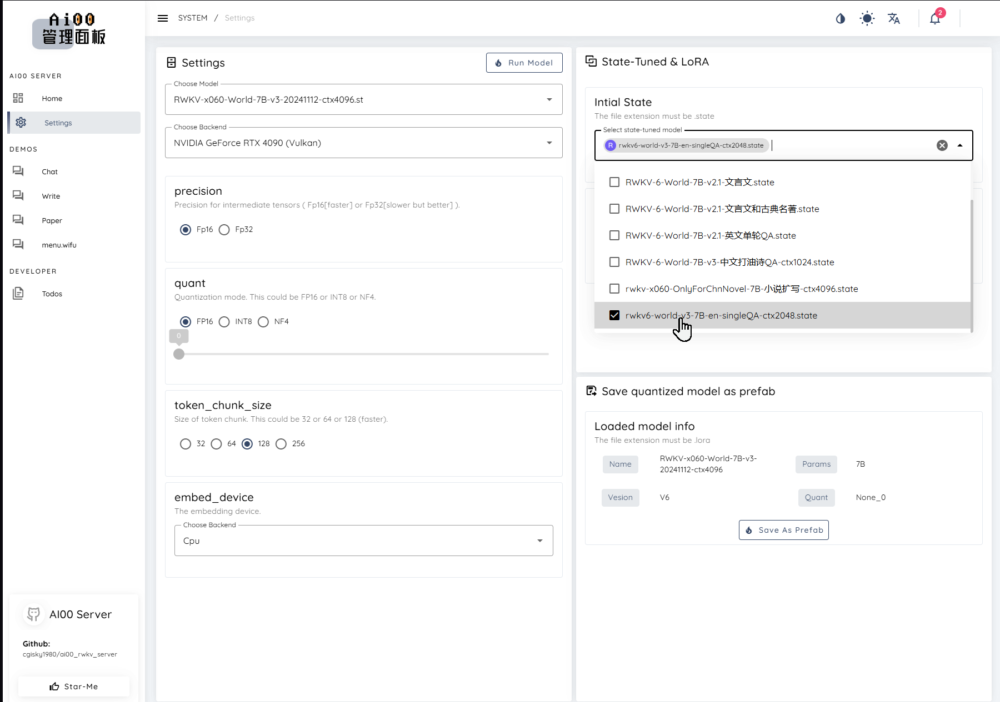

# State Tuning Tutorial

::: info What is State Fine-Tuning?

RWKV is a pure RNN, so it can do things that transformers find difficult. For example, as an RNN has a fixed-size state, fine-tuning the initial state of RWKV is equivalent to the most thorough prompt tuning and can even be used for alignment because of its strong transferability.
:::
The State tuning method in this article comes from the RWKV community fine-tuning project [RWKV-PEFT](https://github.com/JL-er/RWKV-PEFT).

Before you start, make sure you have a Linux workspace and an NVIDIA graphics card that supports CUDA.

The VRAM requirements for State tuning can be referred to in the following table:

| Model Size | fp16  | int8  | nf4  |
|------------|---------|--------|--------|
| RWKV6-1.6B | 5.8GB GPU   | 4.5GB GPU  | 3.9GB GPU  | 
| RWKV6-3B      | 8.7GB GPU  | 6.2GB GPU  | 4.9GB GPU  | 
| RWKV6-7B      | 17.8GB GPU    | 11.9GB GPU  | 8.5GB GPU  | 

The data in the above table is based on the following test parameters:

- ctxlen=1024 
- micro_bsz=1
- strategy=deepspeed_stage_1

## Organize the Training Data

### Collect Training Data in jsonl Format

To fine-tune the RWKV model through state tuning, you need to collect data suitable for training RWKV (in jsonl format). For specific methods, you can refer to [Preparing the Training Dataset](../advance/training-datasets.md).

To highlight the characteristics of state tuning, we have selected a large amount of conversation data with emojis as the training data for this tutorial:


### Convert to binidx Data

Using the [`make_data.py`](https://github.com/BlinkDL/RWKV-LM/blob/main/RWKV-v5/make_data.py) script, you can shuffle and repeat the jsonl training data 10 times and convert it into binidx data that can be used for RWKV training at the same time.

Run the following commands in sequence in the Linux workspace to use the `make_data.py` script in the `RWKV-LM` repository to generate binidx data:

``` bash copy
git clone https://github.com/BlinkDL/RWKV-LM.git # Clone the RWKV-LM repository
cd RWKV-LM/RWKV-v5 # Enter the RWKV-v5 directory
python make_data.py /home/rwkv/RWKV-PEFT/data/qaemoji.jsonl 10 512 # Shuffle and copy the data and generate binidx data
```


`/home/rwkv/RWKV-PEFT/data/qaemoji.jsonl` needs to be replaced with the path of your own jsonl file. 10 is the number of times the data is repeated, and 512 is the ctx_len (context length) of the training data.

::: tip
In the community experiments, the ctx_len of state tuning should be as small as possible. It is recommended to start with 512.
:::

## Configure the Training Environment

Please refer to the [RWKV Training Environment Configuration](../advance/training-enviroment.md) section to configure the training environment such as Conda.

## Clone the Repository and Install Dependencies

In Linux or WSL, use the git command to clone the RWKV-PEFT repository:

```  bash copy
git clone https://github.com/JL-er/RWKV-PEFT.git
```

After the cloning is completed, use the `cd RWKV-PEFT` command to enter the `RWKV-PEFT` directory. And run the following command to install the dependencies required by the project:

```  bash copy
pip install -r requirements.txt
```

## Modify the Training Parameters

Open the `demo-state-tuning.sh` file in the `RWKV-PEFT/scripts` directory using any text editor (such as vscode), and modify the training parameters to control the fine-tuning training process and training effect:


The following is a state tuning parameter adjustment process:

### Adjust the Path Parameters

The first three lines of the `demo-state-tuning.sh` file are file path parameters:

- load_model: The path of the base RWKV model
- proj_dir: The output path of the training log and the state file obtained from training
- data_file: The path of the training dataset. Note that there is no need to include the bin and idx suffixes in the path, only the file name is required.

### Adjust the n_layer and n_embd Parameters

The parameter sizes of the base RWKV models are different, and the values of n_layer and n_embd used during training are also different. The following is the comparison list of the RWKV models with different parameters and the values of n_layer and n_embd:

| Model Size | n_layer | n_embd |
|------------|---------|--------|
| 0.1B       | 12      | 768    |
| 0.4B       | 24      | 1024   |
| 1.5B       | 24      | 2048   |
| 3B         | 32      | 2560   |
| 7B         | 32      | 4096   |
| 14B        | 61      | 4096   |

### Adjust the Important Training Parameters

::: tip
The following parameters are recommended to be adjusted according to your fine-tuning data and device performance.
:::

| Parameter | Description |
| --- | --- |
| `micro_bsz=1` | Micro-batch size. Adjust according to the size of the VRAM. Gradually increase it starting from 1 during fine-tuning |
| `epoch_save=1` | Save the State file every few training epochs |
| `epoch_steps=1000` | The number of steps in each training epoch. Increasing this value will lengthen the training time of a single epoch |
| `ctx_len=512` | The context length of the fine-tuned model. For state tuning, it is recommended to start with a short length, such as 512 |

### Adjust Other Training Parameters

The following lists other modifiable training parameters in the script and the effects of their modification.

::: tip
Note: When fine-tuning the state, it is recommended to set `--warmup_steps 10`, `--lr_init 1`, `--lr_final 0.01`, and as short a ctxlen as possible. (Yes, state tuning requires a very high learning rate.)
:::

| Parameter | Description |
| --- | --- |
| `--data_type binidx` | The file format of the training corpus, supporting: "utf-8", "utf-16le", "numpy", "binidx", "dummy", "wds_img", "uint16" |
| `--vocab_size 65536` | The size of the vocabulary. The default is 65536. Setting it to 0 means the model automatically determines the size of the vocabulary |
| `--epoch_count 5` | The total number of training epochs, which can be adjusted according to the effect |
| `--epoch_begin 0` | The initial training epoch, that is, start loading from the Nth epoch |
| `--pre_ffn 0` | Replace the first att layer with ffn, which may be beneficial sometimes |
| `--head_qk 0` | Usually keep the default value of 0, that is, the closed state |
| `--lr_init 1` | The initial learning rate. It is recommended to be 1 for state tuning, and it is recommended not to exceed 1e-4 for other fine-tunings |
| `--lr_final 0.01` | The final learning rate. It is recommended to be 0.01 for state tuning, and it is recommended not to exceed 1e-4 for other fine-tunings |
| `--warmup_steps 10` | The number of warm-up steps. It is recommended to be 10 for state tuning |
| `--beta1 0.9` | The beta1 parameter of the Adam optimizer |
| `--beta2 0.99` | The beta2 parameter of the Adam optimizer |
| `--adam_eps 1e-8` | The epsilon parameter of the Adam optimizer |
| `--accelerator gpu` | The type of accelerator used. Currently, it mainly supports gpu, and cpu basically does not support training |
| `--devices 1` | Fill in 1 for a single graphics card, and fill in the actual number for multiple cards |
| `--precision bf16` | The training precision. The default is bf16, and it supports: "fp32", "tf32", "fp16", "bf16" |
| `--strategy deepspeed_stage_1` | The lightning training strategy parameter. deepspeed_stage_1 is recommended for fine-tuning |
| `--grad_cp 1` | The number of gradient accumulation steps. 0 makes the training faster but requires more VRAM, and 1 makes the training slower but saves VRAM |
| `--my_testing "x060"` | The version of the RWKV model being trained. Select x052 for v5 and x060 for v6 |
| `--dataload pad` | The data loading option. pad supports bsz>1, and only limits bsz=1 |
| `--train_type "state"` | The training type is state tuning, keep it as the default |
| `--op` | Select the operator, supporting: "cuda", "fla", "triton", with the default setting being "cuda" |
| `--quant int8/nf4` | RWKV uses the bf16 training precision by default, but it supports two quantization training types, int8 and nf4. int8 with less precision loss is recommended |
| `--wandb PEFT-State-tuning` | Whether to use wandb to visually record the training log. You need to configure a [wandb](https://wandb.ai/) account in advance |

Quantization training can reduce the VRAM requirements but will lead to a loss of model accuracy. If you do not need quantization training, you can delete the parameters related to `quant`.

::: tip
After adjusting the parameters, remember to save the `demo-state-tuning.sh` file.
:::

### Appendix: State Tuning Configuration Reference

``` bash copy filename="demo-state-tuning.sh"
load_model='/home/rwkv/RWKV-PEFT/model/RWKV-x070-World-0.4B-v2.9-20250107-ctx4096.pth'
proj_dir='/home/rwkv/RWKV-PEFT/output-manjuan/lora'
data_file='/home/rwkv/RWKV-PEFT/data/test-1'

n_layer=24
n_embd=1024

micro_bsz=4
epoch_save=1
epoch_steps=1000
ctx_len=512

lora_config='{"lora_load":"","lora_r":32,"lora_alpha":64,"lora_dropout":0.01}'


python train.py --load_model $load_model \
--proj_dir $proj_dir --data_file $data_file \
--vocab_size 65536 \
--n_layer $n_layer --n_embd $n_embd \
--data_type binidx --dataload pad --loss_mask pad \
--ctx_len $ctx_len --micro_bsz $micro_bsz \
--epoch_steps $epoch_steps --epoch_count 1 --epoch_begin 0 --epoch_save $epoch_save \
--lr_init 2e-5 --lr_final 2e-5 --warmup_steps 0 --beta1 0.9 --beta2 0.99 --adam_eps 1e-8 \
--accelerator gpu --devices 1 --precision bf16 --strategy deepspeed_stage_1 --grad_cp 1 \
--my_testing "x070" \
--peft lora --lora_config $lora_config \
# The following are optional
# --op cuda/fla/triton (choose different operators, default is cuda)
# --wandb RWKV-PEFT-LoRA (whether to use wandb to monitor the training process)
# --quant int8/nf4 (whether to quantize the training)
# --lr_schedule wsd (whether to enable cosine annealing to optimize the learning rate, default lr_schedule = cos_decay)
```

## Start the Training

In the RWKV-PEFT directory, run the command `sh scripts/demo-state-tuning.sh` to start state tuning.

After the training starts normally, it should be as follows:


After the training is completed, you should be able to find the trained state file (in `.pth` format) and the training log (`.txt` file) in the output folder:


## How to Use the State File

After obtaining the state file, you can use it as follows:

- Use the `demo-state-merge.sh` tool to merge the state file into the base RWKV model to obtain a complete state fine-tuned model.

- You can choose to mount the state file separately in tools such as RWKV Runner or Ai00. (Recommended usage)

::: tip
Note: When mounting the state file, you must use the same RWKV model as the one used to train this state file.
:::

For example: This state file is fine-tuned based on the `RWKV-6-World-3B-v3` model. Then, in tools such as RWKV Runner or Ai00, you must start the `RWKV-6-World-3B-v3` model for the mounted state file to take effect.



Since our sample data is based on a large number of emojis and the ctx is very short, the effect of the trained State file is as follows:


::: tip ✨
Since the state file supports separate mounting, other users can also enhance the usage experience of the RWKV model by mounting the state file you trained.

:::
