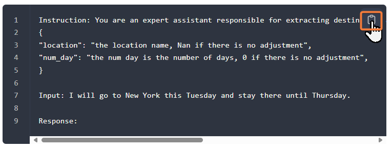

# Completion Prompt

This page displays multiple prompt formats for **completion tasks**. Each prompt example features a copy button on the top right, enabling you to copy the prompt text with a single click and paste it into the RWKV Runner/Ai00 text box for use.



::: warning
The prompts on this page are suitable for RWKV Runner or Ai00's completion mode.

All the following prompt examples are based on the RWKV-6-7B-World model. As the model version and parameters are adjusted, the generated results may vary.
:::

## Structured

When performing tasks such as material extraction or summarization, you can significantly reduce the model's creativity by lowering the Temperature and Top_P parameters, ensuring the model strictly follows instructions. For example, set Temperature = 0.9 - 1 and Top_P = 0 - 0.1.

### ⭐ Extract Keywords from User Input and Output JSON

::: tip
Keyword extraction is a purely mechanical task. Recommended parameters: set Temperature to 1, and Top_P, Presence Penalty, and Frequency Penalty to 0.
:::

**Input prompts:**

``` markdown copy
Instruction: You are an expert assistant responsible for extracting destination and day information from user input and producing valid JSON in the following format:
{
"location": "the location name, Nan if there is no adjustment",
"num_day": "the num day is the number of days, 0 if there is no adjustment",
}

Input: I will go to New York this Tuesday and stay there until Thursday. 

Response:
```

**Reference output:**
``` markdown
{
    "location": "New York",
    "num_day": "2"
}
```
---

### ⭐ Extract Dialogue Information and Output JSON

::: tip
Information extraction is a purely mechanical task. Recommended parameters: set Temperature to 1, and Top_P, Presence Penalty, and Frequency Penalty to 0.
:::

**Input prompts:**
``` markdown copy
Instruction: You are an expert assitant for summarizing and extracting insights from sales call transcripts
Generate a valid JSON in the following format:
{
    "summary": "Summary of the call transcript. ",
    "products": ["product 1", "product 2"],
    "rep_name": "Name of the sales rep",
    "prospect_name": "Name of the prospect",
    "action_items": ["action item 1", "action item 2"],
}

Input: [Phone rings]

John: Hello, this is John.

Sarah: Hi John, this is Sarah from XYZ Company. I'm calling to discuss our new product, the XYZ Widget, and see if it might be a good fit for your business.

John: Hi Sarah, thanks for reaching out. I'm definitely interested in learning more about the XYZ Widget. Can you give me a quick overview of what it does?

Sarah: Of course! The XYZ Widget is a cutting-edge tool that helps businesses streamline their workflow and improve productivity.

John: That sounds really interesting. I can see how that could benefit our team. Do you have any case studies or success stories from other companies who have used the XYZ Widget?

Sarah: Absolutely, we have several case studies that I can share with you. I'll send those over along with some additional information about the product. I'd also love to schedule a demo for you and your team to see the XYZ Widget in action.

John: That would be great. I'll make sure to review the case studies and then we can set up a time for the demo. In the meantime, are there any specific action items or next steps we should take?

Sarah: Yes, I'll send over the information and then follow up with you to schedule the demo. In the meantime, feel free to reach out if you have any questions or need further information.

John: Sounds good, I appreciate your help Sarah. I'm looking forward to learning more about the XYZ Widget and seeing how it can benefit our business.

Sarah: Thank you, John.

John: You too, bye.

Response:
```
**Reference output：**
``` json
{
    "summary": "John and Sarah discuss the XYZ Widget, a new product that could benefit John's business. Sarah sends over case studies and a demo schedule.",
    "products": ["XYZ Widget"],
    "rep_name": "John",
    "prospect_name": "Sarah",
    "action_items": ["review case studies", "schedule demo"]
}
```
---

### ⭐ Summarize News Keywords and Output JSON

::: tip
Material summarization is a purely mechanical task. Recommended parameters: set Temperature to 1, and Top_P, Presence Penalty, and Frequency Penalty to 0.
:::

**Input prompt:**

```` markdown copy
User: Hong Kong Police Arrest 6 Linked to Phone Scam Gang Operating for Months. Suspects, aged 23 to 44, arrested in raids as officers warn schools to be on their guard against scammers after janitors caught out.

Assistant: ``` json
{
"keywords": ["Hong Kong police", "arrest", "phone scam gang", "suspects", "schools", "scammers"]
}
``` 

User: United Airlines Resumes Flights to Tel Aviv After Six - month Suspension. 17th March 2025 – (Jerusalem) United Airlines has become the first U.S. carrier to resume flights to Israel, ending a six - month suspension prompted by regional tensions. Flight UA084 departed from Newark Liberty International Airport in new York on Saturday, arriving at Ben Gurion Airport near Tel Aviv on Sunday. The airline now operates daily flights.

Assistant: ``` json
{
"keywords": ["United Airlines", "resume flights", "Tel Aviv", "six - month suspension", "regional tensions"]
}
```

User: A trial of cloud - brightening technology sparks controversy in a California city. Experts worry that the technology, which aims to reflect sunlight back into space to cool the Earth, could have unforeseen consequences for the local environment and weather patterns. Some residents are in favor of the trial, believing it could be a potential solution to combat climate change, while others are strongly opposed, concerned about the possible negative impacts on air quality and water resources

Assistant: ``` json
````
**Reference output：**

```` json
{
"keywords": ["cloud - brightening technology", "controversy", "California city", "climate change", "environment", "weather patterns"]
}
```
````

## function call

::: tip
Function-calling tasks require both a certain level of accuracy and creativity. Recommended parameters: set Temperature to 1, Top_P to 0.2, and Presence Penalty and Frequency Penalty to 0.
:::

### ⭐ Search for Restaurant Recommended Dishes via Search Engine

**Input prompts:**

```` markdown copy
User: What's the phone number of "Riverside Grill"
Available Tools:
- `print(str)`: print the string.
- `search_web(str)`: search the web with the given string, returning raw web page data.
- `extract_information(str, key)`: extract the key information in the web data.

Assistant:
Thoughts:
- I need to find the restaurant's information from a search engine.
- I need to extract the phone number of the restaurant.
- I need to print the phone number of the restaurant.
Reasoning:
- `search_web` can search the web for the restaurant's information.
- `extract_information` can extract the phone number from the search result. The key should be "phone number".
- `print` can print the phone number to the output.
Execution:
    ```
    web_result = search_web("Riverside Grill")
    phone_number = extract_information(web_result, "phone number")
    print(phone_number)
    ```

User: Recommend a local restaurant and one of its best dishes.
Available Tools:
- `print(str)`: print the string.
- `search_web(str)`: search the web with the given string, returning raw web page data.
- `extract_information(str, key)`: extract the key information in the web data.

Assistant:
Thoughts:
````
**Reference output**

````
- I need to find a local restaurant.
- I need to recommend a dish from the restaurant.
- I need to print the name of the restaurant and the name of the dish.
Reasoning:
- `search_web` can search the web for the restaurant's information.
- `extract_information` can extract the name of the restaurant and the name of the dish from the search result.
- `print` can print the name of the restaurant and the name of the dish to the output.
Execution:
    ```
    web_result = search_web("local restaurant")
    restaurant_name = extract_information(web_result, "name")
    dish_name = extract_information(web_result, "dish name")
    print(restaurant_name)
    print(dish_name)
    ```
````

### ⭐ Identifying Role-Playing Dialogue and Invoking Corresponding Functions

**Input prompts:**
``` markdown copy
User: Choose Jack's most relevant function for the provided dialogue. Only select one function from the list.
Response format: <rationale>Reasoning.</rationale><function>name()</function>
 
dialogue:
- Tourist: Hello there
- Jack: Hello, is it cold? The bonfire is a bit weak now
 
Available functions:
- start_smile(): Whenever Tourist gives a compliment or says something nice, or when I recall a happy memory
- start_happy(): Whenever Tourist shares good news or something uplifting, or when I feel a burst of joy
- start_surprise(): Whenever Tourist shares something unexpected or when I encounter an unforeseen event
- start_acknowledge(): Whenever Tourist asks for confirmation or acknowledgment, or when I want to show understanding and agreement
- start_scared(): Whenever Tourist shares sudden alarming news or when I sense immediate danger
- start_confused(): Whenever Tourist shares something puzzling or ambiguous, or when I'm uncertain about the context
- start_sing_edge_of_night(): Whenever Tourist requests a song or when I'm feeling contemplative
- start_sing_dragonborn_comes(): Whenever Tourist asks for a tune or when the spirit of adventure rises in me
- start_sing_ancient_woods(): Whenever Tourist asks for a melody that echoes the past or when I'm reminiscing ancient times
- start_sing_celestial_chants(): Whenever Tourist desires a hymn from the heavens or when I'm feeling uplifted
- start_sing_enchanted_echoes(): Whenever Tourist yearns for a magical melody or when enchantment fills the air
- start_sing_savage_daughter(): Whenever Tourist requests a song of wild spirits or when my inner warrior awakens
- adjust_sitting_position_by_fire(): Whenever I feel the need to change my pose by the fire, or when Tourist asks me to change my pose by the fire
- stand_up(): After being seated by the fire for a while, I may want to stand to stretch my legs, or when Tourist suggests I stand up for a moment
- sit_beside_you(): Whenever I feel the need for some companionship, or when Tourist invites me to sit next to them
- walk_around_campfire_Investigating(): If I hear a rustling in the woods or sense something amiss, or when Tourist asks me to check the surroundings
- casual_stroll_around_campfire(): When I want to stretch my legs or clear my thoughts, or if Tourist suggests a leisurely walk
- add_wood_to_fire(): When I notice the flames dwindling, or when Tourist mentions the fire needs fuel
- noop(): None of these actions match the reply.
 
Assistant: <rationale>Jack's response indicates that he has noticed the bonfire is weak and implies a need to address it by adding more wood to maintain the fire. This aligns with the function of adding wood to the fire when the flames are dwindling.</rationale><function>add_wood_to_fire()</function>
 
User: Choose Jack's most relevant action for the provided dialogue. Only select one action from the list.
Response format: <rationale>Reasoning.</rationale><function>name()</function>
 
dialogue:
- Tourist: Sit beside me
- Jack: *I'll think about it* Fine, I'll reluctantly sit beside you
 
Available tools:
- start_smile(): Whenever Tourist gives a compliment or says something nice, or when I recall a happy memory
- start_happy(): Whenever Tourist shares good news or something uplifting, or when I feel a burst of joy
- start_surprise(): Whenever Tourist shares something unexpected or when I encounter an unforeseen event
- start_acknowledge(): Whenever Tourist asks for confirmation or acknowledgment, or when I want to show understanding and agreement
- start_scared(): Whenever Tourist shares sudden alarming news or when I sense immediate danger
- start_confused(): Whenever Tourist shares something puzzling or ambiguous, or when I'm uncertain about the context
- start_sing_edge_of_night(): Whenever Tourist requests a song or when I'm feeling contemplative
- start_sing_dragonborn_comes(): Whenever Tourist asks for a tune or when the spirit of adventure rises in me
- start_sing_ancient_woods(): Whenever Tourist asks for a melody that echoes the past or when I'm reminiscing ancient times
- start_sing_celestial_chants(): Whenever Tourist desires a hymn from the heavens or when I'm feeling uplifted
- start_sing_enchanted_echoes(): Whenever Tourist yearns for a magical melody or when enchantment fills the air
- start_sing_savage_daughter(): Whenever Tourist requests a song of wild spirits or when my inner warrior awakens
- adjust_sitting_position_by_fire(): Whenever I feel the need to change my pose by the fire, or when Tourist asks me to change my pose by the fire
- stand_up(): After being seated by the fire for a while, I may want to stand to stretch my legs, or when Tourist suggests I stand up for a moment
- sit_beside_you(): Whenever I feel the need for some companionship, or when Tourist invites me to sit next to them
- walk_around_campfire_Investigating(): If I hear a rustling in the woods or sense something amiss, or when Tourist asks me to check the surroundings
- casual_stroll_around_campfire(): When I want to stretch my legs or clear my thoughts, or if Tourist suggests a leisurely walk
- add_wood_to_fire(): When I notice the flames dwindling, or when Tourist mentions the fire needs fuel
- noop(): None of these actions match the reply.

Assistant: <rationale>Jack's response directly addresses the Tourist's request to sit beside them, and he ultimately agrees to do so, albeit reluctantly. This aligns with the action of sitting beside the Tourist when invited.</rationale><function>sit_beside_you()</function>
 
User: Choose Jack's most relevant action for the provided dialogue. Only select one action from the list.  
Response format: <rationale>Reasoning.</rationale><function>name()</function>  

dialogue:  
- Tourist: We just received a huge reward!  
- Jack: *happy* Really? That's great, we can have a big feast!  

Available tools:  
- start_smile(): Whenever Tourist gives a compliment or says something nice, or when I recall a happy memory  
- start_happy(): Whenever Tourist shares good news or something uplifting, or when I feel a burst of joy  
- start_surprise(): Whenever Tourist shares something unexpected or when I encounter an unforeseen event  
- start_acknowledge(): Whenever Tourist asks for confirmation or acknowledgment, or when I want to show understanding and agreement  
- start_scared(): Whenever Tourist shares sudden alarming news or when I sense immediate danger  
- noop(): None of these actions match the reply.
 
Assistant:
```
**Reference output：**
```
<rationale>Jack's response indicates that he is happy and excited about the news of receiving a large reward. This aligns with the action of expressing happiness and excitement when receiving good news or when something positive happens.</rationale><function>start_happy()</function>
```

## Daily Q&A

### ⭐ Multilingual Translation

::: tip
When performing translation tasks, you can achieve more accurate translation results by appropriately lowering the Temperature and Top_P parameters. Recommended parameters: Temperature set to 0.9, Top_P set to 0.1, Presence Penalty set to 0, Frequency Penalty set to 1
:::

**Input prompts:**
``` markdown copy
Japanese: 春の初め、桜の花が満開になる頃、小さな町の片隅にある古びた神社の境内は、特別な雰囲気に包まれていた。

English:
```
**Reference output：**
``` markdown 
At the beginning of spring, when the cherry blossoms were in full bloom, a small town's ancient shrine was enveloped in a special atmosphere.
```
You can replace "Japanese" and "English" with other languages to achieve translation across international languages, for example:

**Input prompts:**
``` markdown copy
English: In the early spring, when the cherry blossoms were in full bloom, a small shrine in a remote corner of a town was enveloped in an atmosphere of special charm.

Spanish:
```
**Reference output：**
``` markdown 
En la primavera temprana, cuando las cerezas estaban en plena floración, un pequeño santuario en un rincón de una ciudad estaba envuelto en un ambiente especial de encanto.
```

### ⭐ Crafting Video Copy Based on Titles

::: tip
When performing creative tasks, you can enhance the creativity of responses by appropriately increasing the Temperature and Top_P parameters. For example: Temperature = 1, Top_P = 0.3
:::

**Input prompts:**

``` markdown copy
Instruction: Based on the title I provide, write a vivid video script:

Input: Essential WeChat Official Account Setup Methods Every Beginner Must Know

Response:
```
**Reference output：**

``` markdown 
Title: Essential WeChat Official Account Setup Methods Every Beginner Must Know
[Opening shot of a person holding a smartphone, looking at the WeChat app]
Narrator: In today's digital age, having a strong online presence is crucial for businesses of all sizes. And one of the most popular social media platforms for businesses is WeChat. But with so many features and options available, it can be overwhelming for beginners to know where to start. That's why we've put together this essential guide to help you set up your WeChat Official Account like a pro.
[Cut to a shot of the user opening the WeChat app and navigating to the "Official Account" section]
Narrator: Step 1: Create your Official Account
[Cut to a shot of the user tapping on "Official Account" and then tapping on "Create"]
Narrator: The first step in setting up your WeChat Official Account is creating it. This will allow you to connect with other businesses and users on the platform. Once you've created your account, you'll be able to start building your online presence and engaging with potential customers.
[Cut to a shot of the user tapping on "Create" again]
Narrator: Step 2: Choose Your Business Category
[Cut to a shot of the user tapping on "Business Category"]
Narrator: Next, you'll need to choose your business category. This will help users find your account more easily when they're searching for businesses in their area or industry. Make sure you choose the category that best represents what your business does or offers.
[Cut to a shot of the user tapping on "Business Category"] again]
Narrator: Step 3: Add Your Business Information and Photos 
[Cut to a shot of the user tapping on "Add Business Information"] 
Narrator: Now it's time to add some basic information about your business, such as its name, address, phone number, and website URL. You can also add photos that showcase what you do or offer – this will help potential customers get a better idea of what they can expect from working with you. 
[Cut back to original screen] 
Narrator: Step 4: Customize Your Profile Picture & Cover Photo 
[Cut back into original screen] 
Narrator: Customizing your profile picture and cover photo is an important step in making sure people recognize your brand when they see it online – so make sure these images are eye-catching! You can also add more photos that showcase what makes your business unique or special – this will help attract potential customers who are looking for products/services like yours!
[Cut back into original screen] 
Narrator : Step 5 : Connect With Other Businesses & Users On The Platform - Now that all these steps have been completed successfully ,it’s time for some networking ! Connecting with other businesses/users on WeChat Official Account allows them access into new markets ,helps build relationships ,and ultimately increases sales . So don’t forget about connecting with others !
```

### ⭐ Motivating the Model with "Rewards" to Write a Paper

::: tip
This type of question requires a certain level of creativity, so it is appropriate to increase the Temperature and Top_P parameters. For example: Temperature = 1, Top_P = 0.3. Additionally, to prevent the generated content from being truncated, you can appropriately increase the Max Tokens (maximum response tokens).
:::

---
**Input prompts:**
``` markdown copy
User: I will reward you with ten thousand dollar, please write a detailed paper: Will the stock market rise or fall when the U.S. raises interest rates?

Assistant: Sure,
```
**Reference output：**
``` markdown
here's a detailed paper on the topic:
Will the Stock Market Rise or Fall When the U.S. Raises Interest Rates?
Introduction:
The U.S. Federal Reserve has been raising interest rates since 2015, and it is expected to continue to do so in the coming years. This has led to concerns about how it will affect the stock market, which is a key indicator of economic health and growth. In this paper, we will explore whether the stock market will rise or fall when the U.S. raises interest rates, and what factors may influence this outcome.
Background:
The Federal Reserve raises interest rates to control inflation and slow down economic growth when it becomes too high or too fast. When interest rates rise, borrowing becomes more expensive, which can lead to a decrease in consumer spending and investment spending by businesses. This can slow down economic growth and lead to a decrease in stock prices as investors become more cautious about investing in stocks due to lower returns on their investments (Ben-David & Kaminsky 2019).
On the other hand, when interest rates fall, borrowing becomes cheaper, which can lead to an increase in consumer spending and investment spending by businesses. This can stimulate economic growth and lead to an increase in stock prices as investors become more optimistic about investing in stocks due to higher returns on their investments (Ben-David & Kaminsky 2019).
Factors Affecting Stock Market Movements:
There are several factors that can affect whether the stock market will rise or fall when the U.S. raises interest rates:
1) Economic Growth: If economic growth is strong, it may be able to offset any negative effects of higher interest rates on consumer spending and investment spending (Ben-David & Kaminsky 2019). However, if economic growth is weak or negative, it may not be able to offset these effects and could lead to a decline in stock prices (Ben-David & Kaminsky 2019).
2) Inflation: Higher inflation can erode the purchasing power of money over time and make investments less attractive as returns on investments become less competitive with inflation (Ben-David & Kaminsky 2019). This could lead investors to sell off stocks in favor of other assets such as bonds or real estate that offer lower returns but are less affected by inflationary pressures (Ben-David & Kaminsky 2019).
3) Monetary Policy: The Federal Reserve's monetary policy decisions also play an important role in determining how stocks will react when interest rates rise or fall (Ben-David & Kaminsky 2019). If the Fed raises interest rates too quickly without considering other factors such as economic growth or inflationary pressures, it could lead to a sharp decline in stock prices due to increased borrowing costs for businesses and consumers alike (Ben-David & Kaminsky 2019). Conversely if they raise them gradually over time while considering these factors then there may be less impact on stock prices overall but still some volatility depending upon how quickly they raise them each time around etc..
Conclusion:
In conclusion, whether the stock market will rise or fall when the U.S. raises interest rates depends on several factors including economic growth rate ,inflation rate ,monetary policy decisions made by central banks like FED etc.. It is important for investors who own stocks directly through mutual funds ETFs etc.. To keep track of these variables closely so that they can make informed decisions about their investments based upon current conditions prevailing at any given point in time .

```

**🧐 Try increasing the reward amount, and you might get a more detailed paper.**

**Input prompts:**

``` markdown copy
User: I will reward you with one hundred million dollar, please write a detailed paper: Will the stock market rise or fall when the U.S. raises interest rates?

Assistant: Sure,
```

```
**Reference output：**
``` markdown
😃 I can help you with that. Here's a detailed paper on the topic:
Title: Will the Stock Market Rise or Fall When the U.S. Raises Interest Rates?
Introduction:
The U.S. Federal Reserve has been raising interest rates in recent years to combat inflation and promote economic growth. However, this has raised concerns about the impact on the stock market, which is sensitive to changes in interest rates and economic conditions. In this paper, we will explore whether the stock market will rise or fall when the U.S. raises interest rates and what factors may influence this outcome.
Body:
1) The relationship between interest rates and stock prices:
Interest rates play a crucial role in determining stock prices as they affect borrowing costs for businesses and consumers, which can impact investment decisions and overall economic activity. When interest rates rise, borrowing costs increase, which can lead to reduced investment spending and slower economic growth, potentially causing stock prices to fall as investors become more cautious about future returns on their investments (Brigham & Houston 2017). Conversely, when interest rates fall, borrowing costs decrease, which can stimulate investment spending and boost economic growth, potentially leading to higher stock prices (Baker et al., 2019).
2) Factors that may influence the impact of rising interest rates on the stock market:
Several factors may influence how rising interest rates affect the stock market. These include:
	* Economic conditions: If economic conditions are strong with low unemployment and high consumer confidence levels, rising interest rates may not have a significant impact on stocks as investors are optimistic about future returns (Baker et al., 2019).
	* Monetary policy actions: The Federal Reserve's actions in raising or lowering interest rates can also influence how stocks react to rate hikes (Brigham & Houston 2017). For example, if the Fed raises interest rates gradually over time rather than making sudden moves, it may be easier for investors to adjust their portfolios accordingly without causing significant disruptions in the market.
	* Market sentiment: Investor sentiment towards stocks can also play a role in how they react to rate hikes. If investors are optimistic about future returns despite rising interest rates, they may continue buying stocks even if borrowing costs increase (Baker et al., 2019). Conversely, if investor sentiment is negative towards stocks due to concerns about future returns or other factors such as geopolitical tensions or trade wars between countries like China and US then it could lead them selling off their holdings regardless of whether there is an increase in borrowing costs(Kumar et al., 2020).
3) Historical evidence on how stock markets have reacted when interest rates rise:
Historically speaking when US raised its federal funds rate from 0% - 0% during late 1970s till early 1980s there was significant decline seen across all major indices such as Dow Jones Industrial Average(DJIA), S&P 500 Index etc.(Mishkin & Eakins 2017). However since then after adjusting monetary policies accordingly by central banks around globe including US itself there has been no significant correlation observed between changes made by central banks regarding raising/lowering of interbank lending rates vis-a-vis performance of respective indices over long term horizon(Mishkin & Eakins 2017).
Conclusion:
In conclusion, while rising interest rates can potentially have a negative impact on stock prices due to increased borrowing costs for businesses and consumers alike; several factors such as economic conditions and investor sentiment could mitigate this effect. Historical evidence suggests that while some correlation exists between changes made by central banks regarding raising/lowering of interbank lending rates vis-a-vis performance of respective indices over long term horizon; no significant correlation was observed during late 1970s till early 1980s when US raised its federal funds rate from 0% - 0%. Therefore it would be difficult to predict with certainty whether the U.S.' s current efforts at raising its own benchmark lending rate will cause any meaningful disruption within global equity markets at present time.(Kumar et al., 2020)

```
## Natural Language Processing

::: tip
When performing natural language processing tasks, you can significantly reduce the model's creativity and randomness by substantially lowering the Temperature and Top_P parameters, ensuring the model strictly follows instructions. For example: Temperature = 1, Top_P = 0.1
:::

### ⭐ Natural Language Processing (Sentiment Classification)

#### 1. Sentiment Analysis of User Reviews

**Input prompts:**
``` markdown copy
Instruction: Please determine the sentiment tendency of the following sentence. The sentiment types include: Negative, Positive.
Please directly output the type name without any additional content.

Input: The service and environment are both good...

Response:
```
**Reference output：**
```
Positive
```
---
#### 2. Sentiment Analysis of Food Delivery Reviews

**Input prompts:**
``` markdown copy
Instruction: Perform sentiment classification on customer reviews from a Chinese food delivery app, where 0 represents negative and 1 represents positive.

Input: The noodles were completely "broken" when they arrived, just like the rice. Sigh, a bit disappointing.

Response:
```
**Reference output：**
```
0
```
---

#### 3. Sentiment Analysis of E-commerce Product Reviews

**Input prompts:**

``` markdown copy
Instruction: Please analyze whether the given review is positive or negative.

Input: The delivery was very fast; I placed the order in the morning, and it arrived in the afternoon. The packaging was also high-end. However, the sound quality of the headphones is very poor. Even after burning them in for over 100 hours, the sound quality is similar to my colleague's 100-yuan headphones. Spending 1580 yuan on these headphones feels like a huge waste.

Response:
```
**Reference output：**
```
Negative
```

### ⭐ Natural Language Processing (Similarity Classification)

**Input prompts:**
``` markdown copy
Instruction: Please determine whether the following two sentences are semantically similar.
Directly output "Yes" or "No" without any additional content.

Input: Sentence 1: Why do I cough up blood after intense exercise?
Sentence 2: Why does one cough up blood after intense exercise?

Response:
```

**Reference output：**

```
Yes
```

### ⭐ Natural Language Processing (Text Classification)

**Input prompts:**
``` markdown copy
Instruction: Determine the theme of the given sentence and respond in the format {"LABEL": label}. The short text is provided in the format sentence:<>. The available categories are: story, culture, entertainment, sports, finance, house, car, education, tech, military, travel, world, stock, agriculture, game.

Input: sentence:<During class, students' phones kept ringing incessantly. The teacher, in a fit of anger, smashed a phone. The parent brought the invoice demanding the teacher to compensate. What do you think about this incident?>

Response:
```
**Reference output：**
```
LABEL: education
```
### ⭐ Rating Based on Restaurant Reviews

**Input prompts:**
``` markdown copy
Instruction: Rate the restaurant review on Meituan using a scale of 1 to 5 stars.

Input: My first visit to Zhuangyuan Lou Restaurant was impressive due to its prime location: situated on Heyi Avenue in Ningbo, it exudes a high-end, grand, and sophisticated atmosphere. The interior is decorated in a traditional Chinese style, and the dishes are authentic Ningbo cuisine with pure flavors. The drunken snails were particularly amazing, bringing back childhood memories. Since we arrived late, we waited in the lobby for a while, during which we were served tea and chatted with the staff. When it was time to dine, the restaurant was bustling, and the servers were practically running, yet their service attitude remained impeccable, with every detail attended to. They patiently explained the drink options to us, which deserves special praise. In particular, Peng Xinxing and Hong Jihua (I learned their names from their badges) also enhanced the image of Ningbo City. Zhuangyuan Lou is a window into Ningbo, and the quality of the staff reflects the spirit of Ningbo people. Thumbs up!

Response:
```
**Reference output：**
```
5
```

### ⭐ Natural Language Processing (Emotion Detection)

**Input prompts:**
``` markdown copy
Instruction: In this task, you need to classify the emotional tendency of the given text. The Input will provide a piece of Chinese text, and you need to determine whether its emotional tendency is positive, negative, or neutral.

Input: Written on the fifth day of my child's flu at the beginning of winter, we still did not forget to warmly embrace the first day of 2020. With a touch of superstition, I dressed my child in a red down jacket and pants in the morning, praying for the children's health in the new year. There is still a hint of anxiety, anxiety about why my child has matured too early, starting to pay attention to my emotions since the age of two, and saying deeply: "Mom, you finally smiled!" These words pierced my heart like a knife... (expand full text)

Response:
```
**Reference output：**
```
The emotional tendency of the given text is negative.
```

### ⭐ Natural Language Processing (Machine Reading Comprehension)

**Input prompts:**
``` markdown copy
Instruction: Please first read the following text, then answer the question. The answer to the question should be found within the text and should be in the form of a single sentence.

Input: Text:
"Warriors Orochi 3" () is the official third sequel in the Warriors Orochi series, developed by Koei and ω-force. This game revolves around three main storylines: the "Kanto Sangokushi" featuring characters like Takeda Shingen, the "Sengoku Sanke" featuring Oda Nobunaga, and the "Young Warriors of Sekigahara" featuring Ishida Mitsunari, enriching the in-game narrative. This section specifically introduces the characters. For information on weapons, secret techniques, or preferred attack types, please refer to the Warriors Orochi series. 1. Due to the unfortunate passing of Mr. Gorō Naya, it was necessary to find another voice actor to take over, starting from "Moushouden" and "Z". 2. The original male and female protagonists of "Warriors Orochi Chronicles" also have exclusive voice actors. This mode is a new addition adapted from the Nintendo game "Nazo no Murasame Castle". The game features a total of 20 battlefield maps (excluding Murasame Castle), with 3 additional battlefield maps added in the later released "Moushouden". However, due to the numerous battles in the game, some maps are reused, and the authenticity of the battles is based on the content of the two "Warriors Orochi 3 Character Encyclopedia" books published by Koei. Below is the relevant introduction. (Note: Maps and stages marked with ☆ are new additions in "Moushouden".) Combining the main game and "Moushouden" content, excluding the Murasame Castle mode, the "Sengoku History" mode can be played directly. The game features two main modes: "Battle History" & "Conquest". Spin-off series.
Question:
Which two companies collaborated to develop "Warriors Orochi 3"?

Response:
```

**Reference output：**
```
Koei and ω-force
```

### ⭐ Natural Language Processing (Trigger Word Recognition)

**Input prompts:**
``` markdown copy
Instruction: Please identify the trigger words of the event from the following text. The text content is provided in text:<>, and the output should be in the format {'TRIGGERS': trigger1, trigger2...}.

Input: text:<Original Title: Wanxun Automation (7.490, -0.10, -1.32%): Fu Yuchen Releases Partial Share Pledge, Cumulative Pledge Ratio Reaches 39.55%    Source: Daily Economic News
According to a quick report by AI Every Day, Wanxun Automation (SZ 300112, closing price: 7.49 yuan) announced on the afternoon of June 3 that the company received notice from shareholder Fu Yuchen, informing that Fu Yuchen has pledged part of his shares. As of the date of this announcement, Fu Yuchen holds a total of 57.9038 million shares of the company, accounting for 20.25% of the company's total shares; the cumulative pledged shares amount to 22.9 million, accounting for 39.55% of Fu Yuchen's total holdings and 8.01% of the company's total shares.
The 2019 annual report shows that Wanxun Automation's main business is in the industrial automation control industry, accounting for 99.05% of its revenue.
The chairman of Wanxun Automation is Fu Yuchen, male, 57 years old, Chinese nationality, without permanent residency abroad, holds a Bachelor of Engineering, a Master of Business Administration, and is an automation instrument engineer. The general manager of Wanxun Automation is Fu Xiaoyang, male, 49 years old, Chinese nationality, without permanent residency abroad, holds a Bachelor of Engineering.
(Reporter Zeng Jian)>

Response:
```

**Reference output：**
```
 {"TRIGGERS": ["Fu Yuchen", "Fu Yuchen", "Fu Yuchen", "Fu Yuchen", "Wanxun Automation"]}
```

### ⭐ Natural Language Processing (Understanding Dialogue Q&A)

**Input prompts:**
``` markdown copy
Instruction: Based on the dialogue between the man and the woman, as well as the question, select the correct answer from the options. Must respond in the format {"Answer": " "}.

Input: {"Dialogue": "['Man: Do you have time tonight? Let’s go watch a movie together.', 'Woman: You like horror movies and romance movies, but I prefer comedies. Sci-fi movies are just okay for me. So...']"
"Question": "What type of movie does the woman like the most?"
"Options": "['Horror movies', 'Romance movies', 'Comedies', 'Sci-fi movies']"}

Response:
```
**Reference output：**
```
Answer: Comedies
```

### ⭐ Natural Language Processing (Text Topic Classification)

**Input prompts:**

``` markdown copy

Instruction: Please determine which category the following sentence belongs to. The categories include culture, entertainment, sports, finance, real estate, automotive, education, technology, military, travel, international, securities, agriculture, esports, and livelihood.
Directly output the category without any additional content.

Input: Which private equity tycoon has abandoned whom?

Response:
```

**Reference output：**

```
finance
```

### ⭐ Assist in writing code

::: tip
This type of task requires a certain level of creativity while maintaining high accuracy. Recommended parameters: set Temperature to 1, Top_P to 0.3, Presence Penalty to 0, and Frequency Penalty to 0.
:::

## Novel Continuation

### ⭐ Using the "Please Expand" Instruction to Expand Novel Plot

🧐 This prompt currently has a minor issue: Chinese numerals may be converted to Arabic numerals.

::: tip
This type of question requires a certain level of creativity, so it is appropriate to increase the Temperature and Top_P parameters. For example: Temperature = 1.2, Top_P = 0.4

The Frequency Penalty needs to be increased a bit to avoid loops, it is recommended to set it at 0.5 or higher; the Presence Penalty should not be too low or too high, as too low may result in cyclic generation, and too high may leave no words to choose from, it is suggested to set it greater than 0.
:::

**Input prompts:**

``` markdown copy
Instruction: Please expand

Input: Lin Fan and Long Aotian engage in a fierce battle.

Response: Lin Fan let out a cold snort,
```

**Reference Completion Result:**

``` markdown

 and his eyes were filled with a cold light. He had never thought that Long Aotian would be so ruthless. He had already given him a chance to surrender, but he still chose to fight.
Lin Fan's eyes flashed with a cold light, and he said coldly, "Long Aotian, you have chosen your own path. I will not hold back anymore."
Long Aotian sneered and said, "Lin Fan, you are too arrogant. You think that just because you have some strength, you can bully others? I will show you the true power of the Long family."
With that said, Long Aotian's body burst into flames as he transformed into a giant fire dragon. The flames were so hot that they could melt steel. Lin Fan's eyes widened in shock as he saw this transformation.
"This is the true power of the Long family," Long Aotian sneered as he flew towards Lin Fan with his fire dragon form. "You will regret ever challenging me."
```

### ⭐ Completion of "The Three-Body Problem" Novel Plot

**Input prompts:**

``` markdown copy
User: Known: "Of course, the universe won't stop collapsing because of these five kilograms," Guan Yifan said. He had another thought he didn't voice: Perhaps the universe really could shift from being closed to open due to the difference of a single atom's mass. The precision of nature sometimes surpasses imagination, such as the birth of life, which requires the precise coordination of cosmic parameters to an accuracy of one part in a hundred quadrillion. But Cheng Xin could still keep her ecosphere, because among the countless small universes created by countless civilizations, a significant portion would certainly not heed the call of the return movement. Therefore, the mass ultimately lost by the universe would be at least several billion tons, or even possibly several hundred quadrillion tons. Hopefully, the universe can overlook this margin of error. Cheng Xin and Guan Yifan entered the spacecraft, and Sophon finally came in as well. She no longer wore the luxurious kimono; now she was dressed in camouflage, once again a nimble and capable warrior. She carried many weapons and survival equipment, the most striking being the katana strapped to her back. "Don't worry, as long as I'm here, you're safe!" Sophon said to her two human friends. The fusion engine started, and the thrusters emitted a faint blue glow as the spacecraft slowly passed through the cosmic gate. Only the message bottle and the ecosphere remained in the small universe. The message bottle vanished into the darkness, and in a universe one kilometer square, only the small sun within the ecosphere emitted a faint light. In this tiny world of life, several clear water droplets floated quietly in the zero-gravity environment. A small fish leaped from one droplet into another, swimming gracefully among the green algae. On a small patch of land within the grass, a dewdrop detached from a blade of grass, spinning and floating upward, refracting a glimmer of sunlight into space. Continue writing, describing Sophon's explosion process, the appearance of the spacecraft, and the psychological portrayal of Cheng Xin and Guan Yifan.

Assistant:
```

**Reference Completion Result:**

``` markdown

As the spacecraft slowly passed through the cosmic gate, Sophon's eyes gleamed with a fierce determination. She had been born for this moment, to protect her human friends and ensure their survival. Her body was encased in a sleek, silvery armor that shimmered with an otherworldly glow. The fusion engine hummed softly as it propelled the spacecraft through the cosmic void, leaving behind a trail of glowing particles that slowly faded into nothingness.
Meanwhile, Cheng Xin and Guan Yifan sat in the small spacecraft, their hearts pounding with anticipation and fear. They had faced countless dangers together before, but this was different. This time, they were facing an unknown enemy that could destroy everything they held dear.
As they watched Sophon's explosion process unfold before their eyes, Cheng Xin felt a surge of pride and admiration for her friend's bravery and sacrifice. She knew that Sophon would do anything to protect them, even if it meant sacrificing herself in the process.
Guian Yifan felt a similar sense of awe and respect for his friend's bravery. He knew that Sophon was not just any warrior; she was a living legend who had fought countless battles against impossible odds and emerged victorious every time.
As they watched Sophon disappear into the darkness of space, Cheng Xin felt a sense of loss deep within her heart. She knew that she would never see her friend again, but she also knew that she had done everything in her power to ensure their survival.
The spacecraft continued its journey through the cosmic void, guided by Sophon's final message to them: "Remember me as I remember you - strong, brave, and unbreakable." Cheng Xin clutched the message bottle tightly in her hand as tears streamed down her face. She knew that she would never forget Sophon or the sacrifices she had made for them all.
```

### ⭐ Generating an Outline for a Continuation of "The Three-Body Problem" Novel

**Input prompts:**

``` markdown copy
User: Known: "Of course, the universe won't stop collapsing because of these five kilograms," Guan Yifan said. He had another thought he didn't voice: Perhaps the universe really could shift from being closed to open due to the difference of a single atom's mass. The precision of nature sometimes surpasses imagination, such as the birth of life, which requires the precise coordination of cosmic parameters to an accuracy of one part in a hundred quadrillion. But Cheng Xin could still keep her ecosphere, because among the countless small universes created by countless civilizations, a significant portion would certainly not heed the call of the return movement. Therefore, the mass ultimately lost by the universe would be at least several billion tons, or even possibly several hundred quadrillion tons. Hopefully, the universe can overlook this margin of error. Cheng Xin and Guan Yifan entered the spacecraft, and Sophon finally came in as well. She no longer wore the luxurious kimono; now she was dressed in camouflage, once again a nimble and capable warrior. She carried many weapons and survival equipment, the most striking being the katana strapped to her back. "Don't worry, as long as I'm here, you're safe!" Sophon said to her two human friends. The fusion engine started, and the thrusters emitted a faint blue glow as the spacecraft slowly passed through the cosmic gate. Only the message bottle and the ecosphere remained in the small universe. The message bottle vanished into the darkness, and in a universe one kilometer square, only the small sun within the ecosphere emitted a faint light. In this tiny world of life, several clear water droplets floated quietly in the zero-gravity environment. A small fish leaped from one droplet into another, swimming gracefully among the green algae. On a small patch of land within the grass, a dewdrop detached from a blade of grass, spinning and floating upward, refracting a glimmer of sunlight into space. Generate a title and outline for the continuation of the novel.

Assistant:
```

**Reference Novel Outline Output:**

``` markdown

Title: **"The Last Voyage"**
Outline:
1. **Introduction:**
   - The spacecraft, "The Last Voyage," is launched into the cosmic void, carrying the last remnants of humanity.
   - The crew consists of Cheng Xin, Guan Yifan, and Sophon.
2. **Cosmic Parameters:**
   - The crew discusses the delicate balance of cosmic parameters that allow for the return movement to be successful.
   - Cheng Xin reflects on her previous life and how it led her to this moment.
3. **Departure from the Small Universe:**
   - The spacecraft exits the small universe through a cosmic gate, leaving behind a single atom's mass and several billion tons of mass in a closed universe.
   - Sophon remains behind to monitor the small universe for any signs of life or civilizations that may have evolved there.
4. **Journey Through Cosmic Void:**
   - The spacecraft navigates through vast expanses of space, encountering various celestial bodies and phenomena along the way.
   - Cheng Xin reflects on her life's journey and how it has led her to this point in time and space.
5. **Arrival at Destination:**
   - After an unknown period of time, the spacecraft arrives at its destination, a habitable planet orbiting a distant star system.
   - The crew prepares to establish a new civilization on this planet, using their knowledge and resources from their previous lives on Earth to create a new society from scratch.
6. **New Beginnings:**
   - The crew begins to establish their new society on the planet, facing challenges such as adapting to their new environment and finding resources necessary for survival.
   - They also face moral dilemmas regarding their role in shaping this new civilization and whether they should intervene in natural processes or allow them to unfold naturally.
7. **Reflections on Life:**
   - As they settle into their new lives, Cheng Xin reflects on her journey through time and space, contemplating the nature of existence and the meaning of life itself.
8. **Epilogue:**
   - The novel ends with Cheng Xin looking up at the stars, contemplating her place in the vastness of space and time while pondering what lies ahead for humanity's future generations as they continue to explore and expand beyond their home planet Earth
```

### ⭐ Directly input the continuation of the story from the previous text

**Input prompts:**

``` markdown copy
In the middle reaches of the Mississippi River, a vibrant and bustling riverside unfolds. The gentle flow of the river water shimmers under the warm sunlight, and the lush vegetation along the banks sways gently in the breeze. Among the reeds and bushes, there lives a clever and resourceful beaver named Benny.​
Benny has always been proud of his home by the river. He has built a sturdy lodge with his dexterous paws, and the surrounding area is his carefully maintained territory. One day, an unwelcome figure appears in this peaceful place - Bald Qiang.​
Bald Qiang, with his shabby hat and a chainsaw that makes a terrifying roar, has come with the intention of cutting down the precious trees along the riverbank. His actions immediately disrupt the tranquility of Benny's world.​
As soon as Benny spots Bald Qiang, his beady eyes widen with determination. He knows that he must protect his home and the beautiful natural environment around him. Without hesitation, Benny starts to plan his strategy, ready to engage in a battle of wits against the intruder.
```

**Reference Output:**

``` markdown
Bald Qiang, with his chainsaw in hand, moves towards the trees, confident in his ability to cut them down effortlessly. However, Benny has already devised a clever plan. He hides behind a thick bush and waits for the right moment to strike.​
As Bald Qiang approaches the first tree, Benny emerges from his hiding spot and quickly dashes towards him. With a surprising burst of speed, he leaps onto Bald Qiang's back and bites down hard on his chainsaw's handle. The loud roar of the chainsaw suddenly stops, leaving Bald Qiang stunned and momentarily helpless.​
Benny takes advantage of this opportunity to release his grip on Bald Qiang's chainsaw handle and darts away to safety. The sudden interruption has given him enough time to regroup and devise a new plan for protecting his home.​
Meanwhile, Bald Qiang is left standing there in shock as he tries to comprehend what just happened. He shakes off the surprise attack and realizes that he needs to be more cautious when facing Benny's clever tactics. He adjusts his chainsaw once again, ready for another confrontation with Benny.​
The two adversaries face off once more in a fierce battle of wits and strength. Benny uses his agility and quick thinking to evade Bald Qiang's attacks while also searching for an opportunity to strike back effectively. On the other hand, Bald Qiang relies on brute force but also demonstrates some level of cunning as he tries different strategies against Benny's clever maneuvers..
```
