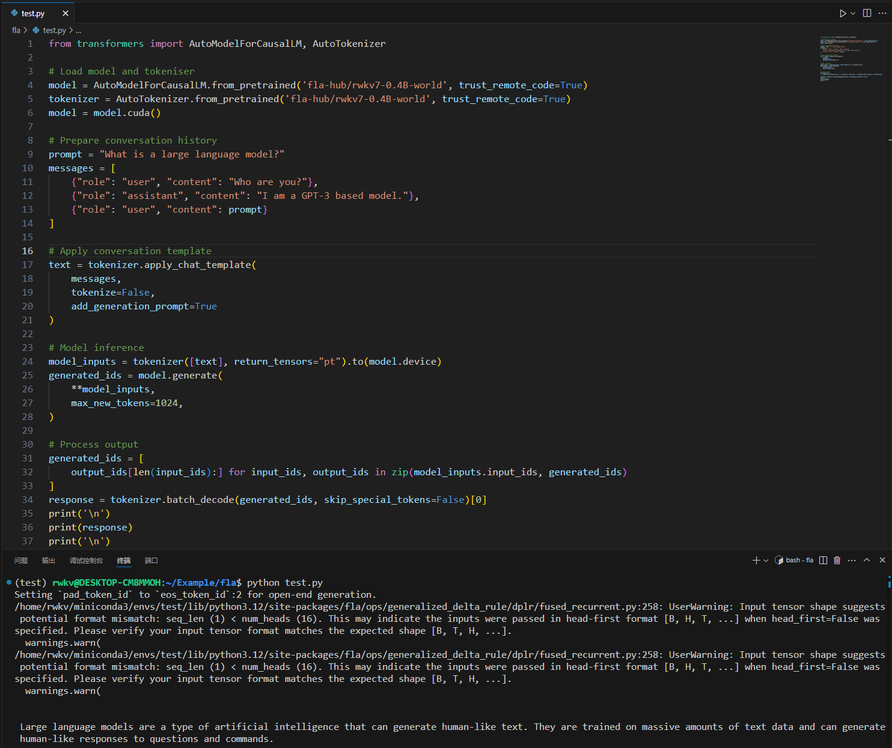

# RWKV-FLA User Guide

::: tip
RWKV-FLA is a high-performance inference and training framework specifically designed for the RWKV model series, leveraging Triton kernels to accelerate RWKV model performance.
:::

## Features and Benefits

- **Cross-Platform Support**: Supports various hardware backends, including NVIDIA, Intel, AMD, Moore Threads, and MuxiAI
- **High-Performance Implementation**: Optimised with Triton kernels, delivering efficient computational performance
- **Flexible API**: Provides user-friendly interfaces that easily integrate with existing code
- **Precision and Stability**: Verified on NVIDIA 4090, H100, and Intel A770

## Installation Guide

::: tabs
@tab Consumer-grade GPUs (Recommended)

For consumer-grade GPUs (5090 and below), we recommend using the stable version of Triton;

Run the following commands in sequence to install RWKV-FLA and related dependencies:

```bash
# Create a new environment (recommended)
conda create -n rwkv-fla python=3.12
# Enter the newly created environment
conda activate rwkv-fla
# Install related dependencies
pip3 install torch torchvision torchaudio --upgrade
# Install the latest version of RWKV-FLA
pip install --upgrade rwkv-fla
```

::: tip
We recommend using mainstream Linux distributions. Windows and Mac systems have many more complex configurations and are not recommended.

@tab High-performance GPUs

Triton nightly is the latest testing version of Triton. The nightly version with new syntax offers a 13% improvement in end-to-end performance. However, it has not undergone large-scale testing and may contain bugs.

To use the Triton nightly version, we recommend creating a brand new environment following these steps:

```bash
# Create a new environment (recommended)
conda create -n triton-nightly python=3.12
conda activate triton-nightly

# Install PyTorch nightly (required for compatibility with Triton nightly)
pip install -U --pre torch --index-url https://download.pytorch.org/whl/nightly/cu126

# Install Triton nightly
pip uninstall triton pytorch-triton -y
pip install -U triton-nightly --index-url http://pypi.fla-org.com/simple --trusted-host pypi.fla-org.com

# Install flash-linear-attention
pip install einops ninja datasets transformers numpy
pip uninstall flash-linear-attention && pip install -U --no-use-pep517 git+https://github.com/fla-org/flash-linear-attention --no-deps

# Optional: Install flash-attention
conda install nvidia/label/cuda-12.6.3::cuda-nvcc
pip install packaging psutil ninja
pip install flash-attn --no-deps --no-cache-dir --no-build-isolation
```

:::

## Model Inference Example

Using RWKV-FLA for model inference is quite straightforward, similar to using the Hugging Face Transformers library;

Below is a test code snippet that you can copy to any `.py` file and run using the `python` command:

```python copy
from transformers import AutoModelForCausalLM, AutoTokenizer

# Load model and tokeniser
model = AutoModelForCausalLM.from_pretrained('fla-hub/rwkv7-0.4B-world', trust_remote_code=True)
tokenizer = AutoTokenizer.from_pretrained('fla-hub/rwkv7-0.4B-world', trust_remote_code=True)
model = model.cuda()

# Prepare conversation history
prompt = "What is a large language model?"
messages = [
    {"role": "user", "content": "Who are you?"},
    {"role": "assistant", "content": "I am a GPT-3 based model."},
    {"role": "user", "content": prompt}
]

# Apply conversation template
text = tokenizer.apply_chat_template(
    messages,
    tokenize=False,
    add_generation_prompt=True
)

# Model inference
model_inputs = tokenizer([text], return_tensors="pt").to(model.device)
generated_ids = model.generate(
    **model_inputs,
    max_new_tokens=1024,
)

# Process output
generated_ids = [
    output_ids[len(input_ids):] for input_ids, output_ids in zip(model_inputs.input_ids, generated_ids)
]
response = tokenizer.batch_decode(generated_ids, skip_special_tokens=False)[0]
print('\n')
print(response)
print('\n')
```

If installed correctly, running the code will output content as shown in the image below:



::: tip
This example uses RWKV7-World-0.4B, but many other models are available. For details, please visit [https://huggingface.co/fla-hub](https://huggingface.co/fla-hub).
:::

## Using RWKV Components

RWKV-FLA provides various components that can be used individually to build custom model architectures.

### Using RWKV7 Attention Layer

```python
from rwkvfla.layers.rwkv7 import RWKV7Attention

attention_layer = RWKV7Attention(
    mode=config.attn_mode,
    hidden_size=config.hidden_size,
    head_dim=config.head_dim,
    num_heads=config.num_heads,
    decay_low_rank_dim=config.decay_low_rank_dim,
    gate_low_rank_dim=config.gate_low_rank_dim,
    a_low_rank_dim=config.a_low_rank_dim,
    v_low_rank_dim=config.v_low_rank_dim,
    norm_eps=config.norm_eps,
    fuse_norm=config.fuse_norm,
    layer_idx=layer_idx,
    value_dim=config.value_dim[layer_idx],
    num_hidden_layers=config.num_hidden_layers
)
```

### Using RWKV7 Feed-Forward Network

```python
from rwkvfla.models.rwkv7.modeling_rwkv7 import RWKV7FeedForward

ffn_layer = RWKV7FeedForward(
    hidden_size=config.hidden_size,
    hidden_ratio=config.hidden_ratio,
    intermediate_size=config.intermediate_size,
    hidden_act=config.hidden_act,
    layer_idx=layer_idx,
    num_hidden_layers=config.num_hidden_layers
)
```

## Common Issues and Solutions

### MMA Assertion Error on H100

**Error Message**:

```bash
Assertion `!(srcMmaLayout && dstMmaLayout && !srcMmaLayout.isAmpere()) && "mma -> mma layout conversion is only supported on Ampere"' failed.
```

**Solution**:
This issue has been fixed in [PR #4492](https://github.com/triton-lang/triton/pull/4492). Please install the nightly version as per the installation guide above.

### 'NoneType' Object Has No 'start' Attribute

**Solution**:
This is a known issue ([triton-lang/triton#5224](https://github.com/triton-lang/triton/issues/5224)). Please upgrade to Python 3.10 or higher.

### LinearLayout Assertion Error on H100

**Error Message**:

```bash
mlir::triton::LinearLayout::reshapeOuts(...) failed.
```

**Solution**:
This is a known issue ([triton-lang/triton#5609](https://github.com/triton-lang/triton/issues/5609)). Please install the latest version as per the solution for the MMA assertion error above.

## Important Notes

- Although RWKV-FLA supports multiple hardware platforms, it has currently been fully verified only on NVIDIA 4090, H100, and Intel A770
- If you encounter platform-specific issues (such as Triton version, precision anomalies, etc.), it is recommended to report them to the respective hardware manufacturer first
- Direct calls to underlying computational kernels are not recommended unless you have special requirements and are fully familiar with the code implementation

## Version Requirements

- Triton 3.2.0 and above versions are recommended
- The Triton nightly version is especially recommended for access to the latest features and bug fixes