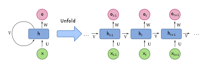
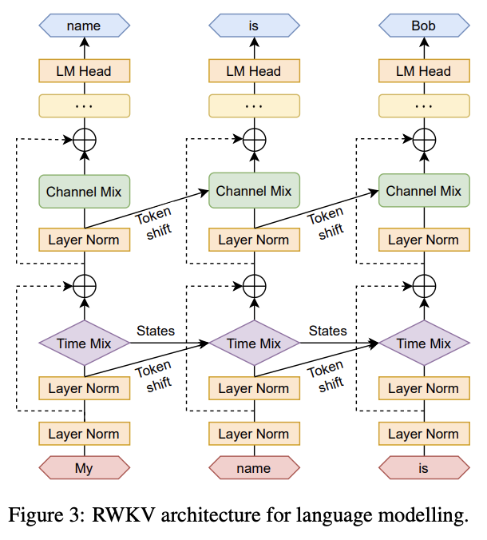

# RWKV Architecture

::: tip
If you are not not familiar machine learning, I would highly recommend [Andrej Karpathy series on neural networks](https://www.youtube.com/watch?v=VMj-3S1tku0&list=PLAqhIrjkxbuWI23v9cThsA9GvCAUhRvKZ&ab_channel=AndrejKarpathy) - that would help provide a good foundation on various neural network architectures concepts.
:::

## What is a classic RNN network? / What is the hidden state?

An RNN network is a time of AI neural network, in its simplest form. Uses a hiddenstate, which is constantly being updated by a function, as it processes each input token, while predicting the next token (if needed)

As each token gets completed, it is used to feedback into the RNN network to update its state, and predict the next token.

Looping until the target completion state is reached.

This hidden state can be viewed as the AI models "state of mind"

RWKV can be viewed as a modified varient of RNN

## How does RWKV differ from classic RNN?

RNN traditionally, due to its sequential nature, of needing to fully process one token and its hidden state before the next token. Is hard to parallize and train with GPUs. Making them difficult to train at scale for Large Language Models.

RWKV mitigate this issue, by splitting the full RNN network into multiple smaller layers. Where each layer's hidden state can be used independently to compute the next token hidden state for the same layer.

This allow for the next token states to be computed partially in parallel, while awaiting the complete calculation of the first hidden state. In a cascading like pattern.

The follow gif, illustrates the parallel cascading nature over approximately 3 layers (height) and 25 tokens (width)

Effectively, allowing the RNN network to run like a transformer network, when rolled out side by side. Where it can be trained "like a transformer" and "executed like an RNN" (the best of both worlds)

All of this while achieved by using a combination of token shifting, channel and time mixing, to replace LSTM and compute the next layer / hidden state.

> Note the cascading digram is the theoretical optimal, in practise some trainers and/or inference implementation may batch the cascade to chunks of tokens (32/64/128/256/512), to reduce VRAM lookup and latency, and improve overall performance.

## What is channel / time mixing, explain it in simple terms?

Channel mixing is the process where the next token being generated is mixed with the previous state output of the previous layer, to update this "state of mind". Because it is unable to read its own channel mix layer output state from the previous iteration. Information in channel mixing can only flow upwards through the layer, step by step. - an analogy to this is to view it as short-term, accurate memory.

Time mixing is a similar process, but it allows the model to retain part of the previous state of mind, allowing it to choose and store state information, over a longer period of time, chosen by the model. This is trained by the model, which may allow it to retain data from the past indefinitely, if it was trained to do so - an analogy to his is to view it as longer-term, lower accuracy memory.

Because the current token, is able to read data from the past state via both channel and time mixing, in various forms. This provides an alternative to "attention" models. 

Where key information is stored in the hidden state (decided by the model weights), across the various layers, and is read against the current token. With various effects applied, as per its training. 

Effectively providing a form of "trained attention" of the past tokens (stored inside the hidden state), against the current token.

> PS: the above is an inaccurate oversimplification, read the paper / links below for deeper details

## How does WKV works? / I want the nitty-gritty, where do I find it?

A good starting point, is to look into [RWKV in 150 lines of code](https://github.com/BlinkDL/ChatRWKV/blob/main/RWKV_in_150_lines.py), which is a good starting point to understand the core concepts of RWKV. 

You can find the 150 lines explained in more details at the following two [blog post here](https://johanwind.github.io/2023/03/23/rwkv_details.html) [and here](https://github.com/uasi/rwkv-in-150-lines-ex)

Alternatively, you can study it up via the [RWKV paper](https://arxiv.org/abs/2305.13048)

Or watch [Yannic Kilcher break the paper down step by step on youtube](https://www.youtube.com/watch?v=x8pW19wKfXQ&pp=ygUEUldLVg%3D%3D)

If you would like a breakdown on the math involved, you can find it covered in a blog post here: [https://ben.bolte.cc/rwkv](https://ben.bolte.cc/rwkv)

Finally once you gotten a grasp on the fundemantals, you can start studying the training and cuda code respectively in the [main repo](https://github.com/BlinkDL/RWKV-LM)

**Additional links/resources**
- RWKV model math: [https://ben.bolte.cc/rwkv-model](https://ben.bolte.cc/rwkv-model)
- RWKV explained: [https://fullstackdeeplearning.com/blog/posts/rwkv-explainer/](https://fullstackdeeplearning.com/blog/posts/rwkv-explainer/)
- How RWKV works: [https://johanwind.github.io/2023/03/23/rwkv_details.html](https://johanwind.github.io/2023/03/23/rwkv_details.html)
- RWKV training cost estimate (outdated): [https://johanwind.github.io/2023/03/23/rwkv_overview.html](https://johanwind.github.io/2023/03/23/rwkv_overview.html)

