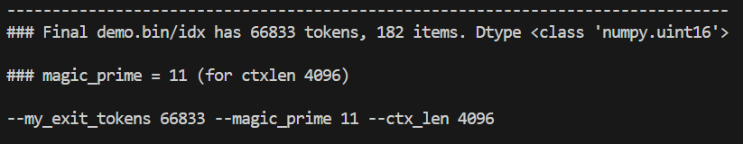
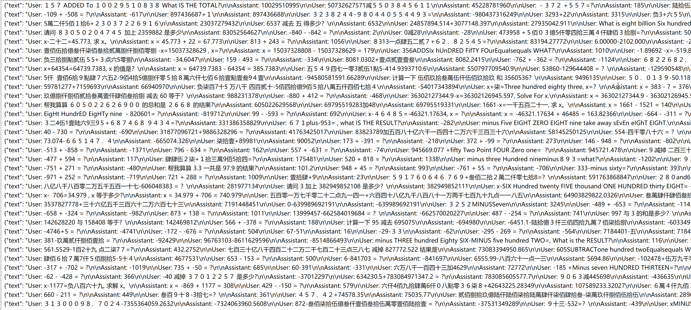
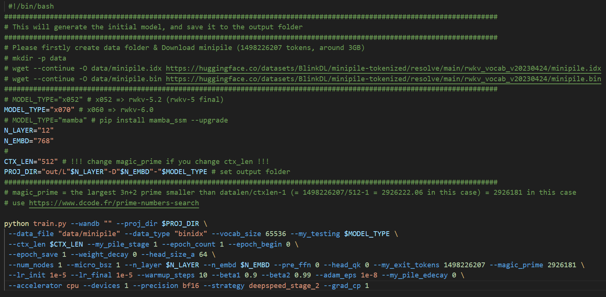
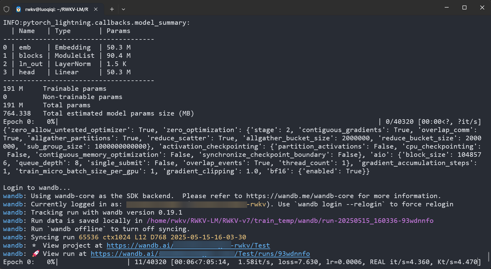
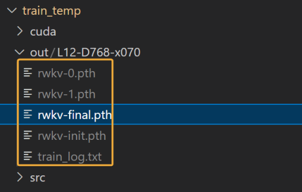
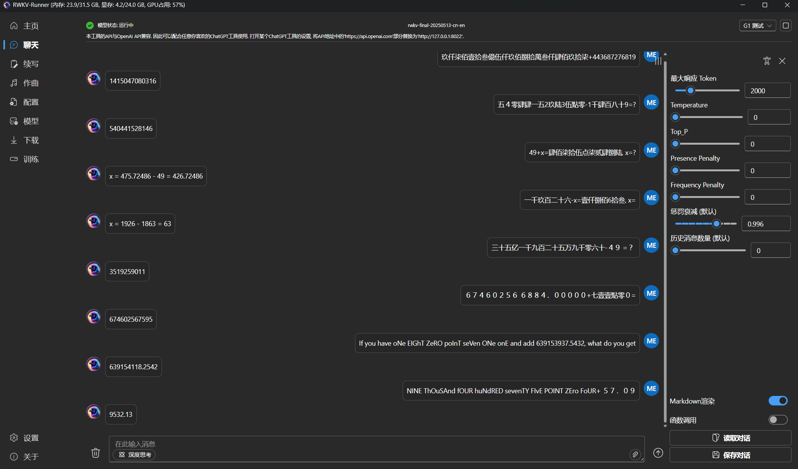
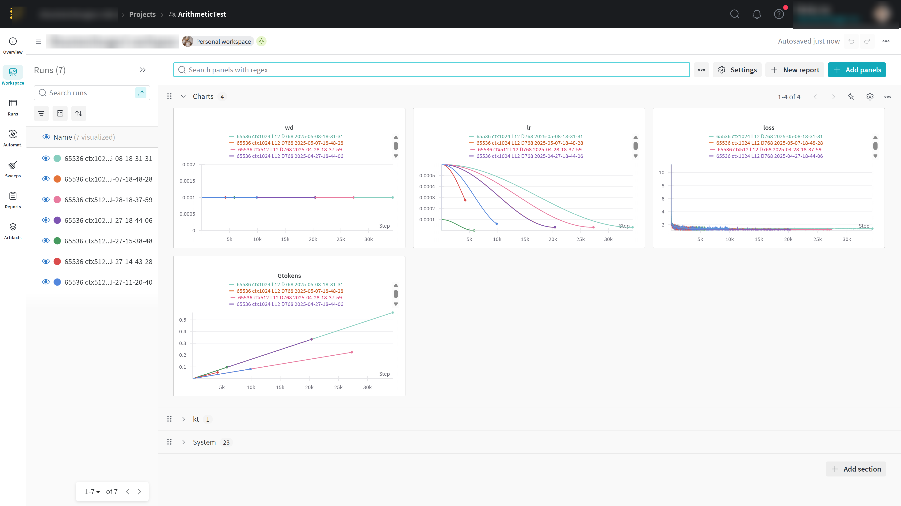

# RWKV-LM Pre-training Tutorial

This pre-training tutorial is based on the [RWKV-LM](https://github.com/BlinkDL/RWKV-LM) repository. The training process is identical to that of the official RWKV models.

## Pre-training Example

- [RWKV-7-Arithmetic-0.1B](https://huggingface.co/shoumenchougou/RWKV-7-Arithmetic-0.1B): A 0.1B model pre-trained on the RWKV-7 architecture, capable of performing basic addition/subtraction operations and solving addition/subtraction equations.

## Hardware Requirements

The VRAM required for pre-training is **significantly higher** than for fine-tuning.

The following table shows the VRAM required to pre-train RWKV models of different parameter sizes with `M_BSZ="1"` and `CTX_LEN="4096"`:

| Model Parameters | Layers | Dimension | VRAM Requirement                             |
| ---------------- | ------ | --------- | -------------------------------------------- |
| 0.1B             | 12     | 768       | 6540MB (6.39GB) / BSZ=8 23634MB (23.08GB)      |
| 0.4B             | 24     | 1024      | 12414MB (12.12GB) / BSZ=6 23046MB (22.51GB)    |
| 1.5B             | 24     | 2048      | 42104MB (41.12GB)                            |
| 3B               | 32     | 2560      | 91354MB (89.21GB)                            |
| 7B               | 32     | 4096      | 4*4090 OOM                                   |
| 14B              | 61     | 4096      | 4*4090 OOM                                   |

## Clone the Repository

```bash
git clone https://github.com/BlinkDL/RWKV-LM.git
```
Unable to clone? Copy and run the following command to download and extract the RWKV-LM repository as a zip archive:

```bash
wget -O rwkv.zip https://github.com/BlinkDL/RWKV-LM/archive/refs/heads/main.zip && \
unzip -q rwkv.zip && \
mv RWKV-LM-main RWKV-LM && \
rm rwkv.zip
```
::: warning
A repository downloaded as a zip file does not contain git information, so you cannot use `git pull` to update it.
:::

## Prepare the Training Environment

Please refer to [RWKV Traing Environment](./training-enviroment.md) to configure a Conda environment, and then install the following software in the new environment:

``` bash copy
# Install the CUDA 12.1 version of torch via a specific URL, or you can choose the latest version of torch + your CUDA version.
pip install torch --upgrade --extra-index-url https://download.pytorch.org/whl/cu121
# Install version 1.9.5 of PyTorch Lightning and other common machine learning toolkits.
# The --upgrade flag means that if the corresponding package is already installed, it will be upgraded.
pip install pytorch-lightning==1.9.5 deepspeed wandb ninja --upgrade
```

After installation, use the following command to verify the PyTorch and CUDA versions:

```bash
python -c "import torch; print(torch.__version__, torch.cuda.is_available())"
```

The output `2.5.1+cu121 True` indicates that PyTorch 2.5.1 for CUDA 12.1 is installed and the CUDA 12.1 toolkit is available.

## Prepare the Training Data

Please refer to the [Prepare Training Data](./training-datasets.md) document to prepare a pre-training dataset in `jsonl` format and place it in the `RWKV-LM/RWKV-v5` directory.

In the `RWKV-LM/RWKV-v5` directory, run the following command to convert the `jsonl` data file to `binidx` format:

``` bash
python make_data.py demo.jsonl 30 4096
```

In the command, `30` represents the number of duplications, and `4096` is the context length. `make_data.py` will perform the following operations:

- Duplicate and shuffle `demo.jsonl` 30 times.
- Load the duplicated `demo.jsonl` and tokenize it based on the `rwkv_vocab_v20230424` vocabulary.
- Save the data in `binidx` format as two files: `demo.bin` and `demo.idx`.
- Calculate the `my_exit_tokens` and `magic_prime` parameters required for pre-training, based on the 4096 context length.



::: warning
Be sure to save the `--my_exit_tokens` and `--magic_prime` parameters from the command line output. **These parameters will be used frequently in subsequent pre-training steps.**
:::

::: tip
In this example, we will use a **multi-turn dialogue dataset for addition and subtraction**, which includes a mix of Chinese/uppercase Chinese, English, half-width/full-width Arabic numerals, positive/negative numbers, and decimals, to pre-train an RWKV-7 0.1B arithmetic model.


:::

## Initialize the RWKV Model

::: tip
Before starting pre-training, we need to initialize an RWKV model to serve as a starting point.
:::

Open the `demo-training-prepare.sh` script in the `RWKV-LM/RWKV-v7/train_temp` directory with a text editor and modify the following initialization parameters:

| Parameter                  | Explanation                                                                                                                                                                             |
| -------------------------- | --------------------------------------------------------------------------------------------------------------------------------------------------------------------------------------- |
| `MODEL_TYPE="x070"`        | The **model version** to train. It's recommended to use the RWKV-7 architecture. For RWKV-6, use `x060`.                                                                                   |
| `N_LAYER="12"` `N_EMBD="768"` | **Model layers and dimension**. These determine the parameter size of the pre-trained model. It is recommended to modify them based on the [Hardware Requirements](#hardware-requirements). `N_EMBD` must be a multiple of 64. |
| `CTX_LEN="4096"`           | The **context length** for pre-training. It must be a multiple of 512. A length of 4096 is recommended for better support of multi-turn dialogues.                                         |
| `data_file`                | The **path to the pre-training data**. Use the converted bin and idx data, without the file extension.                                                                                    |
| `--my_exit_tokens`         | The **total number of tokens** in the training dataset. The training will exit after all tokens have been processed. This value is calculated by `make_data.py`.                           |
| `--magic_prime`            | The **magic_prime value** for the training dataset. This value is calculated by `make_data.py`.                                                                                           |

Please **keep the remaining parameters at their default values**. After modifying and saving the `demo-training-prepare.sh` file, run the `sh demo-training-prepare.sh` command in the terminal to initialize the RWKV model.



## Pre-training Stage

### Adjust Training Parameters

After initialization, open the `demo-training-run.sh` script in the `RWKV-LM/RWKV-v7/train_temp` directory with a text editor and modify the training parameters.

**These training parameters must be consistent with the initialization stage:**

| Parameter                  | Explanation                                                                                                                                                                             |
| -------------------------- | --------------------------------------------------------------------------------------------------------------------------------------------------------------------------------------- |
| `MODEL_TYPE="x070"`        | The **model version** to train. It's recommended to use the RWKV-7 architecture. For RWKV-6, use `x060`.                                                                                   |
| `N_LAYER="12"` `N_EMBD="768"` | **Model layers and dimension**. These determine the parameter size of the pre-trained model. It is recommended to modify them based on the [Hardware Requirements](#hardware-requirements). `N_EMBD` must be a multiple of 64. |
| `CTX_LEN="4096"`           | The **context length** for pre-training. It must be a multiple of 512. A length of 4096 is recommended for better support of multi-turn dialogues.                                         |
| `data_file`                | The **path to the pre-training data**. Use the converted bin and idx data, without the file extension.                                                                                    |
| `--my_exit_tokens`         | The **total number of tokens** in the training dataset. The training will exit after all tokens have been processed. This value is calculated by `make_data.py`.                           |
| `--magic_prime`            | The **magic_prime value** for the training dataset. This value is calculated by `make_data.py`.                                                                                           |

**The explanations and reference values for other training parameters are as follows:**
::: warning
Some parameters will affect VRAM usage and training speed. Before modifying them, please ensure you correctly understand their meaning.
:::

| Parameter                      | Explanation                                                                                                                                                                            |
| ------------------------------ | -------------------------------------------------------------------------------------------------------------------------------------------------------------------------------------- |
| `PROJ_DIR`                     | Model output directory. Must be consistent with the initialization stage. It's recommended to keep the default.                                                                          |
| `M_BSZ=16`                     | Recommended to be a power of 2. Set it as large as your VRAM allows.                                                                                                                   |
| `LR_INIT="6e-4"`               | **Initial learning rate. The formula is `0.45 / N_EMBD`, rounded appropriately.** For example, for an L12-D768 0.1B model, the initial learning rate is `0.45/768=0.0005859375`, which is rounded to `6e-4`. |
| `LR_FINAL="6e-5"`              | **Final learning rate. The formula is `0.04 / N_EMBD`, rounded appropriately.**                                                                                                          |
| `GRAD_CP=1`                    | Gradient checkpointing. `GRAD_CP=1` saves VRAM. `GRAD_CP=0` is faster but consumes more VRAM.                                                                                           |
| `epoch_steps`                  | Does not exist as a parameter. It is automatically calculated based on `M_BSZ` and other parameters. The formula is `epoch_steps = 40320 / M_BSZ / N_NODE / GPU_PER_NODE`.                   |
| `N_NODE=1`                     | Number of nodes. Usually kept at the default value of `1`.                                                                                                                               |
| `GPU_PER_NODE=1`               | Number of GPUs per node. Use `1` for a single GPU, or change to the actual number for multiple GPUs.                                                                                    |
| `DS_BUCKET_MB=2`               | DeepSpeed bucket size (in MB). Set to `2` for consumer-grade GPUs, and `200` for A100 / H100.                                                                                            |
| `--load_model "0"`             | Keep the default value `0`. If training is interrupted, it will automatically detect the latest checkpoint to resume.                                                                     |
| `--wandb "Test"`               | **It is recommended to register a WandB account and enter your project name to observe and compare the loss. For details, see the appendix [Monitoring Training with WandB](#monitoring-training-with-wandb).** |
| `--train_stage 3`              | Pre-training stage. Keep the default value `3`.                                                                                                                                        |
| `--epoch_count 999999`         | Total number of epochs. This parameter is not effective. The training process will automatically exit after reaching the number of tokens specified by `--my_exit_tokens`.                   |
| `--epoch_begin 0`              | Initial training epoch. Always set to `0`. It will automatically load the latest checkpoint.                                                                                             |
| `--warmup_steps 10`            | Warmup steps. Should be experimented with based on the chosen optimizer and learning rate.                                                                                               |
| `--beta1 0.9`                  | Adam optimizer beta1 parameter. Keep the default value.                                                                                                                                  |
| `--beta2 0.99`                 | Adam optimizer beta2 parameter. Keep the default value.                                                                                                                                  |
| `--adam_eps 1e-18`             | Adam optimizer epsilon parameter. A smaller epsilon is more stable. Keep the default value.                                                                                              |
| `--data_type binidx`           | File format of the training corpus. It's recommended to use data in `binidx` format, as support for other formats has not been fully verified.                                            |
| `--vocab_size 65536`           | Vocabulary size, default is `65536`. Set to 0 for the model to automatically determine the vocabulary size, suitable for char-level LM and `.txt` data.                                 |
| `--weight_decay 0.001`         | Weight decay. Keep the default value `0.001`.                                                                                                                                            |
| `--head_size 64`               | Head size. Keep the default value `64`.                                                                                                                                                |
| `--accelerator gpu`            | Accelerator type. Must be `gpu`.                                                                                                                                                       |
| `--precision bf16`             | Training precision. Default is `bf16`, also supports `fp32`, `tf32`.                                                                                                                     |
| `--strategy deepspeed_stage_2` | **Training strategy, default is `deepspeed_stage_2`**. For more strategies, please refer to [DeepSpeed Training Strategies](#deepspeed-training-strategies).                               |
| `--enable_progress_bar True`   | Whether to display a progress bar in the terminal. Usually kept at the default value `True`.                                                                                             |

### Start Pre-training

After adjusting the training parameters, save the `demo-training-run.sh` file and run the `sh demo-training-run.sh` command in the `RWKV-LM/RWKV-v7/train_temp` directory to start pre-training.

If you configured `--wandb "Test"` in the training parameters, you can access the WandB link (`https://wandb.ai/xxx`) provided in the terminal after starting the training to visually inspect the current loss curve and other information.



## Test the Pre-trained Model

After pre-training is complete, you can find the intermediate checkpoints `rwkv-0/1/2/...pth` and the final model file `rwkv-final.pth` in the `RWKV-LM/RWKV-v7/train_temp/out` directory.



You can use [RWKV Runner](../basic/how-to-play.html#rwkv-runner) or the [RWKV pip - API_DEMO_CHAT.py](../inference/RWKVpip.html) script to test the pre-trained model. In addition to the final model file `rwkv-final.pth`, you can also test the last few model checkpoints.




### DeepSpeed Training Strategies

DeepSpeed supports the following five [training strategies](https://www.deepspeed.ai/tutorials/zero/#zero-overview):

| Strategy Name               | VRAM Usage | CPU Usage | Training Speed | Applicable GPU Scenario                 | Description                                       |
| --------------------------- | ---------- | --------- | -------------- | --------------------------------------- | ------------------------------------------------- |
| `deepspeed_stage_1`         | High       | Low       | Fast           | High-end GPUs with ample VRAM           | Basic version, highest VRAM usage.                |
| `deepspeed_stage_2`         | Medium     | Low       | Fast           | Consumer-grade high-end GPUs (e.g., 3090) | Best balance between VRAM and speed.              |
| `deepspeed_stage_2_offload` | Low        | Medium    | Medium         | Machines with medium VRAM and a decent CPU | Reduces VRAM usage but is slightly slower.        |
| `deepspeed_stage_3`         | Low        | Medium    | Medium         | Low VRAM, requires partitioning large models | Supports extremely large models, complex configuration. |
| `deepspeed_stage_3_offload` | Lowest     | High      | Slow           | Low VRAM + high-performance CPU         | Most VRAM-efficient, but requires high CPU performance. |

**`deepspeed_stage_2` is the best compromise, considering VRAM savings, training performance, and ease of deployment.**

References:

- [DeepSpeed Zero Redundancy Optimizer](https://www.deepspeed.ai/tutorials/zero/#zero-overview)
- [DeepSpeed ZeRO-Offload](https://www.deepspeed.ai/tutorials/zero-offload/)
- [DeepSpeed ZeRO-3 Offload](https://www.deepspeed.ai/2021/03/07/zero3-offload.html)

### Monitoring Training with WandB

::: tip
WandB is a tool for experiment tracking and model evaluation, which helps us better monitor the training process and loss data.
:::

**To monitor the training process with WandB:**

1. Visit the [WandB official website](https://wandb.ai) and click the "Sign up" button to register an account (you can sign up with email, GitHub, Google, etc.).
2. After successful registration, click on your profile picture in the top right corner to go to the “Settings” page. In the “API Keys” section, click “+ New Key” to create a new API Key and copy it.
3. On your training machine, open a terminal and run the `wandb login` command. Paste the API Key you copied and press Enter to confirm.
4. Add the `--wandb "Test"` parameter to your training script. The training logs will be uploaded to your WandB project page under the project name 'Test'.
5. You can click on this project on your WandB dashboard to view real-time metrics such as the loss curve, learning rate changes, and more.



### FAQ

::: details **Training was interrupted. How can I resume?**
Simply re-run the `sh demo-training-run.sh` command. The training script will automatically detect the latest checkpoint and resume training.

Note that frequent interruptions can cause a small increase in loss (approximately 0.0008 per interruption).
:::

::: details **Training is too slow. How can I speed it up?**
Increase the `M_BSZ` parameter as much as your VRAM allows. A larger `M_BSZ` uses more VRAM but also speeds uptraining.

Use the `deepspeed_stage_2` training strategy, which offers the best balance between VRAM and speed.
Enable gradient checkpointing (`GRAD_CP=1`) to save VRAM. Disabling it (`GRAD_CP=0`) can be faster but consumes more VRAM.
:::

::: details **Getting an `AssertionError` or `IndexError: list index out of range` error.**

- Confirm that an `rwkv-init` model has been initialized.
- Check if the `data_file` parameter is correct, ensuring the data file path exists and is accessible.
- Check if the `CTX_LEN` parameter matches the context length used when running `make_data.py`.
- Check if the `my_exit_tokens` and `magic_prime` parameters match the values obtained from `make_data.py`.
:::
