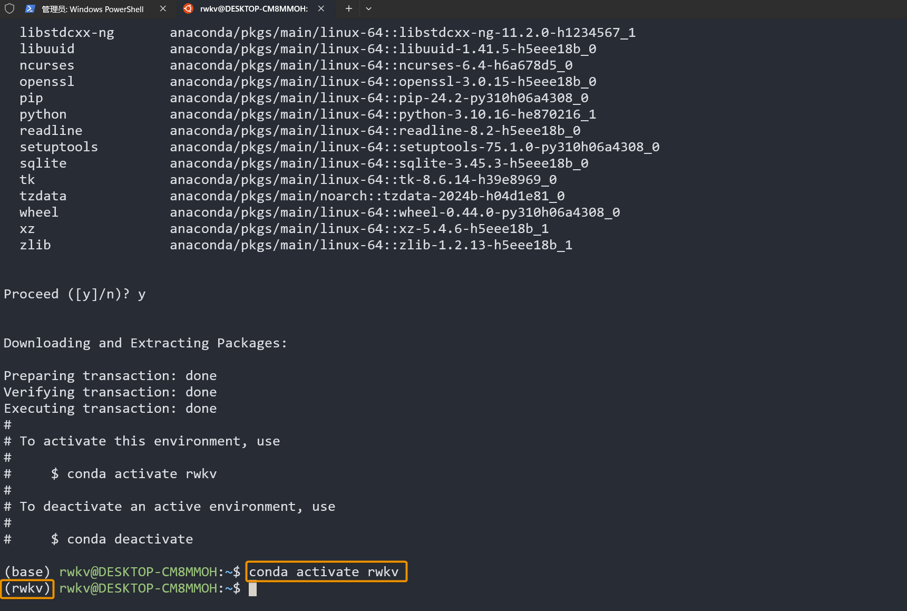
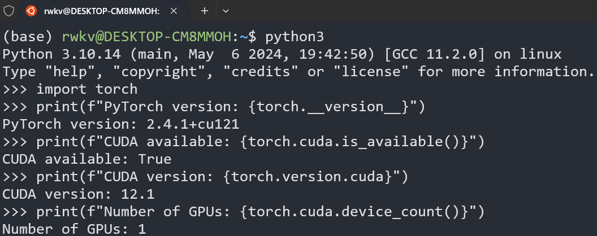

#  RWKV Training Environment

To train the RWKV model, please first follow the steps below to configure the training environment for your Linux system.

### Configure the Conda Virtual Environment

The recommended virtual environment for training the RWKV model is Conda. Here, we take MiniConda as an example to introduce how to configure the Conda environment on a Linux system.

In your Linux or WSL workspace, run the following commands in sequence:

```bash copy
# Download the latest MiniConda installation package
wget https://repo.anaconda.com/miniconda/Miniconda3-latest-Linux-x86_64.sh
# Run the installation script of the MiniConda installation package. Pay attention to the progress during the installation and enter "yes" in time!
sh Miniconda3-latest-Linux-x86_64.sh -u
# Restart the environment variables and activate the Conda environment
source ~/.bashrc
```

At this point, we are in the default `base` environment of Conda. To avoid software version conflicts, we need to create and activate a new Conda environment named `rwkv`. Run the following commands in sequence:

```bash copy
# Create a Conda environment named rwkv and specify the Python version as 3.10
conda create -n rwkv python=3.10
# Activate the rwkv environment
conda activate rwkv
```



So far, we have configured the Conda environment required for RWKV training.

### Install the Software Required for Training

To achieve the **best training performance** of the RWKV model, it is recommended to install the following software:

- torch 2.1.2+cu121 (or the latest version of torch)
- The latest deepspeed
- pytorch-lightning ==1.9.5

Run the following commands in sequence in the Conda environment of the terminal to install the RWKV training environment:

```bash copy
# Install the CUDA 12.1 version of torch by specifying the URL
pip install torch --upgrade --extra-index-url https://download.pytorch.org/whl/cu121
# Specify to install the 1.9.5 version of PyTorch Lightning and other commonly used machine learning toolkits
# The --upgrade parameter means that if the corresponding software package is already installed in the environment, it will be upgraded to the latest version
pip install pytorch-lightning==1.9.5 deepspeed wandb ninja --upgrade
# The following are some other toolkits that will be used when training with RWKV-PEFT. It is recommended to install them in advance
pip install bitsandbytes einops triton rwkv-fla rwkv transformers GPUtil plotly gradio datasets
```

::: tip
The recommended software versions are the best practices for RWKV training. You can also choose to install other versions of the software as long as compatibility is ensured.
:::

### Check the CUDA Environment

After the above dependencies are installed, you should have installed the latest version of Torch and the CUDA 12.1 toolkit at the same time.

Run the following commands in sequence to check the PyTorch version and whether the CUDA tool is available:

```python
python3 # Start python3

import torch # Import the torch package

# Print the PyTorch version
print(f"PyTorch version: {torch.__version__}") 
# Check if CUDA is available
print(f"CUDA available: {torch.cuda.is_available()}")
# Print the CUDA version
print(f"CUDA version: {torch.version.cuda}")
# Print the number of available GPUs
print(f"Number of GPUs: {torch.cuda.device_count()}")
```

If the command `print(f"CUDA available: {torch.cuda.is_available()}")` returns `CUDA available: True`, it proves that the CUDA environment is available:



If it returns `False`, use the command `print(f"CUDA version: {torch.version.cuda}")` to check if the CUDA version of torch is correctly installed.

If the CUDA version of torch is installed and it still returns `CUDA available: True`, you may need to reinstall the CUDA environment (it is recommended to use CUDA 12.1 or a later version). For the installation steps, please refer to the [**CUDA Toolkit Installation Documentation**](https://developer.nvidia.com/cuda-downloads).
