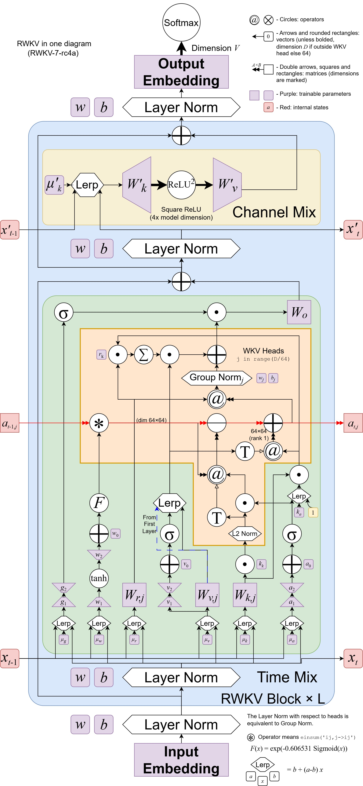

# RWKV Introduction

RWKV (pronounced RWaKuV) is an RNN with GPT-level large language model (LLM) performance, and can be trained directly like a GPT Transformer (parallelizable).

RWKV combines the best features of RNN and Transformer: excellent performance, constant memory usage, constant inference generation speed, "infinite" ctxlen, and free sentence embeddings, and is 100% free of self-attention mechanisms.

The RWKV project was initially proposed by Bo Peng (BlinkDL), and as the project gained attention, it gradually developed into an open-source community.

On September 20, 2023, the RWKV open-source project officially joined the Linux Foundation. Today, the RWKV project is an open-source non-profit organization under the Linux Foundation, with some computing power previously supported by sponsors.

## RWKV Architecture and Papers

The RWKV model architecture has four official versions: RWKV-4, RWKV-5 (code-named Eagle), RWKV-6 (code-named Finch), and RWKV-7 (code-named Goose). Earlier versions RWKV 1/2/3 were experimental.

RWKV-4 is the first official version of the RWKV model. The paper was co-authored by Bo Peng and the RWKV community and was first published on May 22, 2023. In October of the same year, the RWKV-4 architecture paper was accepted by [EMNLP 2023](https://2023.emnlp.org/program/accepted_findings/).

- **RWKV-4 Paper**: "RWKV: Reinventing RNNs for the Transformer Era"
- **Paper Link**: [arXiv:2305.13048](https://arxiv.org/abs/2305.13048)

RWKV 5/6 architectures have several improvements based on the RWKV-4 architecture. Therefore, these two architectures are published in the same paper.

- **RWKV 5/6 Paper**: "Eagle and Finch: RWKV with Matrix-Valued States and Dynamic Recurrence"
- **Paper Link**: [arXiv:2404.05892](https://arxiv.org/abs/2404.05892)

RWKV-7 is the latest version of the RWKV architecture. The training and inference code for the architecture has been finalized, and the architecture paper is being co-authored by Bo Peng and community members.

RWKV-7 adopts Dynamic State Evolution, surpassing the fundamental limitations of the $TC$0 expressive power of the attention/linear attention paradigm.

RWKV-7 architecture diagram:

RWKV-6 architecture diagram:

::: tip
The RWKV-6 architecture diagram was released by RWKV community developers under the CC-BY-SA license and can be found on [rwkv-wiki.fandom](https://rwkv.fandom.com/zh/wiki/RWKV-6%E6%9E%B6%E6%9E%84).
:::

## RWKV Model Version Status

Starting from the RWKV-4 architecture, RWKV has released open-source models of various parameter scales for each architecture version.

As of February 2025, the lifecycle of RWKV-4 and RWKV-5 models has ended. It is recommended to use the **latest RWKV-7-world models**. Thanks to the latest architectural design, RWKV-7 models perform better on all tasks.

| Version | RWKV-V4 | RWKV-v5-Eagle | RWKV-v6-Finch | RWKV-v7-Goose |
| --- | --- | --- | --- | --- |
| Paper | 🎓[Published](https://arxiv.org/abs/2305.13048) | 🎓[Published](https://arxiv.org/abs/2404.05892) | 🎓[Published](https://arxiv.org/abs/2404.05892) | **✍️ In Progress** |
| Overall Status | **⚠ EOL** | **⚠ EOL**| **✨ Stable** | **⚙️ In Training** |
| 0.4B Model | ✅ Released | ✅ Released | ❌ No Plan |✅ [Released](https://modelscope.cn/models/Blink_DL/rwkv-7-world/files) |
| 1.5B Model | ✅ Released | ✅ Released| ✅ [Released](https://hf-mirror.com/BlinkDL/rwkv-6-world/blob/main/RWKV-x060-World-1B6-v2.1-20240328-ctx4096.pth) |✅ [Released](https://modelscope.cn/models/Blink_DL/rwkv-7-world/files) |
| 3B Model | ✅ Released | ✅ Released | ✅ [Released](https://hf-mirror.com/BlinkDL/rwkv-6-world/blob/main/RWKV-x060-World-1B6-v2.1-20240328-ctx4096.pth) |✅ [Released](https://modelscope.cn/models/Blink_DL/rwkv-7-world/files) |
| 7B Model | ✅ Released | ✅ Released| ✅ [Released](https://hf-mirror.com/BlinkDL/rwkv-6-world/blob/main/RWKV-x060-World-7B-v2.1-20240507-ctx4096.pth) |**📅 Planned** |
| 14B Model | ✅ Released | ❌ No Plan | ✅ [Released](https://hf-mirror.com/BlinkDL/rwkv-6-world/blob/main/RWKV-x060-World-14B-v2.1-20240719-ctx4096.pth) |**📅 Planned** |
| MoE Model | ❌ No Plan | ❌ No Plan | ❌ No Plan | ❌ No Plan |

## Which RWKV Models Should I Use?

::: warning
Due to performance issues caused by outdated architectures, the entire RWKV-5, RWKV-4 series (Raven / World / Pile ...), and earlier RWKV versions have ended their lifecycle, and existing models are only for archival purposes.
:::

**Please use RWKV-7 series models**. RWKV-7 models are based on the latest RWKV-7 architecture and latest datasets, therefore offering better performance.

Since RWKV-7 7B and larger models are still in training, for 7B and larger parameter models, it is recommended to use the [RWKV-6-World-14B-V2.1](https://hf-mirror.com/BlinkDL/rwkv-6-world/blob/main/RWKV-x060-World-14B-v2.1-20240719-ctx4096.pth) model; if your hardware configuration is insufficient for using the 14B parameter model, you can consider using the [RWKV-6-World-7B-V3](https://hf-mirror.com/BlinkDL/rwkv-6-world/blob/main/RWKV-x060-World-7B-v3-20241112-ctx4096.pth) model.

::: tip
RWKV-7-World 7B/14B will replace the existing RWKV-6-World 7B/14B models once training is complete.
:::

## Differences Between RWKV and Transformer

### Advantages

- Lower resource usage during runtime and training (VRAM, CPU, GPU, etc.).
- **10 to 100 times lower computational requirements compared to Transformers with larger contexts**.
- Supports linear scaling to any context length (Transformers scale quadratically).
- Performs as well as Transformer architectures in terms of answer quality and generalization ability.
- RWKV models' training data includes languages other than English (e.g., Chinese, Japanese, etc.), offering better multilingual capabilities than most existing open-source models.

### Disadvantages

- RWKV base models are very sensitive to the format of prompts, and the format of prompts significantly affects the generation results.
- Due to architectural design, RWKV models are weaker in **tasks requiring retrospection**, so prompts need to be appropriately ordered. For example, provide task instructions to the model first, then provide the material text needed to perform the task.

## Basic Terminology of the RWKV Community

| Concept | Description |
| --- | --- |
| **RWKV** | The model architecture itself, training code can be found [here](https://github.com/BlinkDL/RWKV-LM). |
| **ChatRWKV** | The official chatbot of RWKV (similar to ChatGPT but based on RWKV), code can be found [here](https://github.com/BlinkDL/ChatRWKV). |
| **RWKV-4/5/6/7** | Different architecture versions of RWKV. Note that using the latest RWKV-7 series models is recommended. |
| **RWKV World** | The base RWKV model trained with global languages, covering a broader and more diverse dataset, including training data in over 100 languages and some instruction training. |
| **Raven** | The official fine-tuned version of the RWKV-4 base model, including instruction training. However, since the RWKV-4 series is no longer updated, it is not recommended for continued use. |
| **RWKV ABC/MIDI** | RWKV music models based on ABC/MIDI format |
| **RWKV CHNtuned / one-state-chat / role_play / novel ...** | Fine-tuned models provided by the RWKV community, optimized for specific tasks or data types. Please prioritize using RWKV-7 series fine-tuned models. |

## RWKV Model Naming Rules

RWKV models typically have two naming conventions:

- RWKV-x060-World-3B-v2.1-20240208-ctx4096.pth
- RWKV-5-World-1B5-v2-20231113-ctx4096.pth

The meaning of each field in the model name:

| Field | Meaning |
| --- | --- |
| **RWKV** | Model name |
| **x060 / 5** | RWKV model architecture, recommended to use RWKV-6 models |
| **World** | Model type, World indicates RWKV models trained with global languages, thus supporting multilingual tasks |
| **3B / 1B5** | Model parameter scale, "B" stands for "Billions" |
| **v2 / v2.1** | Model training set version, v2 ≈ 1.1 T , v2.1 ≈ 2.5T ,v3 ≈ 5.6T  |
| **20240208 / 20231113** | Model release date |
| **ctx4096** | Pre-trained context length |

## How Do RWKV Community Members Communicate?

We have a [Discord channel](https://discord.gg/bDSBUMeFpc)

## RWKV Sponsorship and Contributors

As an open-source project, RWKV has received significant GPU resources and research support from [Stability AI](https://stability.ai/) and [EleutherAI](https://www.eleuther.ai/).

Additionally, we would like to thank the following organizations or teams:

- [alpin @ pygmalionAI](https://pygmalion.chat/)
- [AutoMeta @ AlignmentLab](https://twitter.com/alignment_lab)
- [Recursal.AI](https://recursal.ai)
- And other anonymous supporters providing GPU resources

We also appreciate the hard work of RWKV community members, including those involved in RWKV architecture improvements, academic research using RWKV, building RWKV content, testing the latest models, and any other helpful work.