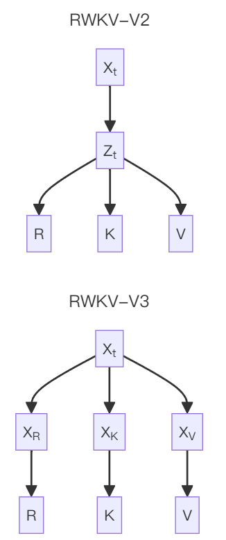
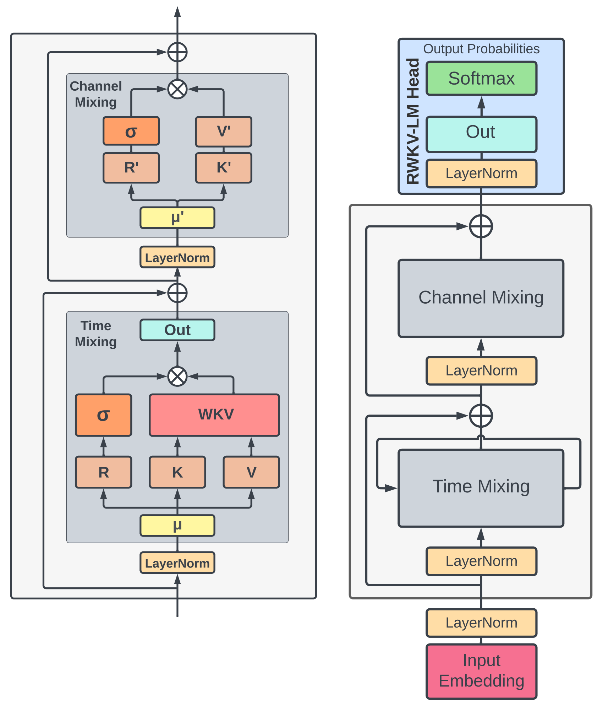
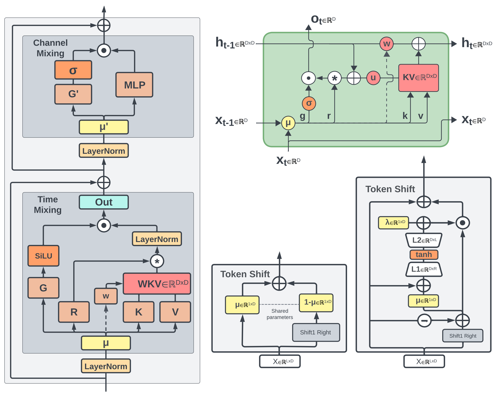

# RWKV Architecture History

::: tip
If you are not familiar with machine learning, I would highly recommend [Andrej Karpathy's series on neural networks](https://www.youtube.com/watch?v=VMj-3S1tku0&list=PLAqhIrjkxbuWI23v9cThsA9GvCAUhRvKZ&ab_channel=AndrejKarpathy) - that would help provide a good foundation on various neural network architecture concepts.
:::

The following is knowledge related to the RWKV architecture, including the origin of the RWKV architecture name, RWKV architecture features, architecture history, and model releases for each architecture.

**RWKV is a variant of RNN**. Therefore, it is necessary to first introduce: What is the RNN architecture, and what is the hidden state of the RNN architecture?

## RNN Architecture and Hidden State

Recurrent Neural Network (RNN) is a neural network model widely used in the field of deep learning.

During the operation of the RNN network, a hidden state (state) is maintained, which can be regarded as the "mental state" of the RNN model.  When humans think, the brain retains the "key information" most relevant to the current event. As the content of thinking changes, the "key information" in our minds is constantly updated. Similarly, the RNN network  **continuously updates its hidden state through specific functions**.


As shown in the figure, the RNN network processes each input token in sequence and predicts the next possible token (if needed) based on the "current hidden state". After processing a token, the RNN feeds the result back to the neural network, thereby "updating its hidden state"; then, RNN uses the "updated state" to predict the next token. This cycle continues until the "task completion" state is reached.

::: info
As a variant of RNN, RWKV supports fine-tuning of the hidden state ([state tuning](https://github.com/JL-er/RWKV-PEFT/blob/main/scripts/demo-state-tuning.sh)). After tuned with specific "mental state", RWKV performs better on various downstream tasks.
:::

## What does RWKV stands for

The name of the RWKV architecture comes from the four main parameters used in the time-mixing and channel-mixing blocks:

- $R$: The **Receptance** vector controls the receptance of past information.
- $W$: The **Weight** signifies the positional weight decay vector, a trainable parameter within the model.
- $K$:  The **Key** vector functions similar to K in Attention 
- $V$: The **Value** vector functions similar to V in Attention.


## Development History of the RWKV Architecture

In 2020, BlinkDL began researching Transformers and immediately discovered two obvious improvement directions: introducing explicit decay and Token-shift (or short convolution). After testing on [https://github.com/BlinkDL/minGPT-tuned](https://github.com/BlinkDL/minGPT-tuned), he found that these techniques significantly improved the performance of Transformers.

Later, he noticed Apple's [Attention Free Transformer](https://arxiv.org/abs/2105.14103) (AFT) paper and tested it, finding that these two techniques also brought significant performance improvements to AFT.

:::tip
As of November 2025, the RWKV-8 architecture is still in the experimental stage. Published features of RWKV-8 include:

- [RWKV-8 Preview: DeepEmbed - An edge-friendly sparse design to solve MoE VRAM usage](https://x.com/BlinkDL_AI/status/1926941496684519805)
- [RWKV-8 Series: DeepEmbedAttention - Streamlining KV Cache, especially suitable for hybrid models (RWKV-7s)](https://x.com/BlinkDL_AI/status/1939660738723004780)
- [RWKV-8 Series: ROSA (RWKV Online Suffix Automaton) Mechanism - Paving the way for the future](https://x.com/BlinkDL_AI/status/1976912771985146184)
:::

### RWKV-V1

In August 2021, the first version of the RWKV architecture: RWKV-V1 released on [**RWKV-LM repository**](https://github.com/BlinkDL/RWKV-LM). The [**first commit**](https://github.com/BlinkDL/RWKV-LM/commit/4c6db5607c6f94c38c10004efb292510bc71ba59) of RWKV-V1 was on August 9, 2021.

RWKV-V1 uses long convolution instead of the Attention mechanism while its architecture consists of alternating Time-mix and Channel-mix. **Channel-mix is a variant of the Transformer's GeGLU layer. Time-mix is a significant improvement over AFT**:

$$
\text { Time-mix }: \mathbf{TM}_{t, c}=\operatorname{sigmoid}\left(R_{t, c}\right) \cdot \sum_{u} W_{t, u, c} \cdot \operatorname{softmax}_{t}\left(K_{u, c}\right) \cdot V_{u, c}
$$

$$
\text { Channel-mix } \mathbf{CM}_{t, c}=\operatorname{sigmoid}\left(R_{t, c}\right) \cdot \sum_{d} W_{c, d} \cdot \operatorname{gelu}\left(K_{t, d}\right) \cdot V_{t, d}
$$

where $R$, $K$, $V$ are generated by linear transformation of the input, and $W$ is the convolution kernel in the long convolution.

::: tip
The structure design of Time-mix and Channel-mix is based on the four main parameters $R$, $W$, $K$, $V$, which is the origin of the name **RWKV**.
:::

::: warning
RWKV-V1 is closer to Linear Transformer rather than RNN, as each time step depends on all previous inputs.
:::

### RWKV-V2-RNN

The RWKV-V2 version was the first RNN model of RWKV, with the pseudo-code diagram as follows:


**Supplementary explanation of the code diagram:**

- a and b are the EMA (exponential moving average) of kv and k
- c and d are a and b plus the pure self-attention effect (self-attention at the same position)
- c / d is the memory mechanism: if a character has a strong k in a certain channel and W is close to 1, the character will be remembered by the subsequent text
- $T$, $K$, $V$, $R$, $W$, $X$, $P$ are trainable parameters
- $W$ is initialized with precomputed values, similar to Alibi (Attention with Linear Biases), but they are trainable non-fixed values and can be different in each channel. This design significantly enhances expressive power of model.
- **Invented a headQK mechanism**, allowing the model to directly copy or avoid generating certain characters from previous text. This mechanism  is important for ICL (in-context learning) and was found by other researchers years later. However, to push the limits of pure RNN model, the main RWKV model never equipped this feature.

```python
q = self.head_q(x)[:,:T,:] 
k = self.head_k(x)[:,:T,:] 
c = (q @ k.transpose(-2, -1)) * (1.0 / 256)
c = c.masked_fill(self.copy_mask[:T,:T] == 0, 0)
c = c @ F.one_hot(idx, num_classes = self.config.vocab_size).float()       
x = self.head(x) + c
```

::: tip
Through exponential decay, RWKV-V2 achieved RNN-style inference: the model's current generation depends on the last output  and current input, while having a fixed-size hidden state (a and b in RWKV-V2).
:::

RWKV-V2's self-attention layer simplified expression:

$$
x_{t+1} = \sigma(Rx_t) \cdot \frac{ \exp(Kx_t) \cdot (V_xt) + \exp(W) \cdot a_t }{ \exp(Kx_t) + \exp(W) \cdot b_t }
$$

### RWKV-V3

RWKV-V3 is a short-term transitional version, which uses more comprehensive token-shift compared to that of RWKV-V2 (using different trainable TimeMix factors for R / K / V in SA and FF layers respectively):

```
xx = self.time_shift(x)
xk = x * self.time_mix_k + xx * (1 - self.time_mix_k)
xv = x * self.time_mix_v + xx * (1 - self.time_mix_v)
xr = x * self.time_mix_r + xx * (1 - self.time_mix_r)
```
Diagram of RWKV-V3's token-shift improvement compared to V2:



In addition, this version uses preLN instead of postLN (more stable while converges faster):

``` python
if self.layer_id == 0:
    x = self.ln0(x)
x = x + self.att(self.ln1(x))
x = x + self.ffn(self.ln2(x))
```

### RWKV-V4

RWKV-V4 is the **first official version** of the RWKV architecture, which is named "Dove". RWKV-V4 solved the numerical stability issues of the RWKV-V3 architecture. The first paper of the RWKV project [《RWKV: Reinventing RNNs for the Transformer Era》](https://arxiv.org/abs/2305.13048) is released at the same time.

The RWKV-V4 architecture paper was co-authored by RWKV author BlinkDL and the RWKV community, first published on May 22, 2023. In October of the same year, the RWKV-V4 architecture paper was accepted by [EMNLP 2023](https://2023.emnlp.org/program/accepted_findings/).



::: info 
The above figure is an overview of the RWKV-V4 model architecture from the paper, where:
- Left: RWKV-V4's time-mixing and channel-mixing modules
- Right: RWKV-V4's language modeling process
::: 

#### Token Shift Concept

The RWKV-V4 paper formally proposed the concept of "Token Shift": mixing each token with all previous token. This process is similar to a one-dimensional causal convolution with a size of 2. Token Shift allows the model to control how much new information and old information would be allocated to each head's reception, key, value, and gate vectors (i.e., $r$, $k$, $v$, and $g$).

The architecture diagram of RWKV-V4 language modeling demonstrates the Token Shift process of RWKV-V4 and the state-update process of RWKV:


::: note
A major feature of the RWKV-V4 version is that the state (RNN's hidden state) is very small, because BlinkDL focused on achieving the best performance with smallest state.

With $D$ as the main dimension of the model and $L$ as the number of layers of the model, the state size of the RWKV-4 model is $5DL$, including $2DL$ for mixing and $3DL$ for WKV.
:::

#### RWKV-V4 Model Release

The research of RWKV-V4 (architecture iteration and model training, etc.) spanned 2022 and 2023. Below are 4 types of major models released:

- RWKV-4-Pile: Pre-trained on the 331B tokens Pile dataset, including models with 169m, 430m, 1B5, 3B, 7B, and 14B parameters
- RWKV-4-Raven: Instruction fine-tuned model of RWKV-4-Pile, fine-tuned using open-source datasets such as Alpaca, CodeAlpaca, Guanaco, GPT4All, ShareGPT, including models with 1B5, 3B, 7B, and 14B parameters.
- RWKV-4-World: Multilingual model trained on the RWKV World v1 dataset (over 100 world languages, training data includes Pile), including base models with 169m, 430m, 1B5, 3B, 7B parameters, and some Chinese fine-tuned models.
- RWKV-4-Music: Music-composition models in MIDI and ABC formats, trained on bread-midi-dataset and irishman music score data. The ABC model has 82m parameters, and the MIDI models have 120m and 560m parameters.

**RWKV-V4 Model Comparison Table:**

| Model Name                                                             | Description                                                               | Training Data (Data Volume)                                                                                                                                     | Vocabulary (Vocabulary Size)                                                                                             |
| ---------------------------------------------------------------------- | ------------------------------------------------------------------------- | --------------------------------------------------------------------------------------------------------------------------------------------------------------- | ------------------------------------------------------------------------------------------------------------------------ |
| **[RWKV-4-Pile](https://huggingface.co/BlinkDL/rwkv-4-pile-14b)**      | Pre-trained language model based on the Pile dataset                      | [EleutherAI/pile](https://huggingface.co/datasets/EleutherAI/pile) (331B tokens)                                                                                | [20B_tokenizer](https://github.com/BlinkDL/RWKV-LM/blob/main/RWKV-v4/20B_tokenizer.json) (50,277)                        |
| **[RWKV-4-Raven](https://huggingface.co/BlinkDL/rwkv-4-raven)**        | Instruction fine-tuned language model of RWKV-4-Pile                      | Alpaca, CodeAlpaca, Guanaco, GPT4All, ShareGPT, etc.                                                                                                            | 20B_tokenizer (50,277)                                                                                                   |
| **[RWKV-4-World](https://huggingface.co/BlinkDL/rwkv-4-world)**        | Pre-trained language model based on a dataset of over 100 world languages | [RWKV World v1](https://rwkv.cn/RWKV-Wiki/FAQ#rwkv-%E6%A8%A1%E5%9E%8B%E5%90%8D%E7%9A%84-v2--v21-v3-%E6%98%AF%E4%BB%80%E4%B9%88%E6%84%8F%E6%80%9D) (590B tokens) | [rwkv_vocab_v20230424](https://github.com/BlinkDL/RWKV-LM/blob/main/RWKV-v5/tokenizer/rwkv_vocab_v20230424.txt) (65,536) |
| **[RWKV-4-Music (MIDI)](https://huggingface.co/BlinkDL/rwkv-4-music)** | Music (composition) model trained on MIDI music score data                | [bread-midi-dataset](https://github.com/briansemrau/MIDI-LLM-tokenizer)                                                                                         | [MIDI-LLM-tokenizer](https://github.com/briansemrau/MIDI-LLM-tokenizer) (20,095)                                         |
| **[RWKV-4-Music (ABC)](https://huggingface.co/BlinkDL/rwkv-4-music)**  | Music (composition) model trained on ABC music score data                 | [irishman](https://huggingface.co/datasets/sander-wood/irishman)                                                                                                | -                                                                                                                        |

In addition, RWKV-V4 trained a 14B parameter model for the first time. Moreover, from RWKV-V4-World, the `World` series dataset containing more than 100 world languages and the corresponding multilingual vocabulary `rwkv_vocab_v20230424` were officially used.

::: info
The `World` series dataset and `rwkv_vocab_v20230424` vocabulary are used in subsequent RWKV architectures such as RWKV-V5 and RWKV-V6.

The `World` dataset will continue adding new training data:

- World v1 ≈ 0.59T tokens
- World v2 ≈ 1.1T tokens
- World v2.1 ≈ 1.42T tokens, total training data for v2.1 models ≈ 2.5T tokens
- World v3 ≈ 3T tokens, total training data for v3 models ≈ 5.5T tokens
:::

### RWKV-V5

RWKV-V5 is an improved version of the RWKV-V4 architecture, codename "Eagle".

RWKV-V5 and RWKV-V6 architectures were released in the same paper [《Eagle and Finch: RWKV with Matrix-Valued States and Dynamic Recurrence》](https://arxiv.org/abs/2404.05892).

The paper was co-authored by RWKV author BlinkDL and the RWKV community, first published on April 9, 2024. In October of the same year, the RWKV 5/6 architecture paper was accepted by the international conference [COLM 2024](https://colmweb.org/AcceptedPapers.html).



::: info
The above figure is an overview of the RWKV 5/6 architecture from the paper, where:

- Left: time-mixing and channel-mixing blocks
- Top right: RWKV time-mixing block as RNN cell
- Bottom middle: token-shift module in FeedForward module and Eagle time-mixing
- Bottom right: token-shift module in Finch time-mixing
- Dashed arrows (left, top right): indicate a connection in Finch, but not in Eagle
:::

#### RWKV-V5 Architecture Optimization Details

Compared to RWKV-V4, the most important change in RWKV-V5 is the introduction of **multi-headed**, **matrix-valued states**, as described in the paper.

In RWKV-V4's time mixing computation, the parameters $u$, $w$, $k$, $v$ are all vectors with dimension $D$, and the head size is 1, resulting in a state vector with dimension $D$:

| $t$ | State $s_t \in \mathbb{R}^D$                                                                                                                              | Output $y_t \in \mathbb{R}^D$   |
| --- | --------------------------------------------------------------------------------------------------------------------------------------------------------- | ------------------------------- |
| 0   | $s_0 = \frac{u \odot k_0 \odot v_0}{u \odot k_0}$                                                                                                       | $y_0 = \sigma(r_0) \odot s_0$ |
| 1   | $s_1 = \frac{u \odot k_1 \odot v_1 + k_0 \odot v_0}{u \odot k_1 + k_0}$                                                                                 | $y_1 = \sigma(r_1) \odot s_1$ |
| 2   | $s_2 = \frac{u \odot k_2 \odot v_2 + k_1 \odot v_1 + w \odot k_0 \odot v_0}{u \odot k_2 + k_1 + w \odot k_0}$                                           | $y_2 = \sigma(r_2) \odot s_2$ |
| 3   | $s_3 = \frac{u \odot k_3 \odot v_3 + k_2 \odot v_2 + w \odot k_1 \odot v_1 + w^2 \odot k_0 \odot v_0}{u \odot k_3 + k_2 + w \odot k_1 + w^2 \odot k_0}$ | $y_3 = \sigma(r_3) \odot s_3$ |

RWKV-V5 splits $u$, $w$, $k$, $v$ into groups of vectors with dimension 64, where each group's $k$ and $v$ are multiplied through outer product to form a $64 \times 64$ **matrix**, which becomes a **head** of the state. The head size is fixed at 64.

The time-mixing steps for each head in RWKV-V5:

| $t$ | State $s_t \in \mathbb{R}^{64 \times 64}$                                                                                                                  | Output $y_t \in \mathbb{R}^{64}$ |
| --- | ---------------------------------------------------------------------------------------------------------------------------------------------------------- | -------------------------------- |
| 0   | $s_0 = \text{diag}(u) \cdot k_0^\top \cdot v_0$                                                                                                            | $y_0 = r_0 \cdot s_0$            |
| 1   | $s_1 = \text{diag}(u) \cdot k_1^\top \cdot v_1 + k_0^\top \cdot v_0$                                                                                       | $y_1 = r_1 \cdot s_1$            |
| 2   | $s_2 = \text{diag}(u) \cdot k_2^\top \cdot v_2 + k_1^\top \cdot v_1 + \text{diag}(w) \cdot k_0^\top \cdot v_0$                                             | $y_2 = r_2 \cdot s_2$            |
| 3   | $s_3 = \text{diag}(u) \cdot k_3^\top \cdot v_3 + k_2^\top \cdot v_2 + \text{diag}(w) \cdot k_1^\top \cdot v_1 + \text{diag}(w^2) \cdot k_0^\top \cdot v_0$ | $y_3 = r_3 \cdot s_3$            |

RWKV-V5 forward propagation (inference process) time-mixing calculation formula:

$$
\square_t = \text{lerp}_{\square}(x_t, x_{t-1}) W_{\square}, \quad \square \in \{ r, k, v, g \}
$$

$$
w = \exp(-\exp(\omega))
$$

$$
wkv_t = \text{diag}(u) \cdot k_t^\top \cdot v_t + \sum_{i=1}^{t-1} \text{diag}(w)^{t-1-i} \cdot k_i^\top \cdot v_i  \in \mathbb{R}^{(D/h) \times (D/h)}
$$

$$
o_t = \text{concat}(\text{SiLU}(g_t) \odot \text{LayerNorm}(r_t \cdot wkv_t)) W_o \in \mathbb{R}^D
$$

By transforming the vectors of RWKV-V4 into matrices, RWKV-V5's state calculation changes from "vector-based" to "matrix-valued states" with a dimension of 64×64, i.e., "matrix-valued states". Assuming the current RWKV model has a dimension of 512, it can be said that there are 512/64 = 8 heads (eight heads × 64 dimensions), which is the "multi-headed" concept of RWKV-V5.

Therefore, we can summarize the optimization details of RWKV-V5 as: **RWKV-V5 eliminates the normalization term (the denominator in the RWKV-V4 formula) and introduces matrix-valued states instead of the previous vector-valued states.**

In this way, RWKV-V5 cleverly expands the scale of the state, giving the RWKV model better memory and model capacity.

::: tip
With $D$ as the main dimension of the model and $L$ as the number of layers of the model, the state size of the RWKV 5/6 model is $66DL$, including $2DL$ for mixing and $64DL$ for WKV.
:::

#### RWKV-V5 Iteration Process

In fact, the research of the RWKV-V5 architecture was not achieved overnight. From its proposal in July 2023 to its finalization in September 2023, the optimization process of RWKV-V5 can be divided into three sub-versions: RWKV-5.0, 5.1, and 5.2.

**RWKV-5.0**

RWKV-5.0 redesigned the $wkv$ module of the RWKV-V4 architecture, where the $k$ and $v$ parameters were transformed from vectors with a dimension of $D$ to matrices with a dimension of 64 \* 64, so the $wkv$ state of RWKV-5.0 is 32 times larger than that of RWKV-V4.

The RWKV-5.0 architecture only released a 0.1B model: RWKV-5-World-0.1B-v1-20230803-ctx4096, which was still trained based on the World-v1 dataset from the RWKV-V4 period.

**RWKV-5.1**

RWKV-5.1 introduced a Time-mixing gating mechanism on the basis of RWKV-5.0, which is an additional matrix $W_g$ and a gating activation function SiLU were added to the time-mixing module.

The RWKV-5.1 architecture only released music models: RWKV-5-ABC-82M-v1-20230901-ctx1024 and RWKV-5-MIDI-560M-v1-20230902-ctx4096.

**RWKV-5.2**

RWKV-5.2 introduced diagonal decay matrices on the basis of RWKV-5.1, that is, the $u$ and $w$ vector parameters were diagonalized.

The RWKV-5.2 architecture released six types of models: 0.4B, 1B5, 3B, 7B, and 3B (ctx16k), which were trained based on the World-v2 dataset.

**RWKV-V5 Subversion Comparison Table**

| Architecture Version | Optimization Details                                                                                                                                                                                                                                 | Released Models                                                                                                         | Dataset                                                                                                                                   |
| -------------------- | ---------------------------------------------------------------------------------------------------------------------------------------------------------------------------------------------------------------------------------------------------- | ----------------------------------------------------------------------------------------------------------------------- | ----------------------------------------------------------------------------------------------------------------------------------------- |
| RWKV-5.0             | Redesigned the $wkv$ module based on RWKV-V4, where the $k$ and $v$ parameters are transformed from vectors with a dimension of $D$ to matrices with a dimension of 64 \* 64, so the $wkv$ state of RWKV-5.0 is 32 times larger than that of RWKV-V4 | [RWKV-5-World-0.1B-v1](https://huggingface.co/BlinkDL/rwkv-5-world/blob/main/RWKV-5-World-0.1B-v1-20230803-ctx4096.pth) | World-v1                                                                                                                                  |
| RWKV-5.1             | Introduced a Time-mixing gating mechanism on the basis of RWKV-5.0, that is, an additional matrix $W_g$ and a gating activation function SiLU were added to the time-mixing module                                                                   | [RWKV-5-music](https://huggingface.co/BlinkDL/rwkv-5-music) series, including ABC-82M and MIDI-560M                     | [irishman](https://huggingface.co/datasets/sander-wood/irishman), [bread-midi-dataset](https://github.com/briansemrau/MIDI-LLM-tokenizer) |
| RWKV-5.2             | Introduced diagonal decay matrices on the basis of RWKV-5.1, that is, the $u$ and $w$ vector parameters were diagonalized                                                                                                                            | [RWKV-5-World-V2.1](https://huggingface.co/BlinkDL/rwkv-5-world) series, including 0.4B, 1B5, 3B, 7B, and 3B (ctx16k)   | World-v2                                                                                                                                  |

::: danger
RWKV-V5 series models are all outdated, it is recommended to use RWKV7-g1 series models.
:::

### RWKV-V6

The version code of RWKV-V6 is "Finch". This version was developed in October 2023.


#### RWKV-V6 Architecture Optimization Details

RWKV-V6 introduced a dynamic recurrence mechanism based on LoRA, further optimizing the Token Shift and time-mixing processes.

RWKV-V5's Token Shift is similar to RWKV-V4, which is a very simple linear interpolation (lerp), and this linear interpolation is data-independent; parameter $\mu$ solely decide the proportion of the current token and the previous token mixed into the model input.

In RWKV-V5's Token Shift, the linear interpolation formula between $x$ and $x-1$ is as follows:


$$
\text{lerp}_{\Box}(a, b) = a + (b - a) \odot \mu_x
$$

---

RWKV-V6 borrowed the technology of low-rank adaptation (LoRA), replacing the static parameter $\mu$ with a dynamic LoRA: a trainable vector with a dimension of $D$ was introduced to $\mu_x$ and each $\lambda_\square$ , and a new trainable weight matrices was introduced to each $A_\square \in \mathbb{R}^{D \times 32}$, $B_\square \in \mathbb{R}^{32 \times D}$.

In RWKV-V6's Token Shift, the linear interpolation formula between $x$ and $x-1$ is as follows:

$$
\text{lora}_{\Box}(x) = \lambda_{\Box} + \tanh(x A_{\Box}) B_{\Box}
$$
$$
\text{ddlerp}_{\Box}(a, b) = a + (b - a) \odot \text{lora}_{\Box}(a + (b - a) \odot \mu_x)
$$

Compared to RWKV-V4/RWKV-V5, RWKV-V6's new Token Shift, which enhances data dependency, effectively expands the model's capabilities. The amount of new and old data allocated to each channel depends on the current input and output from last time steps.

::: tip
In general, this dynamic recurrence mechanism allows "important information" to effectively mark itself for use in subsequent tasks; while "unimportant information" can also mark itself so that model can reduce the probability of or completely avoid it entering the subsequent data flow, thereby reserving space for more important existing data.

In addition, if certain information is not useful for a specific task, the dynamic recurrence mechanism filtered out this information  in advance.
:::

RWKV-V6's dynamic Time Mixing calculation formula:

$$
\square_{t} = \mathrm{ddlerp}_{\square}(x_t, x_{t-1}){W}_{\square}, \quad \square\in \{r,k,v,g\}
$$

$$
d_t = \mathrm{lora}_d( \mathrm{ddlerp}_d ( x_t, x_{t-1} ) )
$$

$$
w_t = \exp(-\exp(d_t))
$$

$$
{wkv}_{t} =  \mathrm{diag}(u)\cdot k_{t}^\mathrm{T} \cdot v_{t} + \sum_{i=1}^{t-1}  \mathrm{diag}\left(\bigodot_{j=1}^{i-1}w_{j}\right) \cdot  k_{i}^\mathrm{T} \cdot v_{i}  \in \mathbb{R}^{(D/h) \times (D/h)}
$$

$$
o_t = \mathrm{concat}\left(\mathrm{SiLU}(g_t) \odot \mathrm{LayerNorm}(r_{t} \cdot {wkv}_{t})\right){W}_o \in \mathbb{R}^{D}
$$

$$
{wkv}' = {s} + \mathrm{diag}(u) \cdot k^\mathrm{T} \cdot v
$$

$$
{s}' = \mathrm{diag}(w) \cdot {s} + k^\mathrm{T} \cdot v
$$

The attention calculation of ${wkv}_{t}$ can be written recursively as:

$$
{wkv}' = {s} + \mathrm{diag}(u) \cdot k^\mathrm{T} \cdot v
$$

$$
{s}' = \mathrm{diag}(w) \cdot {s} + k^\mathrm{T} \cdot v
$$

Unlike RWKV-V5, $w_t$ in RWKV-V6 is not static throughout the sequence. This is the core change of RWKV-V6 decay: each channel of $w_t$ can change independently based on **data dependency**, whereas previously it was a fixed learning vector.

::: warning
The above new LoRA mechanism is used to obtain the mixing vector. Note that the LoRA process itself uses the Token Shift value in the style of Eagle (RWKV-V5) as input (the $\mu_x$ in the **bottom left of the RWKV-V6 complete architecture diagram**) rather than just the latest token. The new time-varying decay $w_t$ also needs to apply LoRA again.

Intuitively, this is a second-order variant of Token Shift, allowing each channel of $w_t$ to change based on the mix of the current and previous tokens, and the mix itself is determined by the embeddings of the two tokens.
:::

#### RWKV-V6 Model Release

The RWKV-V6 architecture itself does not have sub-versions, but different types of models have been released, including base models pre-trained with different training sets, as well as Chinese novel and Japanese fine-tuned models. The following is an overview of models based on the RWKV-V6 architecture:

| Model Category    | Model Status    | Model Description                                                                                           | Training Data                  |
| ----------------- | --------------- | ----------------------------------------------------------------------------------------------------------- | ------------------------------ |
| RWKV-6-World-v2   | **Outdated**    | Multilingual pre-trained model based on the World-v2 dataset                                                | World-v2                       |
| RWKV-6-World-v2.1 | Stable          | Multilingual pre-trained model based on the World-v2.1 dataset                                              | World-v2.1                     |
| RWKV-6-World-v3   | **In Training** | Multilingual pre-trained model based on the World-v3 dataset                                                | World-v3                       |
| RWKV-6-ChnNovel   | Stable          | Chinese novel fine-tuned model, fine-tuned with Chinese novel + instruction data based on RWKV-6-World-v2.1 | World-v2.1, Chinese novel data |
| RWKV-6-Jpn        | Stable          | Japanese fine-tuned model, fine-tuned with Japanese + instruction data based on RWKV-6-World-v2.1           | World-v2                       |

#### RWKV-V6 State Tuning

::: tip
In addition to the complete model weights, RWKV community developed state tuning during the iteration of the RWKV-V6 architecture. This is a novel fine-tuning method that fine-tunes the initial state of RWKV, which is equivalent to the most efficient prompt tuning.   This method is excellent at alignment because of its strong transferability. For detailed methods of state tuning, please refer to [RWKV-PEFT - State Tuning](https://github.com/Joluck/RWKV-PEFT/tree/main/scripts).

The fine-tuned state file can be merged into the base model or used as an "enhancement plugin for the RWKV model": that is, initializing the model's state before loading the base RWKV model to affect the model's response style, response format, etc.
:::

RWKV officially released different types of **state files**:

| State Type                                                  | State Description                                                                                                                                     | Applicable RWKV Model          |
| ----------------------------------------------------------- | ----------------------------------------------------------------------------------------------------------------------------------------------------- | ------------------------------ |
| chn-single-round                                            | Enhanced Chinese single-round dialogue, more in line with human language habits, with rich Emoji expressions                                          | RWKV base model             |
| eng-single-round                                            | Enhanced English single-round dialogue, more in line with human language habits, with rich Emoji expressions                                          | RWKV base model             |
| chn-小说扩写-single-round                            | Chinese single-round dialogue, will expand the novel based on user input (it is recommended to use RWKV-V6-ChnNovel model and state as a replacement) | RWKV base model             |
| chn-打油诗-single-round                                   | Chinese single-round dialogue, will create doggerel based on user input                                                                               | RWKV base model             |
| chn-文言文-single-round                          | Chinese single-round dialogue, the response style will be biased towards classical Chinese                                                            | RWKV base model             |
| chn-文言文和古典名著-single-round | Chinese single-round dialogue, the response style will be biased towards classical Chinese and classical literature                                   | RWKV base model             |
| OnlyForChnNovel_小说扩写                             | Used to expand Chinese novels, suitable for RWKV-V6-ChnNovel models of the same size                                                                  | RWKV-V6-ChnNovel |

### RWKV-V7

The architecture code of RWKV-7 is "Goose". RWKV-7 **surpasses the attention/linear attention paradigm**, its "state evolution" is very flexible, which can solve problems that attention cannot solve with the same computational cost. At the same time, RWKV-7 surpasses the TC0 constraint.

The research of RWKV-7 began in September 2024, and its preview version `RWKV-7 "Goose" x070.rc2-2409-2r7a-b0b4a`'s training code was first released at the [commit](https://github.com/BlinkDL/RWKV-LM/commit/e1d143f526e28be61fc06571034dda179101a683) of the RWKV-LM repository.

::: tip
The paper on the RWKV-V7 architecture, "RWKV-7 "Goose" with Expressive Dynamic State Evolution", was officially released on March 18, 2025.

Paper link: [https://arxiv.org/abs/2503.14456](https://arxiv.org/abs/2503.14456) 
:::


#### RWKV-7 Architecture Optimization Details

::: tip
RWKV-V7 adopts **Dynamic State Evolution**. Through a series of innovations (such as the Generalized Delta Rule), RWKV-7 comprehensively surpasses the Transformer and the previous RWKV-6 architecture in terms of computational efficiency, task performance, and model expressiveness.

On the premise that the training data is much less than that of open-source models such as Qwen2.5 and Llama3.2, the **language modeling ability** of the RWKV-7-World model has reached the state-of-the-art (SoTA) level among all open-source models with a scale of 3 billion parameters.

By introducing the Generalized Delta Rule, RWKV-7 can achieve the $S_5$ state tracking problem with a complexity of $NC^1$ using **only 2 layers**, and can recognize all regular languages using **4 layers**. Its expressiveness significantly exceeds the $TC^0$ limitation of Transformers.  
:::

In general, traditional attention mechanisms (such as the QKV-softmax-attention of Transformers) store multiple ${k, v}$ (key and value vector pairs) and use $q$ (query vector) to match the key to get the corresponding value output.

RWKV-7 does not directly store ${k, v}$ pairs but dynamically updates the state through computation, learning the relationship between key and value from the context, and then using the updated state to process new input $q$ (which is $r$ in RWKV) to get the output.

Specifically, the RWKV-7 model has an internal model $v ≈ k S^\top$. It needs to fit a simple objective: for given two vector sequences ${k_t}$ and ${v_t}$, transform $k_i$ into $v_i$ through $S$ (state), where the output $v$ needs to be as close as possible to the target $v$.

To achieve this goal, RWKV-7 automatically simulates dynamic gradient descent for the L2 loss function $\mathcal{L} = \frac{1}{2} \| v - k S^\top \|^2$ during inference, continuously training the internal model $v ≈ kS^\top$.

**Gradient formula for state:**

$$
\frac{\partial \mathcal{L}}{\partial S} = S k^\top k - v^\top k
$$

State gradient descent formula with weight decay $w_t$ and learning rate $η_t$:

$$
S_t = S_{t-1} \cdot \text{diag}(w_t) - \left( S_{t-1} k_t^\top k_t - v_t^\top k_t \right)  \text{diag}(\eta_t)
$$

Equivalent to:

$$
S_t = S_{t-1} \left( \text{diag}(w_t) - k_t^\top k_t  \text{diag}(\eta_t) \right) + v_t^\top k_t \text{diag}(\eta_t)
$$

Generalized formula for RWKV-7:
$$
S_t = S_{t-1}  \left( \text{diag}(w_t) + \text{a}_t^\top \text{b}_t \right) + \text{v}_t^\top \text{k}_t
$$

Where reasonable initial values are chosen as:

$$
\text{a} = -k ,\quad \text{b} = k \cdot \eta, \quad \text{v} = v, \quad \text{k} = k \cdot \eta
$$

**Comparison of time step formulas and state update mechanisms between RWKV-7 and historical versions (RWKV5/6):**

| Model Version | Time Step Formula                                                                                                                          | State Update Mechanism  |
| ------------- | ------------------------------------------------------------------------------------------------------------------------------------------ | ----------------------- |
| RWKV-5 Eagle  | $S_t = \begin{pmatrix} w_0 & \cdots & 0 \\ \cdots & \cdots & \cdots \\ 0 & \cdots & w_n \end{pmatrix} S_{t-1}$                             | Trainable State Decay   |
| RWKV-6 Finch  | $S_t = \begin{pmatrix} w_{t,0} & \cdots & 0 \\ \cdots & \cdots & \cdots \\ 0 & \cdots & w_{t,n} \end{pmatrix} S_{t-1}$                     | Dynamic State Decay     |
| RWKV-7 Goose  | $S_t = \begin{pmatrix} w_{t,0,0} & \cdots & w_{t,0,n} \\ \cdots & \cdots & \cdots \\ w_{t,n,0} & \cdots & w_{t,n,n} \end{pmatrix} S_{t-1}$ | Dynamic State Evolution |

#### Core Mechanism Code

``` python
def ref_fwd(r, w, k, v, a, b):
    r = r.view(B, T, H, N)
    k = k.view(B, T, H, N)
    v = v.view(B, T, H, N)
    a = a.view(B, T, H, N)
    b = b.view(B, T, H, N)
    w = torch.exp(-torch.exp(w.view(B, T, H, N)))
    out = torch.zeros((B, T, H, N), device=DEVICE)
    state = torch.zeros((B, H, N, N), device=DEVICE)

    for t in range(T):
        kk = k[:, t, :]
        rr = r[:, t, :]
        vv = v[:, t, :]
        aa = a[:, t, :]
        bb = b[:, t, :]
        sab = torch.einsum('bhik,bhk,bhj->bhij', state, aa, bb)
        state = state * w[: , t, :, None, :] + sab + torch.einsum('bhj,bhi->bhij', kk, vv)
        out[:, t, :] = torch.einsum('bhj,bhij->bhi', rr, state)

    return out.view((B, T, C))

```

#### RWKV-V7 Model Release

RWKV-V7 has released three series of pre-trained models: Pile, World, and G1.

- **[RWKV-7-Pile](https://hf-mirror.com/BlinkDL/rwkv-7-pile)** represents experimental models pre-trained on the [EleutherAI/pile](https://huggingface.co/datasets/EleutherAI/pile) dataset
- RWKV-7 "Goose" World models are multilingual pre-trained models based on the World V3 dataset and its sampled subsets
- RWKV7-G1 ("GooseOne") series are reasoning models that continue training the RWKV-7 "Goose" World series models on the World v3.5 dataset

::: tabs
@tab RWKV7-G1
The RWKV7-G1 series models are trained on the latest World v3.5 dataset, featuring strong reasoning, coding, and mathematical capabilities.

| Model Name         | Model Description          | 
| ----------------- | -------- | 
| rwkv7-g1-0.1b     | Trained on 1T tokens randomly sampled from the World v3.5 dataset            | 
| rwkv7-g1-0.4b      | Trained on 2T tokens randomly sampled from the World v3.5 dataset         |
| rwkv7-g1-1.5b     | Trained on 5T tokens randomly sampled from the World v3.5 dataset         |
| rwkv7-g1-2.9b     | Trained on 10T tokens randomly sampled from the World v3.5 dataset         |

All RWKV7-G1 series models can be viewed at the [RWKV7-G1 model repository](https://huggingface.co/BlinkDL/rwkv7-g1/tree/main).

| Field | Meaning |
| --- | --- |
| **rwkv7a / rwkv7** | Model architecture version. [rwkv7](https://arxiv.org/abs/2503.14456) is the latest RWKV base architecture; rwkv7a adds the [DE](https://x.com/BlinkDL_AI/status/1926941496684519805) mechanism to rwkv7, and rwkv7b adds both [DE](https://x.com/BlinkDL_AI/status/1926941496684519805) and [DEA](https://x.com/BlinkDL_AI/status/1939532655823040545) to rwkv7. |
| **0.1b / 7.2b** | Model parameter size, where "B" stands for "Billions". |
| **g1b / g0a2 / g1a3** | **Training data version**. Data quality ranking: G1b > G1a3 > G1a2 > G1a > G1 > G0a2 > G0. The RWKV7-G1a model is based on the RWKV7-G1 model with an additional 1T of high-quality reasoning and instruction data; RWKV7-G1a2 is based on RWKV7-G1a with further data added, and so on. |
| **20250819 / 20251005** | Model release date. |
| **ctx4096/ctx8192** | Pre-training context length. |

::: tip
The World v3.5 dataset is an expanded version of the World V3 dataset, containing additional novels, web pages, mathematics, code, and reasoning data, totaling 5.16T tokens.

@tab RWKV-7-World
RWKV-7-World models are pre-trained on the World V3 dataset and its sampled subsets, available in four parameter sizes: 0.1B/0.4B/1.5B/2.9B.

| Model Category          | Model Description          | 
| ----------------- | -------- | 
| RWKV-7-World-0.1B-v2.8      | Multilingual pre-trained model based on the World-v2.8 dataset, available only in 0.1B parameter version            | 
| RWKV-7-World-0.4B-v2.9     | Multilingual pre-trained model based on the World-v2.9 dataset, available only in 0.4B parameter version         |
| RWKV-7-World-1.5B/2.9B-v3   | Pre-trained models based on the complete World V3 dataset, available in 1.5B and 2.9B parameter versions    |

All RWKV-7-World series models can be viewed at the [RWKV-7-World model repository](https://huggingface.co/BlinkDL/rwkv-7-world/tree/main).

::: tip
World-v2.8 dataset: 1T tokens sampled from the World v3 dataset as training data

World-v2.9 dataset: 2T tokens sampled from the World v3 dataset as training data

@tab RWKV-7-Pile
RWKV-7-Pile models are experimental models based on the Pile dataset, featuring various layer counts and dimensional designs:

- RWKV-x070-Pile-1.47B
- RWKV-x070-Pile-164M-L33-D512
- RWKV-x070-Pile-165M-L25-D576
- RWKV-x070-Pile-168M
- RWKV-x070-Pile-421M

All RWKV-7-Pile series models can be viewed at the [RWKV-7-Pile model repository](https://huggingface.co/BlinkDL/rwkv-7-pile/tree/main).
:::

### RWKV-V8

RWKV-V8's architecture codename is "Heron."
RWKV-V8's first feature `DeepEmbed` was [announced](https://x.com/BlinkDL_AI/status/1926941496684519805) in May 2025. `DeepEmbed` can achieve excellent reasoning performance similar to MoE without consuming VRAM or even RAM, enabling truly sparse large models to be deployed on all edge devices.

#### RWKV-V8's DeepEmbed

DeepEmbed trains a learnable high-dimensional vector for each token in the vocabulary within the FFN of every model layer, which can be written as an Embed layer. These vectors can be learned during training and stored in RAM/SSD during inference, requiring only minimal parameter prefetching for each token, thus significantly reducing VRAM usage.

During inference, the model can prefetch the embedding vectors for the current layer based on the token index, which are used for channelwise multiplicative modulation (channelwise scaling) of the FFN output.

These token-based embedding vectors form a massive but sparse knowledge base that significantly enhances the model's ability to store and retrieve world knowledge. Although these vectors seemingly increase the model's parameter count, they **do not require VRAM**, and during training, they can avoid gradient synchronization bandwidth overhead in DP (Data Parallelism) through TP (Tensor Parallelism), and can be further offloaded to RAM or SSD.

In edge inference scenarios, these vectors can likewise be stored in memory or loaded on-demand directly from disk through mechanisms like `mmap`. Each token introduces only tens of KB of additional memory access overhead, making this mechanism highly suitable for deployment on edge devices.

**DeepEmbed Code Examples:**

Original ReLuSq FFN:

```
x = torch.relu(self.key(x)) ** 2  
return self.value(x)
```

DeepEmbed_1x ReLuSq FFN:

```
self.deepemb = nn.Embedding(d_vocab, d_emb)
...
x = torch.relu(self.key(x)) ** 2
return self.value(x) * self.deepemb(idx)
```

DeepEmbed_4x ReLuSq FFN (better performance, more parameters): 

```
self.deepemb = nn.Embedding(d_vocab, d_emb * 4)
...
x = torch.relu(self.key(x)) ** 2
return self.value(x * self.deepemb(idx))
```

::: tip
Since lookup operations do not consume VRAM during inference, these vectors are essentially "free" in terms of parameter count. Therefore, n-grams (such as `bigram`, `trigram`) can be further introduced to enhance the model's ability to model phrases/segments. If the vocabulary size is large, LoRA techniques can also be combined to reduce VRAM and training overhead.
:::

## RWKV Architecture Features

The characteristics of the RWKV large model architecture include:

- Efficient and stable inference speed
- Low and fixed VRAM usage (supports CPU execution)
- Ability to handle infinite context, making it ideal for long text processing and multi-turn conversations
- Hardware-friendly design, performing only matrix-vector multiplications without requiring KV cache

The RWKV architecture consists of a series of stacked residual blocks, each composed of time-mixing and channel-mixing sub-blocks with recurrent structures. This recurrence is achieved through linear interpolation between the current input and the input from the previous time step (referred to as token shift in the RWKV-4 architecture paper). RWKV-6 optimizes the token shift process by borrowing from LoRA techniques, transforming the simple linear interpolation (lerp) of RWKV-4/5 into data-dependent, dynamic linear interpolation (ddlerp).

Comparing inference complexity across different models, Transformers have time complexity of O(T²) and space complexity of O(T²), resulting in increasingly slower inference and higher memory consumption. In contrast, RWKV has time complexity of O(T) and space complexity of O(1). Through computational flow optimization, RWKV large models achieve constant inference speed, dramatically reducing time consumption during inference.

Furthermore, the RWKV architecture design significantly reduces VRAM usage, enabling efficient model operation even on standard CPU configurations or non-professional GPUs, without dependence on expensive or high-end computing hardware. This breakthrough advancement removes the hardware platform constraints on large-scale deep learning models, broadening their application scope.

## RWKV Architecture References

For core concepts of the RWKV architecture, please refer to [RWKV in 150 lines of code](https://github.com/BlinkDL/ChatRWKV/blob/main/RWKV_in_150_lines.py).

For the architectural design of RWKV-7, you can refer to the blog: [RWKV-7 as a meta-context learner](https://x.com/BlinkDL_AI/status/1861753903886561649).

Alternatively, you can learn by reading RWKV papers:

- [RWKV-4 Architecture Paper | arXiv (2305.13048)](https://arxiv.org/abs/2305.13048)
- [RWKV 5/6 Architecture Paper | arXiv (2404.05892)](https://arxiv.org/abs/2404.05892)
- [RWKV-7 Architecture Paper | arXiv（2503.14456）](https://arxiv.org/abs/2503.14456)

If you have mastered the basics, you can start studying the training and CUDA code of RWKV in the [RWKV main repository](https://github.com/BlinkDL/RWKV-LM).

Overview paper on the development of the RWKV architecture: [Overview of the Development of the RWKV Architecture | arXiv (2411.02795)](https://arxiv.org/abs/2411.02795)

A collection of papers and resources related to a survey of RWKV: [A Survey of RWKV | arXiv (2412.14847)](https://arxiv.org/abs/2412.14847)