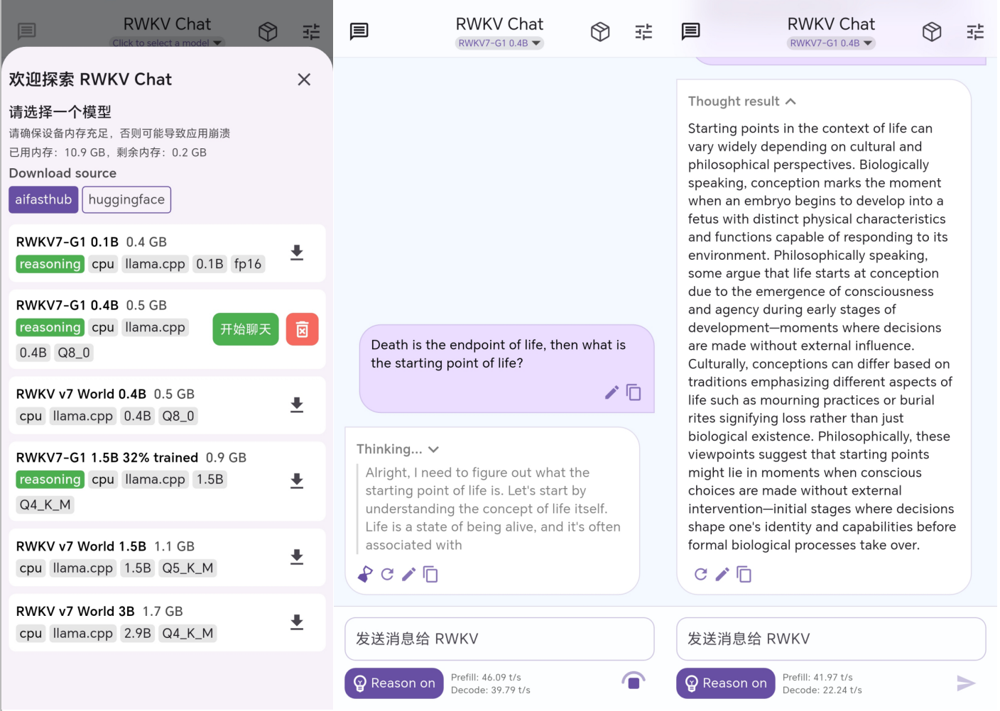
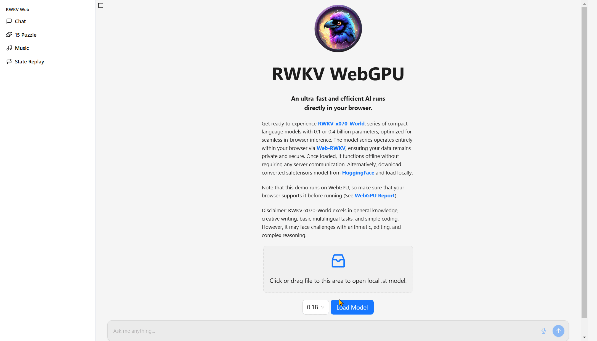
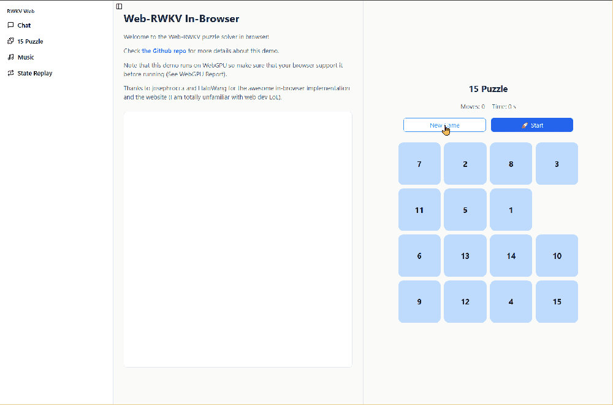
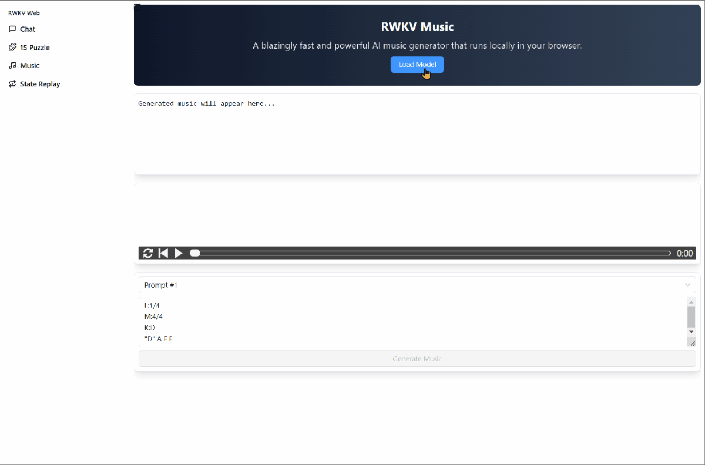
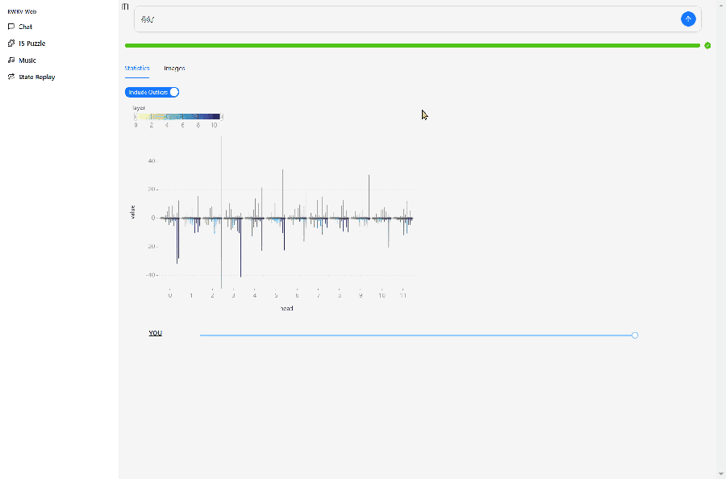

# How to Experience RWKV

This section will guide you on how to experience the RWKV model (either through online services or local deployment):

The following content can guide you in experiencing the RWKV model (online service or local deployment).

::: tip
Before experiencing the RWKV model, it is recommended to read the following chapter:

- [RWKV Decoding Parameters](./decoding-parameters.md)
- [Prompting Format Guidelines](../RWKV-Prompts/prompt-guidelines.md)
:::

## RWKV Online DEMO

If you simply want to try RWKV Goose, checkout the following public demo.

### Hugging Face (Completion Mode)

- [HF-Gradio-1: RWKV7-G1 2.9B](https://huggingface.co/spaces/BlinkDL/RWKV-Gradio-1)
- [HF-Gradio-2: The latest RWKV model](https://huggingface.co/spaces/BlinkDL/RWKV-Gradio-2)

::: warning
The above public demos only support Completion mode and do not support direct dialogue.
:::

If you experience the RWKV model in a public demo, it is recommended to input prompts in the two standard formats of RWKV:

```markdown copy
User: Please translate the following Swedish sentence "hur lång tid tog det att bygga twin towers" into Chinese.

Assistant:
```

```markdown copy
Instruction: Please translate the following Swedish into Chinese.

Input: hur lång tid tog det att bygga twin towers

Response:
```
### Hugging Face (Chat Mode)

We also provide an online chat demo for the RWKV-7 G1 series reasoning models:

- [RWKV-7 G1 Series Reasoning Models](https://huggingface.co/spaces/RWKV-Red-Team/RWKV-LatestSpace)

You can experience the completed RWKV7-G1 series models in this Demo.

::: info
This beautifully designed RWKV chat interface is open-sourced by RWKV community member [@Leon](https://leoncat.top/), with the repository available at: [web-rwkv-realweb](https://github.com/SolomonLeon/web-rwkv-realweb).
:::

### RWKV APP Demo

The RWKV community has completed the development of Android and iOS apps, and now everyone can experience locally deployed RWKV-7 series models on their mobile phones!!!

After loading the model, RWKV models can run locally on your device.

- [https://github.com/RWKV-APP/RWKV_APP](https://github.com/RWKV-APP/RWKV_APP)

Below is the actual performance on a phone equipped with the Qualcomm Snapdragon 8Gen2 chip:



RWKV7-G1 0.4B can consistently achieve an output speed of 30 tokens per second on this mid-range phone!

::: info
These two apps are open-sourced by RWKV community members [@MollySophia](https://github.com/MollySophia) and [@HaloWang](https://github.com/HaloWang), repository link: [rwkv_mobile_flutter](https://github.com/MollySophia/rwkv_mobile_flutter)
:::

### RWKV WebGPU Demo

The [RWKV WebGPU Demo](https://cryscan.github.io/web-rwkv-puzzles/#/chat "RWKV WebGPU Demo") based on [web-rwkv](https://github.com/cryscan/web-rwkv "web-rwkv") is developed by the community.

**No need to download any applications**, the RWKV WebGPU Demo runs the RWKV-7 model locally in the browser, supporting **chat**, **solving the 15 puzzles**, **music composition**, and **visualizing state changes**!

After loading the model, the RWKV model will run offline in the browser without any server communication.

**Chat Function**

In the chat interface, select an RWKV-7 model, click the Load Model button to download and run the model for dialogue.

You can also drag an RWKV-7 model (`.st` format) from the **local directory** into the gray box to run, skipping the download process.



**Solving 15 Puzzles**

::: info
The 15 puzzle (also called the sliding puzzle or 15-number puzzle) is a classic sliding block puzzle game. Players need to place numbers 1-15 in a 4x4 grid with one empty space, then slide the numbers to arrange them in order.
:::

In the Demo's 15 puzzle interface, click the `New Game` button to set up a new 15 puzzle.

Click the `start` button, and the WebGPU Demo will run the RWKV-puzzle15 model to **automatically** solve the current 15 puzzle, with the model's CoT reasoning process displayed on the left.



**Music Composition Function**

In the Demo's Music interface, you can drive the **RWKV ABC model** to **compose music**. The steps are as follows:

1. Click the `Load Model` button to download the composition model.
2. Click the `prompt` drop-down box to select an ABC format prompt.
3. Click the `Generate Music` button to start composing.



**State Replay**

In the Demo's State Replay interface, you can view the **hidden state evolution of the RWKV as an RNN model**.

::: tip
The State Replay function requires starting an RWKV model in the **chat interface** in advance.
:::

The image below shows the hidden state evolution of the RWKV-7-World-0.1B model after inputting "你好" (Hello).

The design of RWKV-7-World-0.1B is L12-D768, so we can view the state evolution of the model's 12 layers in State Replay, with each layer divided into 12 visualization small grids of $64×64$ dimensions (one head).

Explanation of the small grid colors:

- Dark blue: Lower values or values close to negative numbers.
- Yellow: Higher values or values close to positive numbers.
- Gray or black: Values close to 0.



## Local Deployment of RWKV Model

If you wish to deploy and use the RWKV model locally on your own device, it is recommended to use the following tools:

### RWKV Runner

- [RWKV Runner Project](https://github.com/josStorer/RWKV-Runner)
- [installer download (do read the installer README instructions)](https://github.com/josStorer/RWKV-Runner/releases/)

[](https://github.com/josStorer/RWKV-Runner)

**Windows setup guide video**
<iframe style="width: 100%; aspect-ratio: 16 / 9; border: none;" src="https://www.youtube-nocookie.com/embed/LrrYJ1LeVqw?si=fd7HW7Wcog4AL3mQ" title="YouTube video player" frameborder="0" allow="accelerometer; autoplay; clipboard-write; encrypted-media; gyroscope; picture-in-picture; web-share" allowfullscreen></iframe>

### AI00 RWKV Server

Ai00 Server is an RWKV language model inference API server based on the web-rwkv inference engine. It is also an open-source software under the MIT license, developed by the Ai00-x development group led by @cryscan and @顾真牛, members of the RWKV open-source community.

Ai00 Server supports Vulkan as the inference backend, Vulkan parallel and concurrent batch inference, and can run on all GPUs that support Vulkan. In fact, Ai00 Server supports most NVIDIA, AMD, and Intel graphics cards (including integrated graphics).

While maintaining high compatibility, Ai00 Server does not require bulky pytorch, CUDA, or other runtime environments. It is compact, ready to use out of the box, and supports INT8/NF4 quantization, allowing it to run at high speed on most personal computers.

For specific usage of AI00, please refer to the [Ai00 Usage Tutorial](../inference/ai00).

### ChatRWKV

ChatRWKV is the official RWKV chatbot project but does not have a graphical interface. You may need some command-line knowledge to use ChatRWKV.

[ChatRWKV GitHub Repository](https://github.com/BlinkDL/ChatRWKV)

## VRAM Requirements for Local Deployment

It is recommended to deploy and infer the RWKV model locally using **FP16** precision. When your VRAM and memory are insufficient, you can use **INT8 or NF4 quantization methods** to run the RWKV model, reducing VRAM and memory requirements.

::: tip
In terms of response quality, models with the same parameters perform best with FP16, INT8 is comparable to FP16, and NF4 response quality is significantly lower than INT8.

Model parameters are more important than quantization. For example, a 7B model with INT8 quantization generates better results than a 3B model with FP16.
:::

Below are the VRAM requirements and generation speed for locally deploying and running the RWKV model:

::: tip
**Test Environment:**

- CPU: i7-10870H
- GPU: RTX 3080 Laptop, 16GB VRAM
- Memory: 32GB
:::

Below are the VRAM/memory requirements for different inference backends and corresponding quantization methods (**default quantization for all layers**):

| Inference Backend | 1B6 Model | 3B Model | 7B Model | 14B Model |
| --- | --- | --- | --- | --- |
| CPU-FP32 | 6.6GB Memory | 12GB Memory | 21GB Memory | OOM (Not Recommended) |
| rwkv.cpp-FP16 | 3.5GB Memory | 7.6GB Memory | 15.7GB Memory | 30GB (Memory) |
| rwkv.cpp-Q5_1 | 2GB Memory | 3.7GB Memory | 7.2GB Memory | 12.4GB (Memory) |
| CUDA-FP16 | 3.2GB VRAM | 6.2GB VRAM | 14.3GB VRAM | About 28.5GB VRAM |
| CUDA-INT8 | 1.9GB VRAM | 3.4GB VRAM | 7.7GB VRAM | 15GB VRAM |
| webgpu-FP16 | 3.2GB VRAM | 6.5GB VRAM | 14.4GB VRAM | About 29GB VRAM |
| webgpu-INT8 | 2GB VRAM | 4.4GB VRAM | 8.2GB VRAM | 16GB VRAM (Quantized 41 layers, 60 layers about 14.8GB) |
| webgpu-NF4 | 1.3GB VRAM | 2.6GB VRAM | 5.2GB VRAM | 15.1GB VRAM (Quantized 41 layers, 60 layers about 10.4GB) |
| webgpu(python)-FP16 | 3GB VRAM | 6.3GB VRAM | 14GB VRAM | About 28GB VRAM  |
| webgpu(python)-INT8 | 1.9GB VRAM | 4.2GB VRAM | 7.7GB VRAM | 15GB VRAM (Quantized 41 layers) |
| webgpu(python)-NF4  | 1.2GB VRAM | 2.5GB VRAM | 4.8GB VRAM | 14.3GB VRAM (Quantized 41 layers) |

- `CUDA`, `CPU` from [RWKV pip Package](https://pypi.org/project/rwkv/)
- `rwkv.cpp` from [rwkv.cpp](https://github.com/RWKV/rwkv.cpp) Project
- `webgpu` from [web-rwkv](https://github.com/cryscan/web-rwkv) Project, a Rust Inference Framework Based on webgpu
- `webgpu(python)` from [web-rwkv-py](https://github.com/cryscan/web-rwkv-py), Python binding for the web-rwkv Project
:::

The above parameters are only introductory performance references for RWKV inference. As the number of quantization layers and other configuration items change, and the architecture of the graphics card varies, the performance of the model may change.