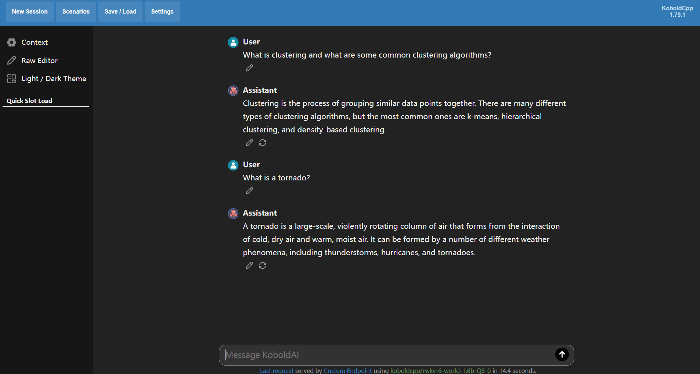
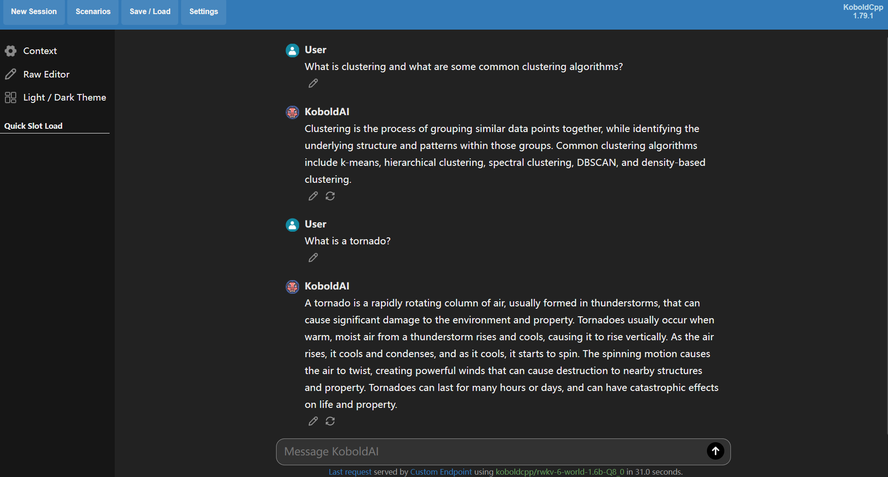
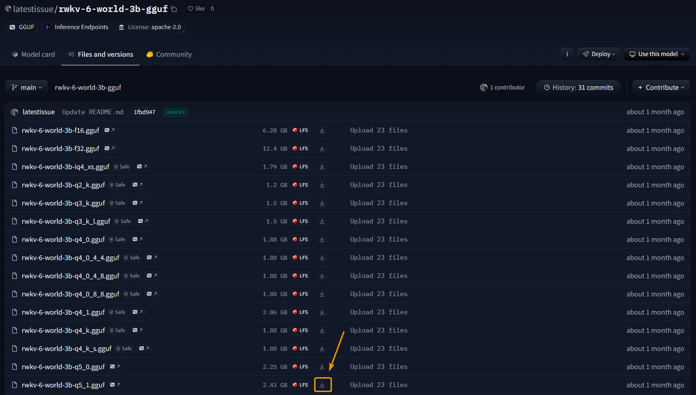
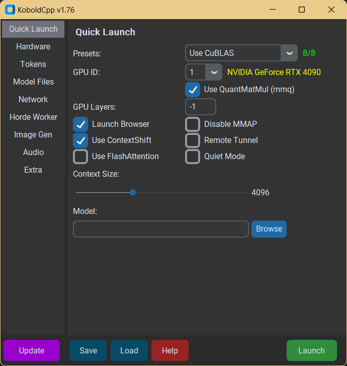
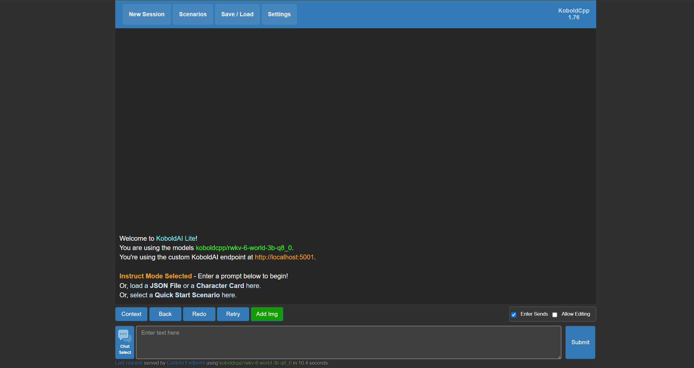
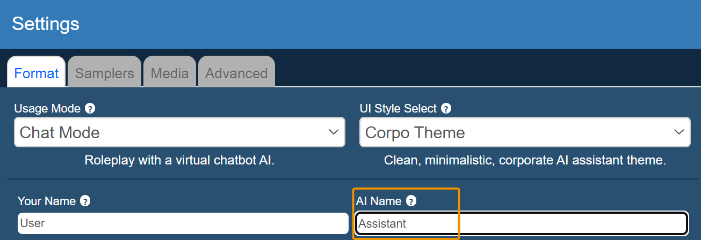

# KoboldCpp Inference

::: tip
[KoboldCpp](https://github.com/LostRuins/koboldcpp) is a simple and user-friendly AI model inference and text generation tool.

KoboldCpp is built on the llama.cpp inference backend and is compatible with both `ggml` and `gguf` model formats.
:::

This tutorial will guide you through running RWKV models in KoboldCpp and having chat conversations with the model.

## Preview

**Chat Mode**: Model responses are shorter, suitable for casual conversation.

**Instruct Mode**: Model responses are more detailed, suitable for questions or problem-solving.

## Download and Installation

### Download RWKV Model

KoboldCpp is compatible with both `ggml` and `gguf` model formats. It is recommended to use RWKV models in `gguf` format.

You can download `gguf` RWKV models from the [RWKV-GGUF Repository](https://huggingface.co/collections/zhiyuan8/rwkv-7-world-gguf-67dbb8f4baeae23ec791f49e). On the Hugging Face page, click the download button next to the model file to download:

::: tip
The RWKV-GGUF repository provides `gguf` model files with different quantization precisions for each RWKV model parameter set.

Quantization affects the model's inference precision and thus the conversation quality. It is recommended to use `Q5_1` and `Q8_0` quantization precision to maintain model performance and user experience.
:::

### Download KoboldCpp

You can download the latest version of KoboldCpp from the [KoboldCpp Releases page](https://github.com/LostRuins/koboldcpp/releases).

#### Windows System

For Windows systems, it's recommended to download `koboldcpp.exe`, or you can choose other exe files based on your hardware configuration:

- If you don't need CUDA (no NVIDIA GPU), you can use the smaller `koboldcpp_nocuda.exe`
- If you have an NVIDIA GPU but use an older CPU, and `koboldcpp.exe` doesn't run, try `koboldcpp_oldcpu.exe`
- If you have a newer NVIDIA GPU, you can use the CUDA 12 version `koboldcpp_cu12.exe` (larger file but slightly faster)

#### Linux System

For Linux systems, please select the Linux binary with the appropriate CUDA version:

- `koboldcpp-linux-x64-cuda1150`: Linux binary with CUDA 11.5
- `koboldcpp-linux-x64-cuda1210`: Linux binary with CUDA 12.1
- `koboldcpp-linux-x64-nocuda`: Linux binary without CUDA

#### macOS System

If you're using macOS running on Apple Silicon (M1, M2, M3 ...) chips, try the `koboldcpp-mac-arm64` binary.

## Configuration and Running

### Adjust KoboldCpp Configuration

Double-click the downloaded exe file to open KoboldCpp's launcher GUI interface:

In the Quick Launch interface of the launcher, you can **adjust KoboldCpp and model configurations**. Focus on these three options:

- **`Model`**: Click the `Browse` button to select a RWKV model file in `gguf` format.
- **`Presets`**: Choose a method to load the model. Select `CUBLAS` for NVIDIA GPUs, `CLBlast` for AMD GPUs, `Vulkan` for other GPUs, and `OpenBLAS` for CPU.
- **`Gpu layers`**: Number of model layers to load on GPU. Recommended to keep the default value of -1 (load all layers). If you have insufficient VRAM, gradually reduce the number of layers from the maximum:

    | Model Parameters | Maximum Layers |
    | --------------- | -------------- |
    | RWKV-1.5B      | 24             |
    | RWKV-3B        | 32             |
    | RWKV-7B        | 32             |
    | RWKV-14B       | 61             |

Other options are **recommended to keep default**, or adjust as needed:

- **`Use QuantMatMul (mmg)`**: Whether to enable `MMQ` mode instead of `CuBLAS` for processing prompts. This is a `CUBLAS` mode-specific option. For more detailed explanation, please refer to [KoboldCpp Documentation - What MMQ Does](https://github.com/LostRuins/koboldcpp/wiki#what-does-quantized-mat-mul-mmq-do-for-cublas)
- **`Launch Browser`**: Whether to automatically open the browser and access KoboldCpp's WebUI after loading the model
- **`Use ContextShift`**: Whether to use ContextShift to reduce context reprocessing time. For more detailed explanation, please refer to [KoboldCpp Documentation - ContextShift](https://github.com/LostRuins/koboldcpp/wiki#what-is-contextshift)
- **`Use FlashAttention`**: Whether to use FlashAttention to optimize memory usage, only effective for `CUDA/CuBLAS` mode
- **`Quite Mode`**: If selected, the terminal will not display the model's generated text content
- **`Remote Tunnel`**: Whether to allow other devices to connect to KoboldCpp using remote tunnels. For more detailed explanation, please refer to [KoboldCpp Documentation - Remote Tunnel](https://github.com/LostRuins/koboldcpp/wiki#how-do-i-run-koboldcpp-on-a-different-device-than-my-pc-over-the-network-remote-play)
- **`Context Size`**: Set the maximum context length that KoboldCpp can process, recommended to keep the default value of 4096 for RWKV models
- For explanations of other parameters, please refer to the [KoboldCpp Documentation](https://github.com/LostRuins/koboldcpp/wiki)

### Running KoboldCpp

After configuration, click the `Launch` button in the bottom right corner to start KoboldCpp.

The KoboldCpp launcher GUI will automatically close and open a browser to access KoboldCpp's WebUI interface:

At this point, KoboldCpp is successfully running, and you can start using the RWKV model for text generation.

## KoboldCpp Usage Guide

### Change Conversation Mode

KoboldCpp supports four chat modes. In KoboldCpp's WebUI interface, click `Settings -> Format -> Usage Mode` to adjust the chat mode:

- **`Instruct Mode`**: Instruction mode, suitable for text generation with instructions
- **`Story Mode`**: Story mode, suitable for novel-style text generation
- **`Adventure Mode`**: Adventure mode, suitable for generating **interactive fiction/role-playing games** content
- **`Chat Mode`**: Chat mode, suitable for casual conversation

In our testing, RWKV models perform best in `Instruct Mode` and `Chat Mode`. `Story Mode` and `Adventure Mode` require additional character settings and configuration for proper use.

::: tip
When using `Chat Mode`, please set the `AI Name` option to `Assistant` for the best conversation experience.
:::

### Change WebUI Style

KoboldCpp supports three WebUI styles. In KoboldCpp's WebUI interface, click `Settings -> Format -> UI Style Select` to adjust the WebUI style:

- **`Classic Theme`**: Default theme, the default interface when accessing KoboldCpp
- **`Aesthetic Theme`**: Aesthetic theme, allows customization of UI size, background image, chat box background color, and other styles
- **`Corpor Theme`**: Minimalist theme, similar to online services like ChatGPT

`Corpor Theme` is recommended:

### Other Settings

Due to the large number of settings in KoboldCpp, this document cannot list complete setting descriptions.

For detailed explanations of each setting, please refer to the comments in the WebUI and the [KoboldCpp Documentation](https://github.com/LostRuins/koboldcpp/wiki).

