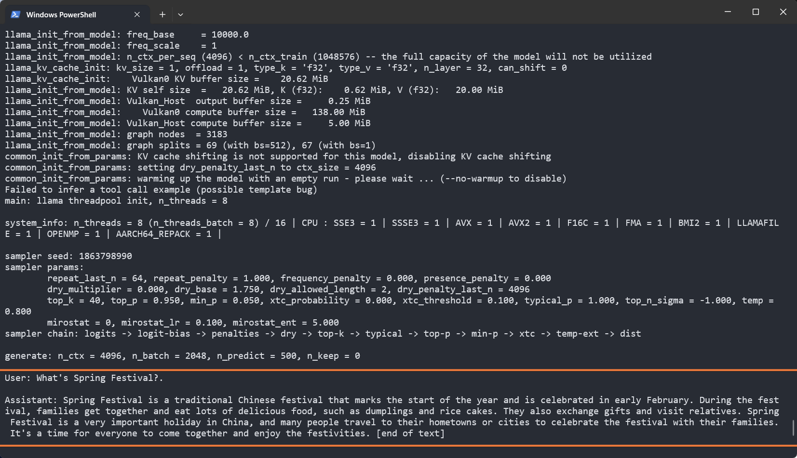
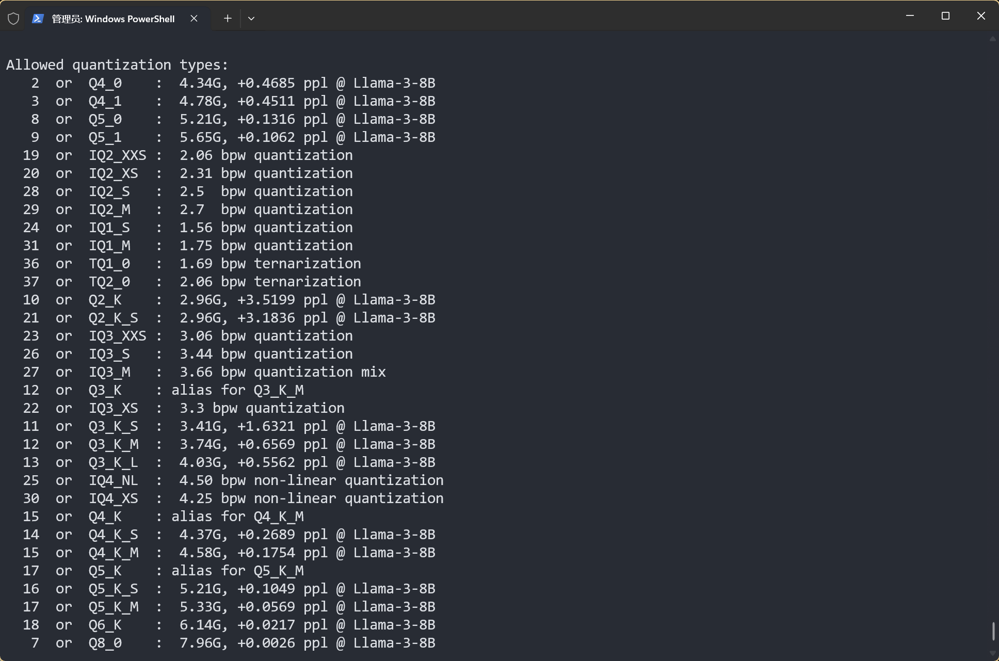

# LlamaCpp Inference Tutorial

::: tip
[llama.cpp](https://github.com/ggerganov/llama.cpp) is a lightweight framework for running large language models, specifically optimized for CPU performance.
:::

Thanks to the work of RWKV community member [@MollySophia](https://github.com/MollySophia), llama.cpp now supports RWKV-6 models.

This section will introduce how to use RWKV-6 models for inference in llama.cpp.

## Running RWKV Models with llama.cpp

### Building llama.cpp Locally

You can choose to download pre-compiled llama.cpp programs from the [llama.cpp release page](https://github.com/ggerganov/llama.cpp/releases).

llama.cpp provides various pre-compiled versions. Choose the appropriate version based on your GPU type:

| System Type | GPU Type | Package Name Field |
|------------|----------|-------------------|
| macOS | Apple Silicon | macos-arm64.zip |
| Windows | Intel GPU (including Arc/Xe) | win-sycl-x64.zip |
| Windows | NVIDIA GPU (CUDA 11.7-12.3) | win-cuda-cu11.7-x64.zip |
| Windows | NVIDIA GPU (CUDA 12.4+) | win-cuda-cu12.4-x64.zip |
| Windows | AMD and other GPUs (including AMD iGPU) | win-vulkan-x64.zip |
| Windows | No GPU | win-openblas-x64.zip |

Alternatively, you can follow the [official llama.cpp build documentation](https://github.com/ggerganov/llama.cpp/blob/master/docs/build.md) to compile locally using your preferred method.

### Getting GGUF Format Models

llama.cpp supports models in `.gguf` format, but RWKV officially only releases `.pth` format models.

Therefore, you can download quantized RWKV models converted to gguf format from the [RWKV - GGUF repository](https://hf-mirror.com/latestissue).

::: tip
Please create a models folder in the llama.cpp directory and place the downloaded gguf models in it.
:::

::: warning
It's recommended to download models with `Q8_0` and `Q5_1` quantization levels. Lower quantization may result in poor model responses.
:::

### Running RWKV Model Inference

Run the following command in the llama.cpp directory to generate text based on a prompt using the RWKV model:

```bash copy
./llama-cli -m models/rwkv-6-world-7b-Q8_0.gguf -p "User: What's Spring Festival?\n\nAssistant:" -no-cnv -t 8 -ngl 99 -n 500
```

This command runs the `models/rwkv-6-world-7b-Q8_0.gguf` model using llama-cli with 8 threads, skips warmup, and generates up to 500 tokens based on the given prompt.

::: warning
Without the `-no-cnv` parameter, `./llama-cli` defaults to conversation mode. If you use the `-no-cnv` parameter to enable completion mode, the model continues text generation from the prompt.
:::



**Parameter Explanation:**

- `./llama-cli`: Launches the compiled llama-cli program
- `-m models/rwkv-6-world-7b-Q8_0.gguf`: Model path parameter
- `-p "User: What's Spring Festival?\n\nAssistant:"`: Prompt parameter for text generation
- `-t 8`: Specifies thread count, adjust based on available physical CPU cores
- `-ngl`: Specifies the number of model layers to load on GPU, set `-ngl 99` to load all RWKV model layers on GPU
- `-n 500`: Maximum number of tokens to generate

::: tip
The complete parameter list can be found in the [llama.cpp parameter documentation](https://github.com/ggerganov/llama.cpp/blob/master/examples/main/README.md).
:::

## Additional Features (Optional)

### Quantizing GGUF Models

Run `./llama-quantize [input_model] [output_model] [quantization_type]` in the llama.cpp directory to quantize `.gguf` models in `fp32` or `fp16` format, for example:

```bash copy
./llama-quantize models/rwkv-6-world-1.6b-F16.gguf models/rwkv-6-world-1b6-Q8_0.gguf Q8_0
```

::: warning
Input model precision is limited to `fp32` and `fp16`. `Q5_1` and `Q8_0` quantization levels are recommended.
:::

Use `./llama-quantize --help` command to view all available quantization levels:



### Convert the `.pth` state file into a `.bin` file

The following code can convert the `.pth` state file officially released by RWKV into a `.bin` format state file that can be used by llama.cpp:

``` python copy filename="convert_rwkv_state_to_llamacpp.py"
import torch
import argparse
import struct
import array
from pathlib import Path


def convert_rwkv_state_to_llamacpp_cache(path_input, path_output):
    state = torch.load(path_input, map_location='cpu')
    n_head, head_size, _ = state['blocks.0.att.time_state'].shape
    n_embd = n_head * head_size
    n_layer = len(state.keys())
    print(f'n_layer: {n_layer}, n_embd: {n_embd}')
    
    LLAMA_SESSION_MAGIC = 0x6767736e
    LLAMA_SESSION_VERSION = 9

    with open(path_output, 'wb') as file:
        # magic, version, n_token_count
        file.write(struct.pack('3I', LLAMA_SESSION_MAGIC, LLAMA_SESSION_VERSION, 0))
        # model arch
        file.write(struct.pack('I5s', 5, b'rwkv6'))
        # session output ids, logits, embeddings (skip)
        file.write(struct.pack('=IQQ', 0, 0, 0))
        # cell_count, pos, n_seq_id, v_trans, n_layer
        file.write(struct.pack('=5I', 1, 0, 0, 0, n_layer))
        for _ in range(n_layer):
            # k_type = GGML_TYPE_F32, k_size = 2 * n_embd * sizeof(float)
            file.write(struct.pack('=iq', 0, 2 * n_embd * 4))
            for _ in range(2*n_embd):
                file.write(struct.pack('=f', 0.0))
            
        for i in range(n_layer):
            # v_type = GGML_TYPE_F32, v_size = n_head * head_size * head_size * sizeof(float)
            file.write(struct.pack('=iq', 0, n_head * head_size * head_size * 4))
            data = state[f'blocks.{i}.att.time_state'].float().transpose(1, 2).flatten().tolist()
            file.write(struct.pack(f'{n_head * head_size * head_size}f', *data))

def main():
    parser = argparse.ArgumentParser(description='Convert RWKV state to llama.cpp prompt cache')
    parser.add_argument('input', type=Path, help='Path to RWKV state')
    parser.add_argument('output', type=Path, help='File name for llama.cpp prompt cache')
    args = parser.parse_args()

    convert_rwkv_state_to_llamacpp_cache(args.input, args.output)

if __name__ == '__main__':
    main()
```
