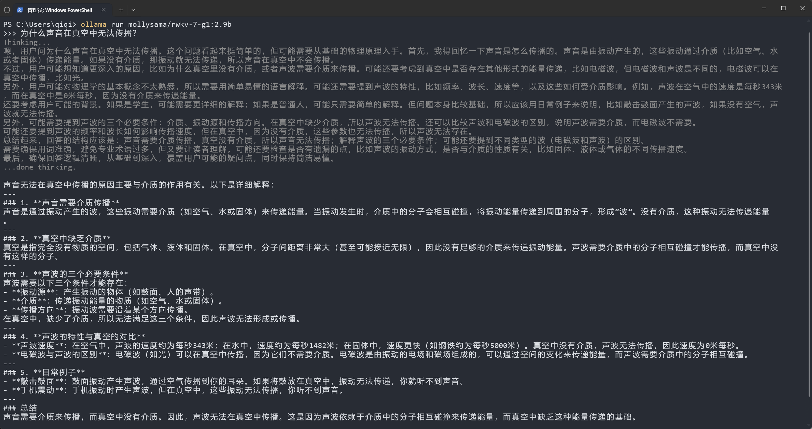
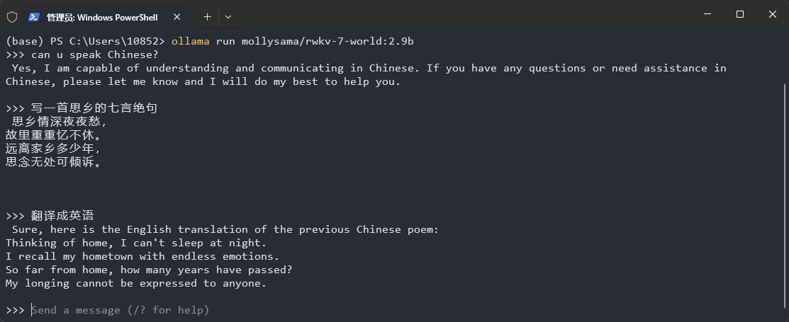

# Ollama Inference

::: tip
[Ollama](https://github.com/ollama) is a simple and easy-to-use open-source local large language model running framework that supports one-click deployment and running of various open-source models on personal computers, featuring simple configuration and low resource consumption.
:::

With the efforts of RWKV community member [@MollySophia](https://github.com/MollySophia), Ollama now supports the RWKV-7 and RWKV-6 model.

This chapter introduces how to use the RWKV model for inference in Ollama.

## Download and Installation of Ollama

You can download the Ollama installer from the [Ollama official website](https://ollama.com/).

After downloading, double-click the exe file to install. After installation, `Ollama` will automatically start, and you can see the `Ollama` icon in the system taskbar.


## Running RWKV Models Provided by Ollama

::: tip
Ollama's RWKV repository provides [RWKV7-G1](https://ollama.com/mollysama/rwkv-7-g1) (recommended) and [RWKV7-World](https://ollama.com/mollysama/rwkv-7-world) models.
:::
::: danger
The RWKV-6 World model is outdated and no longer recommended.
:::
::: tabs

@tab RWKV7-G1 Model (Recommended)
Run the `ollama run mollysama/rwkv-7-g1:2.9b` command in the terminal, and Ollama will **automatically download and run** the RWKV7-G1 2.9B model. You can then have a conversation with the RWKV model in the terminal.



::: tip
By default, Ollama's RWKV7-G1 model has thinking mode enabled, which can be flexibly toggled on and off with the `/set nothink` and `/set think` commands.

All available Ollama/RWKV7-G1 models:

- `mollysama/rwkv-7-g1:2.9b`: Quantization: `Q8_0`
- `mollysama/rwkv-7-g1:2.9b-q6_k`: Quantization: `Q6_K`
- `mollysama/rwkv-7-g1:2.9b-thinkdisabled`: Thinking mode disabled, Quantization: `Q8_0`
- `mollysama/rwkv-7-g1:2.9b-thinkdisabled-q6_k`: Thinking mode disabled, Quantization: `Q6_K`
- `mollysama/rwkv-7-g1:1.5b`: Quantization: `Q8_0`
- `mollysama/rwkv-7-g1:1.5b-q6_k`: Quantization: `Q6_K`
- `mollysama/rwkv-7-g1:1.5b-thinkdisabled`: Thinking mode disabled, Quantization: `Q8_0`
- `mollysama/rwkv-7-g1:1.5b-thinkdisabled-q6_k`: Thinking mode disabled, Quantization: `Q6_K`


::: tip
If you have previously downloaded the `mollysama/rwkv-7-g1:2.9b` model, please run the `ollama pull mollysama/rwkv-7-g1:2.9b` command to pull the latest changes.


@tab RWKV-7-World Model
::: warning
The RWKV7-G1 model is a comprehensive upgrade to the RWKV-7-World model. It is recommended to use the RWKV7-G1 model.
:::

Run the `ollama run mollysama/rwkv-7-world:2.9b` command in the terminal, and Ollama will **automatically download and run** the RWKV7-World 2.9B model. You can have a conversation with the RWKV model in the terminal, as shown in the figure below:



All available Ollama/RWKV-7 World models:

- `mollysama/rwkv-7-world:1.5b`: Quantization: `Q4_K_M`
- `mollysama/rwkv-7-world:2.9b`: Quantization: `Q4_K_M`

::: tip
If you have previously downloaded the `mollysama/rwkv-7-world:2.9b` model, please run the `ollama pull mollysama/rwkv-7-world:2.9b` command to pull the latest changes.
:::

## Running a Custom RWKV Model

To run a custom RWKV model, you need a model file in `.gguf` format and a `Modelfile` for configuring the **chat template and decoding parameters**. Then, use the `ollama create` command to create a custom Ollama model.

After creation is complete, you can use the `ollama run` command to run the custom model.

**1. Download the RWKV gguf Model**

You can download RWKV models in `gguf` format from the [RWKV GGUF Collection](https://huggingface.co/zhiyuan8/models).

::: warning
RWKV gguf models have various quantized versions. It is recommended to use `FP16` and `Q8_0` quantization levels. Lower quantization levels (like `Q5_K_M`, `Q4_K_M`, etc.) may degrade the model's responses.
:::

::: tip
Fine-tuned an RWKV-7 model yourself and want to convert it from pth to gguf format? Check the [llama.cpp docs - Convert pth model to gguf](../llamacpp#get-gguf-models).
:::

---

**2. Create the Model's Modelfile**

In the folder where the RWKV gguf model file is stored, create a text file named `Modelfile`, with no file extension.


Open the `Modelfile` with a text editor like "Notepad", and then **create different Modelfile content** based on whether the model supports thinking mode.

::: tabs
@tab For RWKV Models that Support Thinking
For RWKV G1 series models that support thinking, please write the following content into the `Modelfile`:

```bash
FROM rwkv7-g1-2.9b-20250519-ctx4096-Q8_0.gguf

TEMPLATE """{{- if .System }}System: {{ .System }}{{ end }}
{{- range $i, $_ := .Messages }}
{{- $last := eq (len (slice $.Messages $i)) 1}}
{{- if eq .Role "user" }}
{{- if eq $i 0}}User: {{ .Content }}{{- else }}

User: {{ .Content }}{{- end }}
{{- else if eq .Role "assistant" }}

Assistant: <{{- if and $last .Thinking -}}think>{{ .Thinking }}</think>{{- else }}think>
</think>{{- end }}{{ .Content }}{{- end }}
{{- if and $last (ne .Role "assistant") }}

Assistant:{{- if $.IsThinkSet }} <{{- if not $.Think }}think>
</think>{{- end }}{{- end }}{{- end }}{{- end }}"""

PARAMETER stop """

"""
PARAMETER stop """
User"""

PARAMETER stop "User"
PARAMETER stop "Assistant"

PARAMETER temperature 1
PARAMETER top_p 0.5
PARAMETER repeat_penalty 1.2
```

@tab For RWKV Models that Do Not Support Thinking
For RWKV-World and other models that do not support thinking, please write the following content into the `Modelfile`:

```bash
FROM rwkv7-g1-1.5b-20250429-ctx4096-Q8_0.gguf

TEMPLATE """{{- if .System }}System: {{ .System }}{{ end }}
{{- range $i, $_ := .Messages }}
{{- $last := eq (len (slice $.Messages $i)) 1}}
{{- if eq .Role "user" }}
{{- if eq $i 0}}User: {{ .Content }}{{- else }}

User: {{ .Content }}{{- end }}
{{- else if eq .Role "assistant" }}

Assistant:{{ .Content }}{{- end }}
{{- if and $last (ne .Role "assistant") }}

Assistant:{{- end -}}{{- end }}"""

PARAMETER stop """

"""
PARAMETER stop """
User"""

PARAMETER temperature 1
PARAMETER top_p 0.5
PARAMETER repeat_penalty 1.2
```

Please change `rwkv-xxx.gguf` after `FROM` in the first line to the filename of your local RWKV model.

Decoding parameters like `PARAMETER temperature 1`, `PARAMETER top_p 0.5`, etc., can be adjusted as needed.
:::

**3. Create and Run the Custom RWKV Model**

In the directory where the RWKV gguf model and `Modelfile` are located, open a terminal and execute the `ollama create` command:

``` bash
ollama create rwkv-xxx -f Modelfile
```

::: tip
Change the model name after `ollama create` to your local RWKV model's name (it should be consistent with the model name in the `Modelfile`), but **without the `.gguf` suffix**.
:::

After creation is complete, use the `ollama run` command to run the model directly:

``` bash
ollama run rwkv-xxx
```

Once it runs successfully, you can start a chat conversation with the model.

## Stopping Ollama

Please use the `ollama stop mollysama/rwkv-7-g1:2.9b` command to stop the current model instance, which will **reset the conversation context**.

Otherwise, Ollama will **continuously retain the current session's context** (history messages) as a reference for subsequent conversations.

## Ollama GUIs and Desktop Applications

Ollama itself does not provide a GUI or WebUI service, but its community offers third-party GUIs and desktop applications.

You can view all third-party Ollama tools in [Ollama's GitHub documentation](https://github.com/ollama/ollama?tab=readme-ov-file#web--desktop).

## References

- [Ollama official website](https://ollama.com/)
- [RWKV gguf model repository](https://huggingface.co/latestissue)
- [Ollama GitHub documentation](https://github.com/ollama/ollama?tab=readme-ov-file#web--desktop)