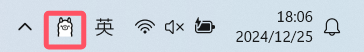
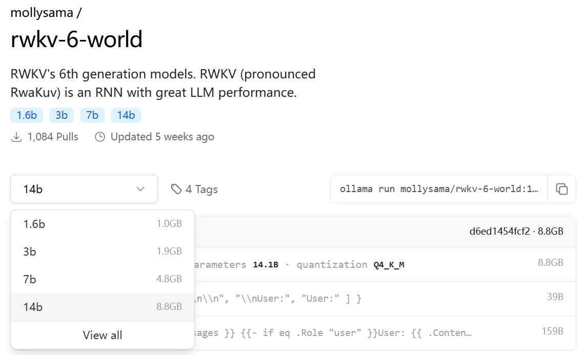
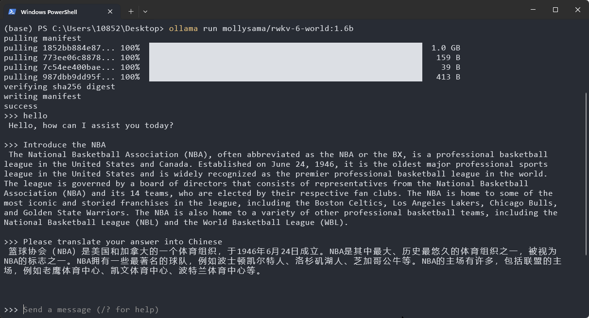
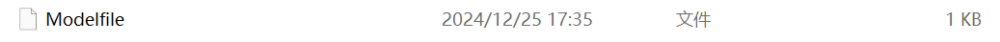
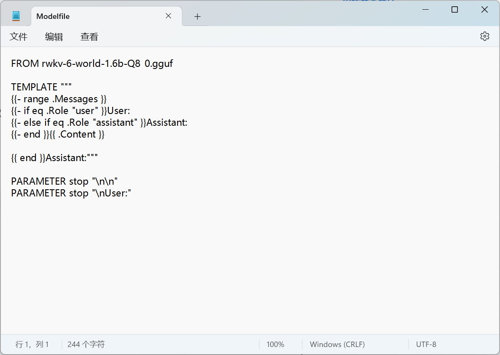
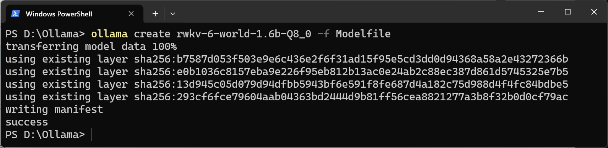
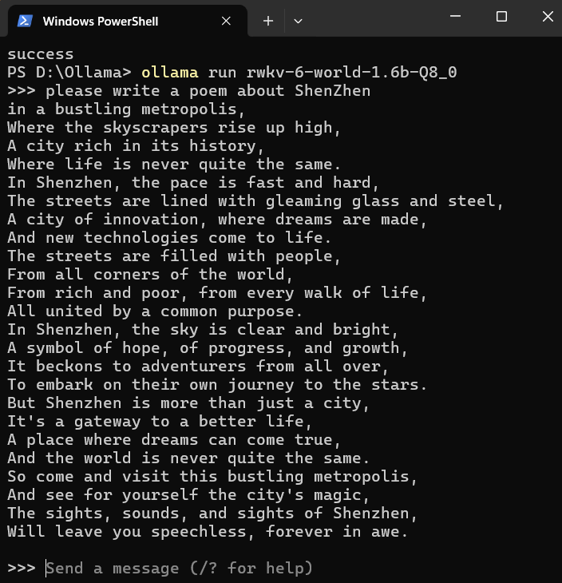

# Ollama Inference

::: tip
[Ollama](https://github.com/ollama) is a simple and easy-to-use open-source local large language model running framework that supports one-click deployment and running of various open-source models on personal computers, featuring simple configuration and low resource consumption.
:::

With the efforts of RWKV community member [@MollySophia](https://github.com/MollySophia), Ollama now supports the RWKV-6 model.

This chapter introduces how to use the RWKV-6 model for inference in Ollama.

## Download and Installation of Ollama

You can download the Ollama installer from the [Ollama official website](https://ollama.com/).

After downloading, double-click the exe file to install. After installation, `Ollama` will automatically start, and you can see the `Ollama` icon in the system taskbar.



## Run RWKV model

There are two ways to run the gguf format RWKV model in Ollama:

- **Download from [Ollama's RWKV-6 repository](https://ollama.com/mollysama/rwkv-6-world)**: Simple to operate, but the RWKV model provided by Ollama **only has the `q4_k_m` quantized version**
- **Custom RWKV model**: Requires manually downloading the `gguf` format RWKV model and creating a `Modelfile` configuration file, but you can **freely run any quantized RWKV model**

::: tabs

@tab Download from Ollama repository
[Ollama's RWKV-6 repository](https://ollama.com/mollysama/rwkv-6-world) provides RWKV-6-World models with four parameter scales: 1.6B, 3B, 7B, and 14B.



Execute the command `ollama run mollysama/rwkv-6-world:1.6b` in your terminal to automatically **download and run** the `q4_k_m` quantized version of the RWKV-6-World 1.6B model.



::: tip
You can replace `1.6b` with `3b`, `7b`, or `14b` to run RWKV-6-World models with other parameter scales.

@tab Custom RWKV model

### Download RWKV gguf model

To customize the RWKV model, you need to first download the `gguf` format RWKV-6-World model from the [RWKV-6 GGUF repository](https://huggingface.co/collections/zhiyuan8/rwkv-6-world-gguf-6790b87a42d4f541a2f6d92b) or [RWKV-7 GGUF repository](https://huggingface.co/collections/zhiyuan8/rwkv-7-world-gguf-67dbb8f4baeae23ec791f49e).

---
⚠️ **RWKV gguf models come in various quantized versions. It is recommended to use `Q5_1` or `Q8_0` quantization precision. Lower quantization precision (such as `Q4_0`, `Q3_0`, etc.) may significantly degrade the model's responses.**

---

### Create Modelfile for the model

Create a text file named `Modelfile` in the folder where the RWKV gguf model file is stored, without any file extension.



Then open this text file with a text editor like "Notepad" and write the following content:

```bash copy
FROM rwkv-6-world-1.6b-Q8_0.gguf

TEMPLATE """
{{- range .Messages }}
{{- if eq .Role "user" }}User: 
{{- else if eq .Role "assistant" }}Assistant:
{{- end }}{{ .Content }}

{{ end }}Assistant:"""

PARAMETER stop "\n\n"
PARAMETER stop "\nUser:"
```

Modify the `rwkv-6-world-1.6b-Q8_0.gguf` after the first line `FROM` to the filename of the RWKV model you downloaded.

---
⚠️ **It is recommended to directly copy the above content into the `Modelfile` to ensure there is a space after `User:` and no space after `Assistant:`; there is an empty line above `{{ end }}Assistant:"""` and no extra characters after it.**

---



### Run custom RWKV model

Open the terminal in the RWKV gguf model folder and execute the `ollama create` command:

``` bash copy
ollama create rwkv-6-world-1.6b-Q8_0 -f Modelfile
```

---
Change the model name after `ollama create` to your local RWKV model, ensuring it matches the model name in the `Modelfile`.

---


After creation, use the `ollama run` command to directly run the model:

``` bash copy
ollama run rwkv-6-world-1.6b-Q8_0
```

After successfully running, you can chat with the model:



:::

## Ollama GUI and Desktop Programs

Ollama itself does not provide GUI or WebUI services, but its community offers third-party GUI and desktop programs.

You can view all third-party Ollama tools in the [Ollama GitHub documentation](https://github.com/ollama/ollama?tab=readme-ov-file#web--desktop).

## References

- [Ollama official website](https://ollama.com/)
- [RWKV gguf model repository](https://huggingface.co/latestissue)
- [Ollama GitHub documentation](https://github.com/ollama/ollama?tab=readme-ov-file#web--desktop)