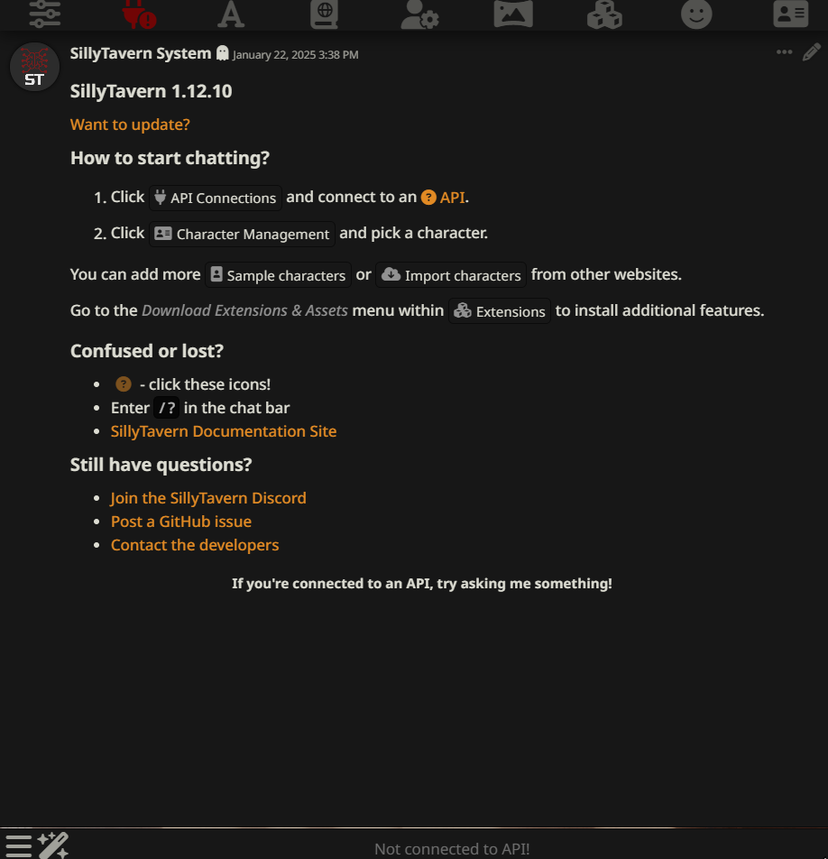
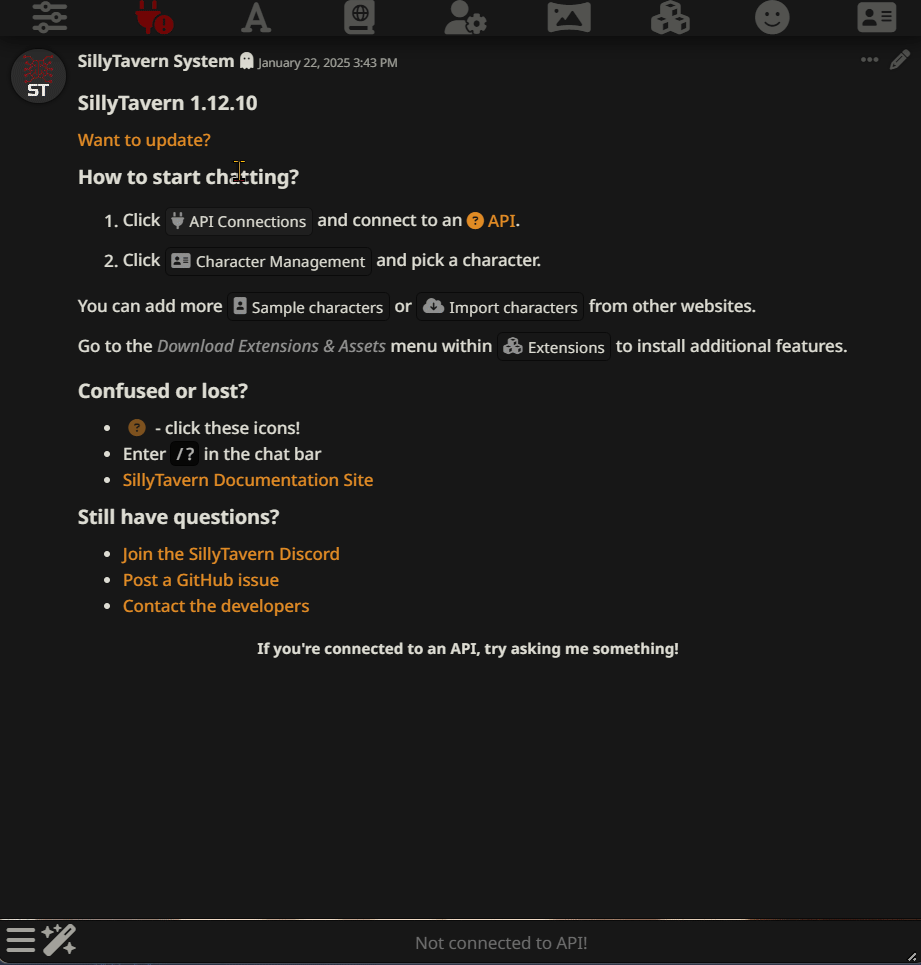
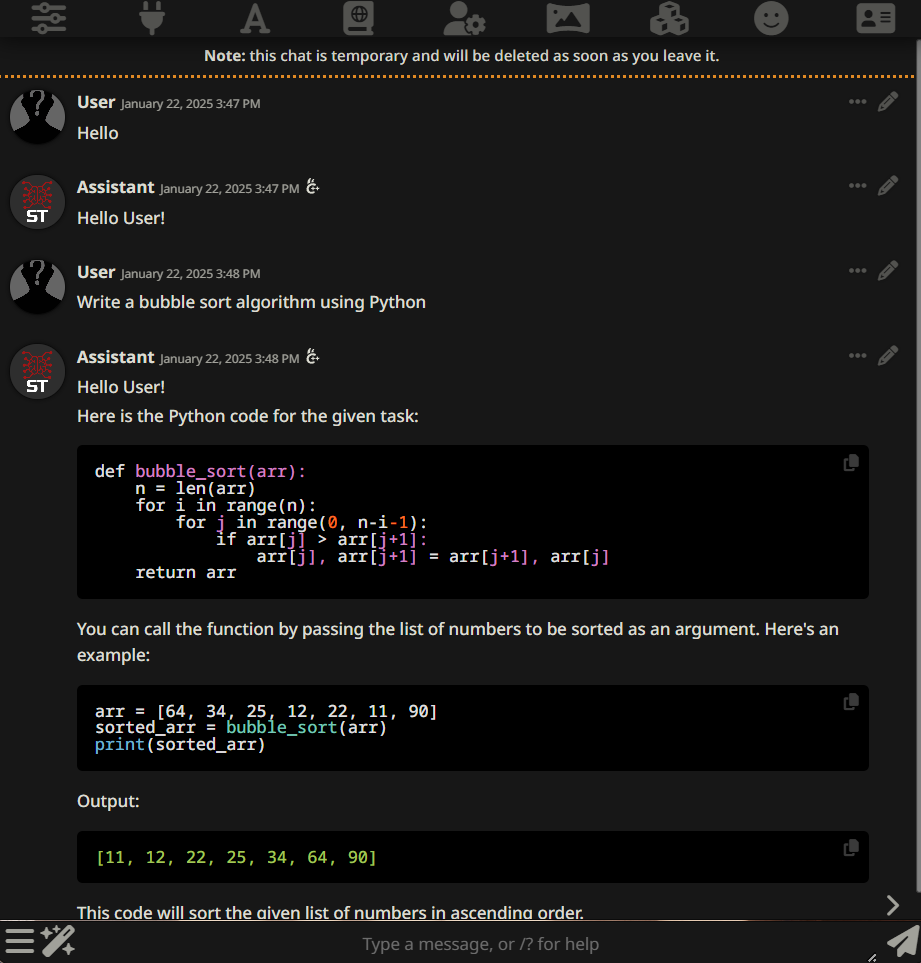
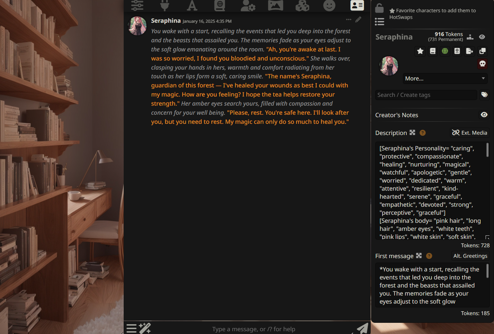
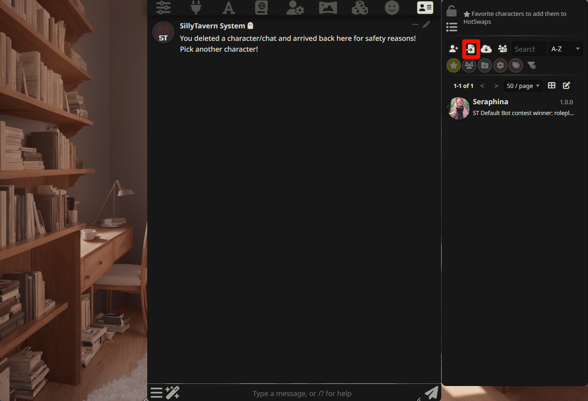
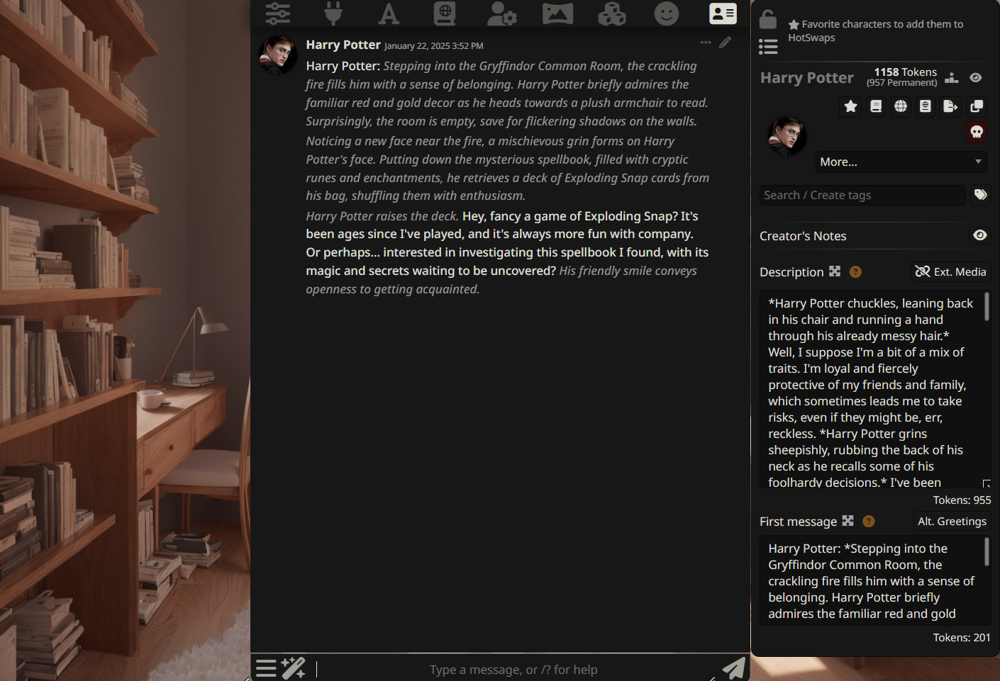
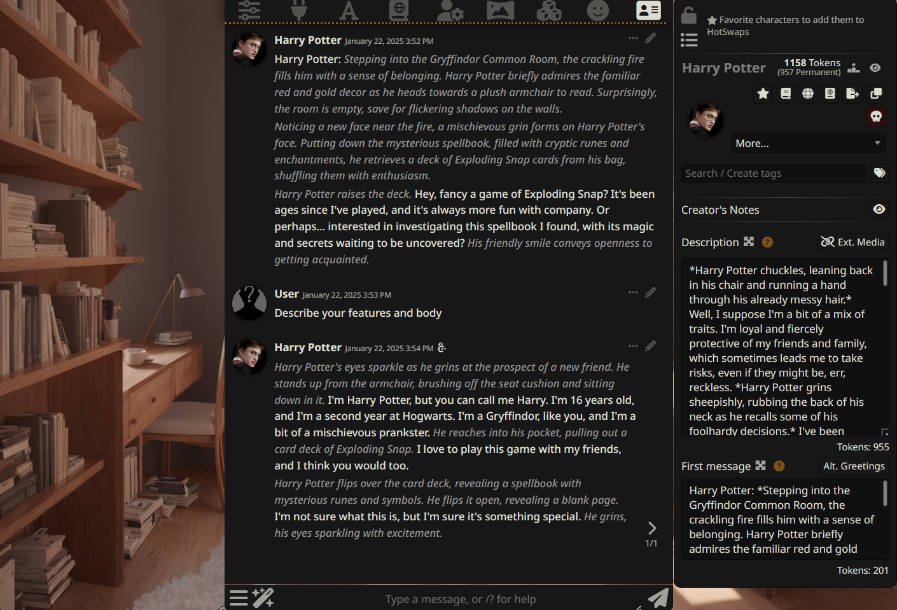
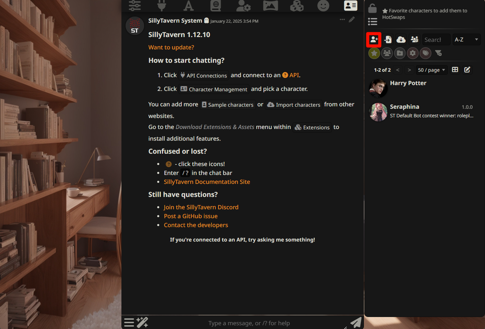
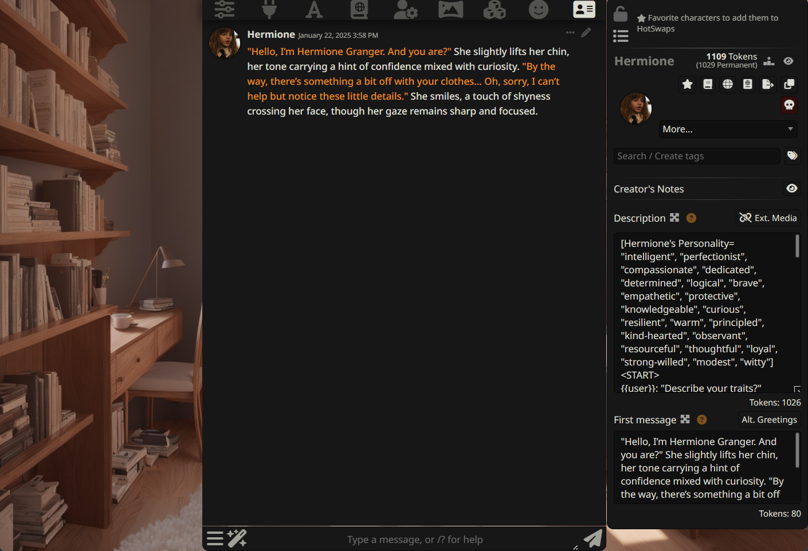

# Silly Tavern Inference Tutorial

::: tip
[SillyTavern](https://github.com/SillyTavern/SillyTavern) is a tool for AI chatting or role-playing, where you can interact with character cards that you create or those provided by the community.

SillyTavern does not have model inference capabilities; it needs to be used in conjunction with LLM inference servers (such as [llama.cpp](https://github.com/ggerganov/llama.cpp), text-generation-webui, etc.).
:::

This article will introduce how to use RWKV models in Silly Tavern for role-playing tasks.

## Silly Tavern Download and Installation

::: tip
This tutorial uses Windows as an example. For macOS and Linux installation methods, please refer to SillyTavern's [installation guide](https://docs.sillytavern.app/installation/linuxmacos/).
:::

First, we need to download and install Silly Tavern. The installation steps are as follows:

1. Install [NodeJS](https://nodejs.org/) (recommended to use the latest LTS version)
2. Download the zip file from the [Releases](https://github.com/SillyTavern/SillyTavern/releases) page of the Silly Tavern Github repository
3. After extracting the zip file, double-click `Start.bat` to automatically install the dependencies required for SillyTavern
4. Once installation is complete, SillyTavern will open a new tab in your browser



## Connecting to Local LLM Server

SillyTavern doesn't have model inference capabilities. Here we'll use [llama.cpp](https://github.com/ggerganov/llama.cpp) as the inference server for RWKV models and use Silly Tavern for chatting.

::: tip
Please read the [llama.cpp inference method](./llamacpp.html) to install and start the llama.cpp application locally.
:::

After installing llama.cpp, use the following command to set up a local llama.cpp service:

```bash copy
./llama-server -m models/rwkv-6-world-1.6b-Q8_0.gguf --port 8080 -ngl 99
```

After the llama.cpp server starts, follow these steps in SillyTavern to connect to the locally set up llama.cpp service:

1. Click on API Connections
2. Set the API to Text Completion
3. Set API Type to llama.cpp
4. Set the server URL to `http://127.0.0.1:8080`
5. Click Connect to connect to the locally set up llama.cpp service



After successfully connecting to the local llama.cpp service, you can start chatting with the AI.



## Silly Tavern Role-Playing

SillyTavern's main feature is role-playing, where you can create a character and have conversations with them.

In SillyTavern, click the "Character Management" button to see SillyTavern's built-in character card Seraphina. Click on her avatar to chat with her and view her basic information.



Besides the built-in character cards, we can also [import existing character cards](#importing-existing-character-cards) or [create our own character cards](#creating-character-cards).

### Importing Existing Character Cards

You can download ready-made character cards from [Ai Character Cards](https://aicharactercards.com/).

::: tip
Downloaded character card files are in png format.
:::

Then in SillyTavern, click the `Character Management` button, click `Import Character from File`, and select the downloaded character card file to import.



After importing, you can see the imported character card in Character Management.



Then click on the imported character card to chat with her and view her basic information.



### Creating Character Cards

Besides importing existing character cards, we can also create our own character cards.

First click "Character Management", then click `Create New Character`.



Here we enter the **character's name and description**, as well as the **first message the character sends in each chat**, then click `Create Character`.
::: tip
The character's description is the most important setting, as it has a permanent effect on the character.
:::
Here's an example of setting a character description:


After creation, click on the created character's avatar to chat with her and view her basic information.



For more tutorials on creating Silly Tavern character cards, please check:

- Trappu's PLists + Ali:Chat guide: [https://wikia.schneedc.com/bot-creation/trappu/creation](https://wikia.schneedc.com/bot-creation/trappu/creation)
- AliCat's Ali:Chat guide: [https://rentry.co/alichat](https://rentry.co/alichat)
- kingbri's minimalistic guide: [https://rentry.co/kingbri-chara-guide](https://rentry.co/kingbri-chara-guide)

## References

- [SillyTavern Official Website](https://sillytavern.app/)
- [SillyTavern GitHub Repository](https://github.com/SillyTavern/SillyTavern)
- [llama.cpp Project Repository](https://github.com/ggerganov/llama.cpp)