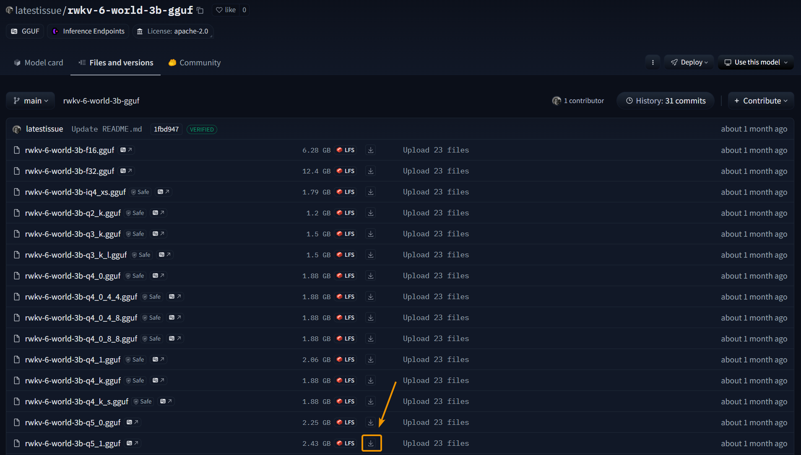

# Text Generation WebUI Inference

::: tip
[Text Generation WebUI](https://github.com/oobabooga/text-generation-webui) is a tool for running large language models. It provides a user-friendly web interface where users can easily configure and run models through a web page.
:::

Text Generation WebUI supports both model inference and training. This article will explain how to use Text Generation WebUI to run RWKV model inference and chat with the model.

## Download Text Generation WebUI

Download Text Generation WebUI using `git clone`:

```bash
git clone https://github.com/oobabooga/text-generation-webui -b dev
```

After cloning the project, run the `cd text-generation-webui` command to enter the project directory.

## Launch Text Generation WebUI

Choose different Text Generation WebUI startup scripts based on your operating system:

### Windows System

Run the following command in the terminal to enable the Windows system installation script:

```bash copy
./start_windows.bat
```

::: tip
This script will automatically install [Miniconda](https://docs.anaconda.com/miniconda/) and install project dependencies like `torch 2.4.1` in the conda environment.
:::

Wait for Miniconda to finish installing, and follow the prompts to select your device's graphics card type and CUDA version.


Wait patiently for the script to install until you see the following prompt:


Text Generation WebUI has now successfully launched. Visit `http://localhost:7860` to open the project's web interface:


### MacOS System

For MacOS systems, use the `start_macos.sh` script to launch the project:

```bash copy
sh start_macos.sh
```

::: warning
If you're using macOS version greater than 15, you need to add additional dependencies at the end of the `requirements_apple_silicon.txt` file to ensure Text Generation WebUI can correctly use llama.cpp to load models:
:::

``` Text copy
https://github.com/oobabooga/llama-cpp-python-cuBLAS-wheels/releases/download/metal/llama_cpp_python-0.3.1-cp311-cp311-macosx_14_0_arm64.whl; platform_system == "Darwin" and platform_release >= "24.0.0" and python_version == "3.11"
https://github.com/oobabooga/llama-cpp-python-cuBLAS-wheels/releases/download/metal/llama_cpp_python-0.3.1-cp310-cp310-macosx_14_0_arm64.whl; platform_system == "Darwin" and platform_release >= "24.0.0" and python_version == "3.10"
```

## Download RWKV Model

Text Generation WebUI supports multiple model loaders, among which the llama.cpp model loader supports RWKV models.

llama.cpp only supports RWKV models in `gguf` format. We need to download `gguf` RWKV models from the [RWKV-GGUF repository](https://huggingface.co/latestissue).

::: tip
The RWKV-GGUF repository provides `gguf` model files with different quantization precisions for RWKV models of different parameters.

Quantization affects the model's inference precision and thus the conversation quality. It's recommended to use `Q5_1`, `Q8_0` quantization precision with lower loss to maintain the model's intelligence and chat experience.
:::

On the Hugging Face page, click the download button on the right side of the model file to download it:



After the model download is complete, place the model file in the `models` folder in the Text Generation WebUI root directory:

```
text-generation-webui
└── models
    └── rwkv-6-world-7b-iq4_nl.gguf
```

## Load RWKV Model

Return to the Text Generation WebUI web interface to configure and load the RWKV model:

1. Click the `Model` tab to switch to the model selection and configuration page
2. Click the `Model` dropdown menu to select an RWKV model
3. Click the `Model loader` dropdown menu to select `llama.cpp` as the model loader
4. Click the `Customize instruction template` dropdown menu on the right, select `RWKV World`, and click the `submit` button below
5. Click the `Load` button to load the RWKV model


::: tip
If the `Model` dropdown menu doesn't show the model file, it might be because the web interface hasn't synchronized the model list in the `models` folder.

Please **click the refresh button on the right** to update the model list.
:::

After successful loading, the terminal will display 4 pieces of information: RWKV model name, model loader, maximum chat length, and chat instruction template:


## Start Chatting

After the model is loaded, return to the `Chat` page -> select `instruct` mode -> enter content and click the `Generate` button to start the conversation.


## Other Parameter Descriptions

Besides the most important model file (RWKV model in `gguf` format), model loader (`llama.cpp`), and chat instruction template (`RWKV World`), llama.cpp provides a series of adjustable parameters that affect model performance metrics such as **memory usage** and **generation speed**.

Usually, you can **keep the default parameters** to run the model. If you need to modify them, please refer to the following parameter descriptions:

| Parameter       | Description                                                                                                                                                                                                                               |
| --------------- | ----------------------------------------------------------------------------------------------------------------------------------------------------------------------------------------------------------------------------------------- |
| `n-gpu-layers`  | Specifies the number of model layers allocated to GPU. Setting it to 0 only means using CPU. If you want to put all layers on GPU, you can set it to the maximum value.                                                                     |
| `n_ctx`         | The context length the model can handle. llama.cpp pre-allocates cache, so higher values require more memory. Usually **automatically set to the model's maximum length** when loading. If memory is insufficient, you can lower this value. |
| `tensor_split`  | Applies to multi-GPU computation. Allocates memory for each GPU proportionally, e.g., 30,70 means one GPU uses 30% and another uses 70%.                                                                                                    |
| `n_batch`       | Batch size when processing prompts. Theoretically, increasing this value can speed up generation, but effects vary by hardware. **Usually doesn't need modification**.                                                                       |
| `threads`       | Number of threads to use. Recommended to **keep default** or set to the number of physical cores on your computer                                                                                                                           |
| `threads_batch` | Number of threads for batch processing. Recommended to **keep default** or set to the total number of physical and virtual cores                                                                                                            |
| `tensorcores`   | **Can be selected for NVIDIA RTX cards** to use llama.cpp version supporting "tensor cores" for improved performance.                                                                                                                       |
| `streamingllm`  | Experimental feature to avoid recomputing entire conversation when deleting old messages, saving inference time. **Not recommended to enable**                                                                                               |
| `cpu`           | Forces CPU computation. **Not recommended to enable** unless GPU isn't working properly or you want to use CPU exclusively.                                                                                                                  |
| `no_mul_mat_q`  | Disables kernels used for computation acceleration. Disabling may reduce generation speed, but can be tried if **encountering compatibility issues**.                                                                                        |
| `no-mmap`       | Loads the model into memory at once, avoiding subsequent disk reads at the cost of longer loading time. **Not recommended to enable**                                                                                                       |
| `mlock`         | Forces the system to keep the model in memory, preventing system from moving it to disk to avoid slowdown. (Note: This feature hasn't been fully tested, effects unknown, **not recommended to enable**)                                     |
| `numa`          | Can be used to optimize performance on some multi-CPU systems.                                                                                                                                                                             |

## Common Issues/Notes

1. When running scripts on MacOS systems, if the terminal log indicates the need to install `httpx[socks]`, please add the `httpx[socks]` dependency at the end of the `./requirements_apple_silicon.txt` file.

2. When using RWKV models with 1.6B parameters, please use `Q5_1`, `Q5_k` or higher quantization precision. In testing, Q5_0 and lower precision quantization may cause small parameter models to become less intelligent or even unable to converse normally.